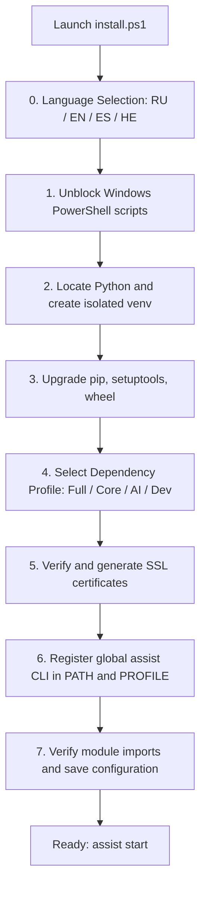

# 📦 AI Breadboard Installation Guide

Comprehensive setup, configuration, and initialization guide for **AI Breadboard** on local environments and host servers.

---

## 📋 Table of Contents
1. [System Requirements](#1-system-requirements)
2. [Automated Installation (Recommended)](#2-automated-installation-recommended)
3. [Manual Installation](#3-manual-installation)
4. [Environment Variables and Configuration](#4-environment-variables-and-configuration)
5. [Global CLI Management (`assist`)](#5-global-cli-management-assist)
6. [Service Launchers](#6-service-launchers)
7. [Troubleshooting](#7-troubleshooting)

---

## 1. System Requirements

* **Operating System:** Windows 10/11 (x64), Linux (Ubuntu 22.04+ / Debian), macOS.
* **Python Runtime:** Python 3.10 – 3.14 (Python 3.12+ recommended from [python.org](https://www.python.org/downloads/)).
  > [!IMPORTANT]
  > When installing Python on Windows, ensure the **"Add python.exe to PATH"** checkbox is checked.
* **Version Control:** Git ([git-scm.com](https://git-scm.com/)).
* **Network Ports:** Port `8000` for FastAPI server and `54837` for local Microsoft AI Foundry service.

---

## 2. Automated Installation (Recommended)

The automated interactive installer [`install.ps1`](../../../install.ps1) sets up the environment end-to-end:

### Running the Installer:

1. Open a PowerShell terminal.
2. Run the installer from the repository root:
   ```powershell
   # Run from local project directory
   .\install.ps1

   # Or remote one-liner execution:
   irm https://raw.githubusercontent.com/hypo69/AI-Breadboard/master/install.ps1 | iex
   ```

### Installer Execution Flow:



* **[0] Language Selection:** Supports English, Russian, Spanish, and Hebrew with automatic OS locale detection.
* **[1/7] Unblock Files:** Unblocks downloaded PowerShell scripts in Windows.
* **[2/7] Virtual Environment:** Creates an isolated `venv` avoiding Windows Store stubs.
* **[3/7] Pip Upgrade:** Upgrades `pip`, `setuptools`, and `wheel` build utilities.
* **[4/7] Dependency Profiles:** Allows choosing between:
  1. *Full Installation (Core + AI + Utils)* — recommended
  2. *Core Server Only (Core)*
  3. *Server + AI Modules (Core + AI)*
  4. *Full Installation + Dev (Tests & Documentation)*
  5. *Skip Dependency Installation*
* **[5/7] SSL Certificates:** Checks for local HTTPS certificates (`localhost+2.pem`) or triggers `install_ssl_cert.ps1`.
* **[6/7] Global assist CLI Integration:**
  * Generates `assist.ps1`, `assist.cmd`, and bash script `assist`.
  * Deploys them to `%USERPROFILE%\.local\bin\`.
  * Adds the path to the system `PATH`.
  * Registers the `assist` helper in PowerShell profiles.
* **[7/7] Final Verification:** Validates key dependencies (`fastapi`, `uvicorn`, `dotenv`, `pydantic`, `cryptography`) and updates `config.json`.

---

## 3. Manual Installation

For step-by-step manual setup:

### 3.1. Clone Repository
```bash
git clone https://github.com/hypo69/AI-Breadboard.git C:\Users\%USERNAME%\AppData\Local\AI-Breadboard
cd C:\Users\%USERNAME%\AppData\Local\AI-Breadboard
```

### 3.2. Create and Activate Virtual Environment
```powershell
python -m venv venv
.\venv\Scripts\Activate.ps1
```

### 3.3. Install Dependencies
```powershell
python -m pip install --upgrade pip setuptools wheel
pip install -r requirements.txt
```

### 3.4. Generate SSL Certificates (for HTTPS)
```powershell
.\install_ssl_cert.ps1
```

### 3.5. Register Global CLI Commands
```powershell
.\assist.ps1 install-profile
```

---

## 4. Environment Variables and Configuration

Architectural Principle: **Configuration over Hardcode**.

### 4.1. Secrets (`.env`)
The `.env` file is stored in the project root and is used **STRICTLY** for secret API keys, tokens, and credentials:

```env
# Google Gemini API keys (comma-separated list of environment variable names)
GEMINI_API_KEY_NAMES=GEMINI_API_KEY_1,GEMINI_API_KEY_2

# API Key values
GEMINI_API_KEY_1=AIzaSy...
GEMINI_API_KEY_2=AIzaSy...

# Antigravity AGY API Key (optional)
AGY_API_KEY=...

# Secret for signing JWT authentication tokens
JWT_SECRET=your_super_secret_jwt_key

# Optional third-party credentials
TELEGRAM_BOT_TOKEN=...
TMDB_API_KEY=...
```

### 4.2. Public Settings (`config.json`)
All public server parameters, AI model selections, plugins, and runtime modes are maintained in `config.json`:

```json
{
  "server": {
    "host": "0.0.0.0",
    "port": 8000,
    "workers": 1,
    "reload": true,
    "use_ssl": true,
    "mode": "DEV",
    "debug": true
  },
  "ai": {
    "use_foundry": true,
    "foundry_base_url": "http://localhost:54837",
    "foundry_model_id": "qwen2.5-1.5b-instruct-generic-cpu:4",
    "use_gemini_cli": true,
    "gemini_cli_model_id": "gemini-3.1-flash-lite",
    "use_agy": false,
    "agy_model_id": "agy-gemini-3.5-flash-lite"
  }
}
```

---

## 5. Global CLI Management (`assist`)

Once installed, the global CLI tool **`assist`** is available across all terminals:

| Command | Description |
|---|---|
| `assist start` | Starts the main application and all dependent services (`run.ps1`) |
| `assist start unicorn` | Starts the FastAPI/Uvicorn server (`Run-Unicorn.ps1`) |
| `assist start light` | Starts lightweight server without auxiliary daemons (`Run-LightServer.ps1`) |
| `assist start foundry` | Starts local Microsoft AI Foundry service |
| `assist stop` | Stops the running server and frees port `8000` |
| `assist restart` | Performs a quick server restart |
| `assist status` | Inspects process status, listening ports, and active services |
| `assist providers` | Inspects and lists all registered AI providers and models |
| `assist logs [N]` | Tails the last $N$ lines of system logs (default: 40) |
| `assist config show` | Displays the current `config.json` configuration |
| `assist config get <key>` | Reads a specific config value (e.g. `assist config get server.port`) |
| `assist config set <key> <val>` | Sets a configuration property (e.g. `assist config set server.port 8000`) |
| `assist test` | Executes the automated test suite with `pytest` |

---

## 6. Service Launchers

All service launchers are located in the repository root and `launchers/` directory:

* **[`run.ps1`](../../../run.ps1)** — Main orchestrator: validates venv, dependencies, port release, starts Foundry, and launches Uvicorn.
* **[`Run-Unicorn.ps1`](../../../launchers/Run-Unicorn.ps1)** — Starts FastAPI server, automatically opens default browser, and writes to `logs/`.
* **[`Run-LightServer.ps1`](../../../launchers/Run-LightServer.ps1)** — Lightweight standalone server (`-mode 0.0.0.0|localhost` and `-port`).
* **[`Run-Foundry.ps1`](../../../launchers/Run-Foundry.ps1)** — Manages Microsoft AI Foundry local daemon (`-Action start|stop|status`).

For complete details, see [`LAUNCHER_GUIDE.md`](LAUNCHER_GUIDE.md).

---

## 7. Troubleshooting

### 7.1. PowerShell Execution Policy Error
If PowerShell outputs `running scripts is disabled on this system`:
```powershell
Set-ExecutionPolicy -Scope CurrentUser -ExecutionPolicy RemoteSigned -Force
```

### 7.2. Port 8000 is Already in Use
`run.ps1` and `Run-Unicorn.ps1` automatically detect and terminate hanging processes on port 8000. You can also manually invoke:
```powershell
assist stop
```

### 7.3. Browser Warning for Self-Signed SSL Certificate
Certificates are generated for `localhost`, `127.0.0.1`, and local network IP addresses. On first access, click **"Advanced" -> "Proceed to localhost (unsafe)"**, or import the certificate into the Windows Trusted Root Certification Authorities store.

### 7.4. Log File Locations
All system logs are stored in the `logs/` directory:
* `logs/fastapi.log` — FastAPI routing and HTTP request logs
* `logs/info.log` — General system runtime events
* `logs/errors.log` — Unhandled application errors and tracebacks
* `logs/uvicorn_*.log` — Raw Uvicorn console output

