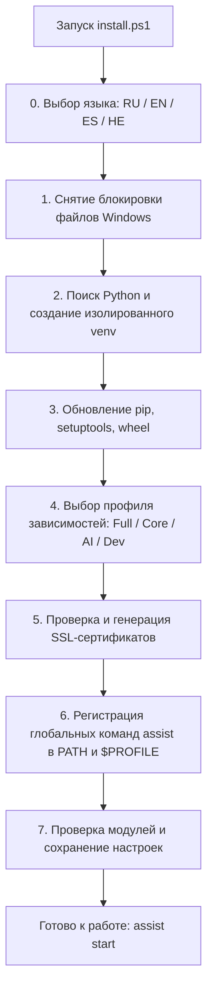

# 📦 Руководство по установке AI Breadboard (Русский)

**Language / Язык:** [🇷🇺 Русский](installation.ru.md) | [🇬🇧 English](installation.en.md) | [🇪🇸 Español](installation.es.md) | [🇮🇱 עברית](installation.he.md)

Документ описывает полный процесс установки, настройки и инициализации проекта **AI Breadboard** на локальной машине или сервере.

---

## 📋 Содержание
1. [Системные требования](#1-системные-требования)
2. [Автоматическая установка (Рекомендуется)](#2-автоматическая-установка-рекомендуется)
3. [Ручная установка](#3-ручная-установка)
4. [Настройка переменных окружения и конфигурации](#4-настройка-переменных-окружения-и-конфигурации)
5. [Глобальные команды управления (CLI assist)](#5-глобальные-команды-управления-cli-assist)
6. [Лончеры сервисов](#6-лончеры-сервисов)
7. [Устранение неполадок (Troubleshooting)](#7-устранение-неполадок-troubleshooting)

---

## 1. Системные требования

* **Операционная система:** Windows 10/11 (x64), Linux (Ubuntu 22.04+ / Debian), macOS.
* **Интерпретатор Python:** Python 3.10 – 3.14 (рекомендуется Python 3.12 или 3.13 с официального сайта [python.org](https://www.python.org/downloads/)).
  > [!IMPORTANT]
  > При установке Python на Windows обязательно отметьте галочку **"Add python.exe to PATH"**.
* **Система контроля версий:** Git ([git-scm.com](https://git-scm.com/)).
* **Сетевые порты:** По умолчанию сервер использует порт `3000` (FastAPI) и `54837` (локальный AI Foundry).

---

## 2. Автоматическая установка (Рекомендуется)

Для быстрой и безошибочной установки предназначен интерактивный скрипт [`install.ps1`](file:///c:/Users/onela/AppData/Local/AI%20Breadboard/install.ps1).

### Шаги запуска инсталлятора:

1. Откройте терминал PowerShell.
2. Запустите инсталлятор:
   ```powershell
   # Запуск из локальной папки проекта
   .\install.ps1

   # Или удаленный запуск одной строкой:
   irm https://raw.githubusercontent.com/hypo69/AI-Breadboard/master/install.ps1 | iex
   ```

### Что делает мастер установки:



* **[0] Язык мастера:** Поддерживает **Русский (RU)**, **English (EN)**, **Español (ES)**, **עברית (HE)** с автоматическим определением локали системы.
* **[1/7] Снятие блокировки (Unblock-File):** Разблокирует загруженные скрипты PowerShell в Windows.
* **[2/7] Виртуальное окружение:** Находит оптимальный Python (через `py` launcher, `python`, `python3`), исключает заглушки Windows Store и создает чистое окружение `venv`.
* **[3/7] Обновление pip:** Обновляет базовые утилиты сборки (`pip`, `setuptools`, `wheel`).
* **[4/7] Профили зависимостей:** Позволяет выбрать профиль установки:
  1. *Полная установка (Core + AI + Utils)* — рекомендуется
  2. *Только базовый сервер (Core)*
  3. *Сервер + AI модули (Core + AI)*
  4. *Полная установка + Dev (Тесты и Документация)*
  5. *Пропустить установку*
* **[5/7] SSL-сертификаты:** Проверяет наличие локальных сертификатов для безопасного HTTPS (`localhost+2.pem`) или запускает генератор `install_ssl_cert.ps1`.
* **[6/7] Глобальная интеграция (assist):**
  * Генерирует `assist.ps1`, `assist.cmd` и bash-скрипт `assist`.
  * Размещает их в каталоге `%USERPROFILE%\.local\bin\`.
  * Добавляет пути в системную переменную `PATH`.
  * Регистрирует функцию `assist` в профилях PowerShell 7 и Windows PowerShell.
* **[7/7] Финальная проверка:** Тестирует импорт ключевых модулей (`fastapi`, `uvicorn`, `dotenv`, `pydantic`, `cryptography`) и сохраняет выбранный язык в `config.json`.

---

## 3. Ручная установка

Если вам требуется выполнить пошаговую ручную установку:

### 3.1. Клонирование репозитория
```bash
git clone https://github.com/hypo69/AI-Breadboard.git C:\Users\%USERNAME%\AppData\Local\AI-Breadboard
cd C:\Users\%USERNAME%\AppData\Local\AI-Breadboard
```

### 3.2. Создание и активация виртуального окружения
```powershell
python -m venv venv
.\venv\Scripts\Activate.ps1
```

### 3.3. Установка зависимостей
```powershell
python -m pip install --upgrade pip setuptools wheel
pip install -r requirements.txt
```

### 3.4. Генерация SSL-сертификатов (для HTTPS)
```powershell
.\install_ssl_cert.ps1
```

### 3.5. Регистрация глобальной команды assist
```powershell
.\assist.ps1 install-profile
```

---

## 4. Настройка переменных окружения и конфигурации

Архитектурный принцип проекта: **Configuration over Hardcode**.

### 4.1. Секретные данные (`.env`)
Файл `.env` располагается в корне проекта и используется **ИСКЛЮЧИТЕЛЬНО** для секретных ключей, паролей и токенов:

```env
# Имена переменных окружения с API-ключами Google Gemini через запятую
GEMINI_API_KEY_NAMES=GEMINI_API_KEY_1,GEMINI_API_KEY_2

# Сами ключи
GEMINI_API_KEY_1=AIzaSy...
GEMINI_API_KEY_2=AIzaSy...

# Antigravity AGY API Key (опционально)
AGY_API_KEY=...

# Секрет для подписи JWT-токенов авторизации
JWT_SECRET=your_super_secret_jwt_key

# Опциональные токены внешних сервисов
TELEGRAM_BOT_TOKEN=...
TMDB_API_KEY=...
```

### 4.2. Несекретные настройки (`config.json`)
Все параметры сервера, модели ИИ, плагины и режимы хранятся в `config.json`:

```json
{
  "server": {
    "host": "0.0.0.0",
    "port": 3000,
    "workers": 1,
    "reload": true,
    "use_ssl": true,
    "mode": "DEV",
    "debug": true
  },
  "ai": {
    "use_foundry": true,
    "foundry_base_url": "http://localhost:54837",
    "foundry_model_id": "qwen2.5-1.5b-instruct-generic-cpu:4",
    "use_gemini_cli": true,
    "gemini_cli_model_id": "gemini-3.1-flash-lite",
    "use_agy": false,
    "agy_model_id": "agy-gemini-3.5-flash-lite"
  }
}
```

---

## 5. Глобальные команды управления (CLI assist)

После установки в любом терминале доступна глобальная утилита **`assist`**:

| Команда | Назначение |
|---|---|
| `assist start` | Запуск главного сервера и зависимых служб (`run.ps1`) |
| `assist start unicorn` | Запуск сервера через FastAPI/Uvicorn (`Run-Unicorn.ps1`) |
| `assist start light` | Запуск облегченного сервера без сторонних служб (`Run-LightServer.ps1`) |
| `assist start foundry` | Запуск локальной службы Microsoft AI Foundry |
| `assist stop` | Остановка сервера и освобождение порта `3000` |
| `assist restart` | Быстрый перезапуск сервера |
| `assist status` | Проверка состояния процессов, открытых портов и статуса служб |
| `assist providers` | Инспекция и список всех подключенных AI-провайдеров и моделей |
| `assist logs [N]` | Просмотр последних $N$ строк системных логов (по умолчанию 40) |
| `assist config show` | Просмотр текущей конфигурации `config.json` |
| `assist config get <key>` | Получить значение параметра (например: `assist config get server.port`) |
| `assist config set <key> <val>` | Установить значение параметра (например: `assist config set server.port 8000`) |
| `assist test` | Запуск набора автоматических тестов `pytest` |

---

## 6. Лончеры сервисов

Все лончеры расположены в корне проекта и могут вызываться напрямую:

* **[`run.ps1`](file:///c:/Users/onela/AppData/Local/AI%20Breadboard/run.ps1)** — Главный оркестратор: проверка venv, зависимостей, освобождение порта, старт Foundry и запуск Unicorn.
* **[`Run-Unicorn.ps1`](file:///c:/Users/onela/AppData/Local/AI%20Breadboard/Run-Unicorn.ps1)** — Запуск FastAPI сервера с автоматическим открытием браузера по готовности порта и записью в `logs/`.
* **[`Run-LightServer.ps1`](file:///c:/Users/onela/AppData/Local/AI%20Breadboard/Run-LightServer.ps1)** — Облегченный режим (параметры `-mode 0.0.0.0|localhost` и `-port`).
* **[`Run-Foundry.ps1`](file:///c:/Users/onela/AppData/Local/AI%20Breadboard/Run-Foundry.ps1)** — Управление локальной службой Microsoft AI Foundry (`-Action start|stop|status`).

---

## 7. Устранение неполадок (Troubleshooting)

### 7.1. Ошибка выполнения скриптов PowerShell (`ExecutionPolicy`)
Если при запуске скриптов PowerShell выводит `running scripts is disabled on this system`:
```powershell
Set-ExecutionPolicy -Scope CurrentUser -ExecutionPolicy RemoteSigned -Force
```

### 7.2. Порт 3000 занят
Скрипты `run.ps1` и `Run-Unicorn.ps1` автоматически находят и завершают зависший процесс. Также это можно сделать вручную командой:
```powershell
assist stop
```

### 7.3. Предупреждение браузера о самоподписанном SSL сертификате
Сертификаты генерируются для доменов `localhost`, `127.0.0.1` и локального сетевого IP. При первом входе в браузере нажмите **"Дополнительно" -> "Перейти на сайт localhost (небезопасно)"**, либо добавьте сертификат в доверенные корневые центры сертификации Windows.

### 7.4. Проверка логов
Все логи сохраняются в каталоге `logs/`:
* `logs/fastapi.log` — запросы и маршрутизация FastAPI
* `logs/info.log` — общие события системы
* `logs/errors.log` — ошибки приложения
* `logs/uvicorn_*.log` — консольный вывод сервера Uvicorn
