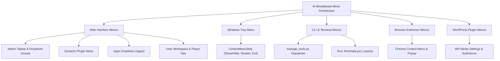
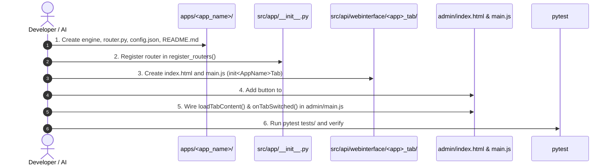

# Menu Systems Architecture, Creation, and Usage Guide

**Project:** `AI-Breadboard`  
**Location:** [`.ai/instructions/knowledge/MENU_CREATION_AND_USAGE_GUIDE.md`](file:///C:/Users/onela/AppData/Local/AI-Breadboard/.ai/instructions/knowledge/MENU_CREATION_AND_USAGE_GUIDE.md)  
**Status:** ✅ Production Standard (English)  
**Version:** 3.0  
**Author:** hypo69  

---

## 📋 Table of Contents
1. [Overview & Architectural Pillars](#1-overview--architectural-pillars)
2. [Web Interface Menu System (Admin & User)](#2-web-interface-menu-system-admin--user)
   - [2.1 Admin Header Navigation & Grouped Dropdowns](#21-admin-header-navigation--grouped-dropdowns)
   - [2.2 Dynamic Plugin Menu Items](#22-dynamic-plugin-menu-items)
   - [2.3 Application Menu Registration Protocol (`/apps/*`)](#23-application-menu-registration-protocol-apps)
   - [2.4 Tab Switching & Lifecycle Events](#24-tab-switching--lifecycle-events)
   - [2.5 User Web Interface Navigation (`/user`)](#25-user-web-interface-navigation-user)
3. [Windows System Tray Context Menu](#3-windows-system-tray-context-menu)
   - [3.1 Tray Menu Architecture (`ShowHide-InTray.ps1`)](#31-tray-menu-architecture-showhide-intrayps1)
   - [3.2 Adding Custom Tray Actions](#32-adding-custom-tray-actions)
4. [CLI & Interactive Terminal Menus](#4-cli--interactive-terminal-menus)
   - [4.1 Command Menu Dispatcher (`manage_tools.py`)](#41-command-menu-dispatcher-manage_toolspy)
   - [4.2 Terminal Layout Menu Launcher (`Run-Terminals.ps1`)](#42-terminal-layout-menu-launcher-run-terminalsps1)
5. [Browser Extension Menus (Chrome Extension)](#5-browser-extension-menus-chrome-extension)
   - [5.1 Context Menus & Action Menus](#51-context-menus--action-menus)
6. [WordPress Plugin Admin Menus](#6-wordpress-plugin-admin-menus)
   - [6.1 Menu Registration in WordPress (`add_menu_page`)](#61-menu-registration-in-wordpress-add_menu_page)
7. [Internationalization & Styling Standards](#7-internationalization--styling-standards)

---

## 1. Overview & Architectural Pillars

AI-Breadboard features several distinct menu tiers designed to provide intuitive interaction across web, operating system, terminal, and browser environments:



---

## 2. Web Interface Menu System (Admin & User)

The web frontend operates on modern vanilla ES Modules, Bootstrap 5 nav-tabs, and asynchronous dynamic component loading.

### 2.1 Admin Header Navigation & Grouped Dropdowns

The administrative navigation bar is defined in [`src/api/webinterface/admin/index.html`](file:///C:/Users/onela/AppData/Local/AI-Breadboard/src/api/webinterface/admin/index.html) and styled via [`src/api/webinterface/css/main.css`](file:///C:/Users/onela/AppData/Local/AI-Breadboard/src/api/webinterface/css/main.css).

#### Core Navigation Groups in Admin:
1. **Dialog & Audio (`#dialogTabsDropdown`):**
   - 💬 Chat (`tab-chat`)
   - 🎙️ Voice & Diarization (`tab-voice`)
   - 🗣️ TTS Settings (`tab-tts`)
2. **AI & Knowledge (`#aiTabsDropdown`):**
   - 🧠 RAG Vector Store (`tab-rag`)
   - 🤖 Models & Routing API (`tab-models`)
   - 🧩 AI Agents (`tab-agents`)
   - ⚡ Skills Registry (`tab-skills`)
   - 🔌 MCP Servers (`tab-mcp`)
3. **Plugins & Search (`#pluginsTabsDropdown`):**
   - Dynamic plugin items (`#nav-enabled-plugins-list`)
   - 🌐 Web Search (`tab-search`)
   - 📑 Sources & Catalogs (`tab-sources`)
   - ⚙️ Plugin Management (`tab-plugins`)
4. **Applications (`#appsTabsDropdown`):**
   - Micro-apps integrated under `/apps` (Trading, Network, System Inspector, etc.)
5. **Administration (`#adminTabsDropdown`):**
   - ⚙️ System Management (`tab-admin`)
   - 👥 Users (`tab-users`)
   - 🌐 Google Accounts (`tab-google-accounts`)
   - 🛟 Helpdesk (`tab-helpdesk`)
   - 📋 Logs (`tab-logs`)
   - 📝 System Instructions (`tab-instructions`)
   - 📚 Reference Guide (`tab-help`)

#### How to Add a New Menu Item to Admin:
To add a new navigation menu item:
1. Open [`src/api/webinterface/admin/index.html`](file:///C:/Users/onela/AppData/Local/AI-Breadboard/src/api/webinterface/admin/index.html).
2. Inside the relevant dropdown container, insert the button:
```html
<button class="dropdown-item d-flex align-items-center gap-2"
        data-tab="tab-mymodule"
        data-bs-target="#tab-mymodule"
        type="button"
        data-i18n="tabs.mymodule">
  ✨ My Module
</button>
```
3. Add the corresponding tab pane in the content container:
```html
<div class="tab-pane fade" id="tab-mymodule" role="tabpanel" aria-labelledby="tab-mymodule">
  <div class="p-3">
    <!-- Component markup or async dynamic container -->
    <div id="mymodule-root"></div>
  </div>
</div>
```

---

### 2.2 Dynamic Plugin Menu Items

Plugins can declare a frontend interface. When activated via the Plugins Manager, menu items are dynamically generated into `#nav-enabled-plugins-list`.

In [`src/api/webinterface/admin/main.js`](file:///C:/Users/onela/AppData/Local/AI-Breadboard/src/api/webinterface/admin/main.js):
```javascript
// Dynamic injection of active plugin tabs into dropdown menu
function updatePluginMenuItems(activePlugins) {
  const container = document.getElementById('nav-enabled-plugins-list');
  if (!container) return;
  
  container.innerHTML = '';
  activePlugins.forEach(plugin => {
    if (!plugin.has_tab) return;
    const btn = document.createElement('button');
    btn.className = 'dropdown-item d-flex align-items-center gap-2';
    btn.setAttribute('data-tab', `tab-plugin-${plugin.name}`);
    btn.setAttribute('data-bs-target', `#tab-plugin-${plugin.name}`);
    btn.innerHTML = `${plugin.icon || '🧩'} ${plugin.title}`;
    container.appendChild(btn);
  });
}
```

---

### 2.3 Application Menu Registration Protocol (`/apps/*`)

According to **CODE_RULES.md § 4.5**, any new application created in `apps/<app_name>` must complete the 6-step integration protocol to appear in the Admin Apps Menu:



#### Step-by-Step Code Example:

1. **In `src/api/webinterface/admin/index.html` (`#appsTabsDropdown`):**
```html
<button class="dropdown-item d-flex align-items-center gap-2" 
        data-tab="tab-my-service" 
        data-bs-target="#tab-my-service" 
        type="button">
  🚀 My Service
</button>
```

2. **In `src/api/webinterface/admin/main.js` (`initInterface` and `onTabSwitched`):**
```javascript
// Asynchronously load tab HTML when first clicked
case 'tab-my-service':
  await loadTabContent('tab-my-service', '/html/my_service_tab/index.html');
  if (typeof window.initMyServiceTab === 'function') {
    window.initMyServiceTab();
  }
  break;
```

---

### 2.4 Tab Switching & Lifecycle Events

Menu items trigger tab changes via event listeners configured in `main.js`:
- Clicks on `[data-tab]` or `[data-bs-target]` activate Bootstrap's Tab API.
- The active dropdown button is updated to reflect the selected child menu item.
- The `onTabSwitched(targetTabId)` callback is triggered to load tab data on-demand, saving memory and bandwidth.

---

### 2.5 User Web Interface Navigation (`/user`)

Located at [`src/api/webinterface/user/`](file:///C:/Users/onela/AppData/Local/AI-Breadboard/src/api/webinterface/user/):
- **Header Action Bar:**
  - AI Model Selector Dropdown (`#modelSelector`)
  - Prompt Template Preset Menu (`#promptPresetsDropdown`)
  - Voice / STT Mode Toggle Button
  - Dark/Light Theme Switcher
- **CosmicPlayer Multimedia Menu:**
  - Track list, Play/Pause/Skip controls, Audio Visualizer mode selector.
- **Chat Context & Session Menu:**
  - History sidebar, Session cleaner, and Export options.

---

## 3. Windows System Tray Context Menu

AI-Breadboard provides a native Windows System Tray utility in [`launchers/ShowHide-InTray.ps1`](file:///C:/Users/onela/AppData/Local/AI-Breadboard/launchers/ShowHide-InTray.ps1) built with `.NET Windows Forms` (`System.Windows.Forms.NotifyIcon` and `System.Windows.Forms.ContextMenuStrip`).

### 3.1 Tray Menu Architecture (`ShowHide-InTray.ps1`)

The tray menu intercepts console window management and offers the following items:

| Menu Item | Action / Handler | Description |
|---|---|---|
| **🌐 Open Web UI** | `[System.Diagnostics.Process]::Start($WebUrl)` | Launches the default browser at `http://localhost:8000/admin` |
| **👁️ Show Console** | `ShowWindow($consoleHwnd, SW_SHOW)` | Restores the minimized/hidden server terminal |
| **🙈 Hide Console** | `ShowWindow($consoleHwnd, SW_HIDE)` | Hides the server terminal into background tray |
| **🔄 Restart Server** | Calls restart handler | Gracefully restarts the FastAPI server process |
| **📊 Service Status** | Shows Windows Tray Balloon notification | Displays CPU, memory, and uptime statistics |
| **❌ Exit** | Releases icon, restores windows, exits process | Clean shutdown of tray hooks and processes |

### 3.2 Adding Custom Tray Actions

To add an item to the Tray context menu in `ShowHide-InTray.ps1`:
```powershell
$menuItemCustom = New-Object System.Windows.Forms.ToolStripMenuItem
$menuItemCustom.Text = "🛠️ Launch Assist CLI"
$menuItemCustom.Add_Click({
    Start-Process pwsh -ArgumentList "-NoExit", "-Command", "py manage_tools.py --help"
})
$contextMenu.Items.Add($menuItemCustom) | Out-Null
```

---

## 4. CLI & Interactive Terminal Menus

### 4.1 Command Menu Dispatcher (`manage_tools.py`)

The project provides a unified CLI tool suite via [`manage_tools.py`](file:///C:/Users/onela/AppData/Local/AI-Breadboard/manage_tools.py):

```powershell
py manage_tools.py <group> <command> [arguments]
```

#### Available CLI Command Groups (Sub-menus):
- **`skills`**: `list`, `info`, `test`, `audit`, `disable`, `enable`
- **`rag`**: `build`, `query`, `stats`, `clean`, `optimize`
- **`db`**: `check-integrity`, `migrate`, `backup`, `vacuum`
- **`docs`**: `generate`, `validate`, `serve`
- **`models`**: `list`, `benchmark`, `probe-hardware`, `test-routing`
- **`app`**: `run`, `status`, `logs`

#### Defining a New CLI Command Group:
```python
# In manage_tools.py (or tools/ directory):
import argparse

def setup_my_tool_menu(subparsers):
    parser = subparsers.add_parser('mytool', help='My custom tool operations')
    sub = parser.add_subparsers(dest='subcommand', required=True)
    
    # Subcommand: status
    status_parser = sub.add_parser('status', help='Check status')
    status_parser.set_defaults(func=handle_mytool_status)

def handle_mytool_status(args) -> bool:
    print("Tool operational.")
    return True
```

---

### 4.2 Terminal Layout Menu Launcher (`Run-Terminals.ps1`)

[`launchers/Run-Terminals.ps1`](file:///C:/Users/onela/AppData/Local/AI-Breadboard/launchers/Run-Terminals.ps1) allows choosing workspace terminal layout presets:

```powershell
# Interactive selection or preset execution
.\launchers\Run-Terminals.ps1 -Preset breadboard -Layout grid
.\launchers\Run-Terminals.ps1 -Preset trading -Layout split
.\launchers\Run-Terminals.ps1 -Preset custom
```

- **Presets:** `breadboard` (Server, CLI, Bot, Logs), `trading` (Ticker, Orderbook, Logs), `network` (Sniffer, Status), `custom`.
- **Layouts:** `grid` (4-way split), `split` (2-way split), `tabs` (multi-tab Windows Terminal), `windows` (standalone windows).

---

## 5. Browser Extension Menus (Chrome Extension)

Located at [`extensions/chrome/`](file:///C:/Users/onela/AppData/Local/AI-Breadboard/extensions/chrome/).

### 5.1 Context Menus & Action Menus

1. **Action Popup Menu:** Configured in `manifest.json` under `"action": { "default_popup": "popup.html" }`. Displays quick toggles for sending page text to AI Breadboard, quick summarization, and model selection.
2. **Right-Click Context Menu:** Registered in `background.js` via `chrome.contextMenus`:
```javascript
// extensions/chrome/background.js
chrome.runtime.onInstalled.addListener(() => {
  chrome.contextMenus.create({
    id: "sendToAIBreadboard",
    title: "Send selection to AI Breadboard",
    contexts: ["selection"]
  });
  
  chrome.contextMenus.create({
    id: "explainCode",
    title: "Explain code with AI",
    contexts: ["selection"]
  });
});

chrome.contextMenus.onClicked.addListener((info, tab) => {
  if (info.menuItemId === "sendToAIBreadboard") {
    sendSelectionToAssistant(info.selectionText);
  }
});
```

---

## 6. WordPress Plugin Admin Menus

For companion WordPress plugins (located in [`wp/wp-content/plugins/`](file:///C:/Users/onela/AppData/Local/AI-Breadboard/wp/wp-content/plugins/)):

### 6.1 Menu Registration in WordPress (`add_menu_page`)

In `wp/wp-content/plugins/ai-responder/admin/class-admin-settings.php`:
```php
<?php
class Admin_Settings {
    public function __construct() {
        add_action('admin_menu', [$this, 'register_admin_menus']);
    }

    public function register_admin_menus(): void {
        add_menu_page(
            __('AI Breadboard Settings', 'ai-breadboard'),
            __('AI Breadboard', 'ai-breadboard'),
            'manage_options',
            'ai-breadboard-settings',
            [$this, 'render_settings_page'],
            'dashicons-superhero',
            65
        );

        add_submenu_page(
            'ai-breadboard-settings',
            __('Model Routing', 'ai-breadboard'),
            __('Model Routing', 'ai-breadboard'),
            'manage_options',
            'ai-breadboard-models',
            [$this, 'render_models_page']
        );
    }
}
```

---

## 7. Internationalization & Styling Standards

All UI menus must follow the strict standards:
1. **Localization:** Every visible menu item must include `data-i18n="tabs.<key>"` for dynamic runtime translation using `i18next`.
2. **Icons:** Use standard Bootstrap Icons (`bi bi-...`) or clean Unicode emojis for consistent visual hierarchy.
3. **Docstrings & Comments:** Code comments and docstrings must be written in Russian; HTML attributes, element IDs, and class names remain in standard ASCII/English. Visible UI strings use `data-i18n` localization.
4. **Theme Compatibility:** Menus must utilize CSS custom properties (`var(--bg-card)`, `var(--text-primary)`, `var(--border-color)`) to support dark and light themes seamlessly.

---

**Status:** ✅ Active Standard  
**Approved by:** hypo69  
