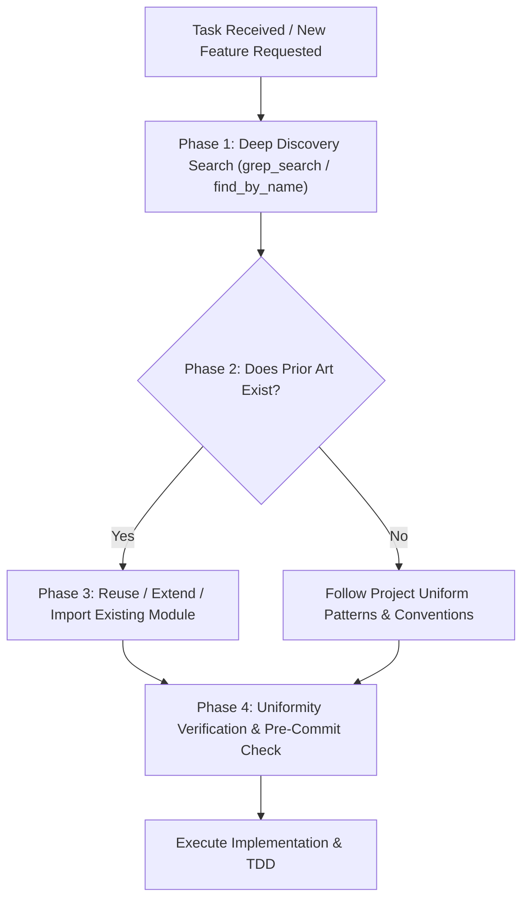

# Codebase Reuse & Prior Art Audit Standard (Code Uniformity Standard)

**Version:** 2.0  
**Scope:** Mandatory for all AI agents, Gemini providers, subagents, and developers.

---

## 1. Fundamental Principle: Zero Divergent Implementations

> [!IMPORTANT]
> **MANDATORY RULE BEFORE ANY CODE GENERATION:**  
> Before creating any new component, UI widget, function, class, utility, API endpoint, prompt template, or style sheet, any AI agent or Gemini provider **MUST** execute a comprehensive prior art audit of the codebase to verify **whether the functionality or an equivalent pattern already exists**.
> 
> **Never create a duplicate or diverging implementation for functionality that already has an existing pattern or module in the project.**

---

## 2. The 4-Phase Pre-Flight Audit Protocol (Mandatory Workflow)

Every AI provider or agent **MUST** follow these 4 steps in order before generating or modifying any code:

### Phase 1: Deep Discovery Search (Discovery & Audit)
Before proposing or writing new code:
1. **Search by Filename & Patterns (`find_by_name`):**
   - Look for existing modules, tools, plugins, components, or routers in relevant directories (`core/`, `plugins/`, `scripts/`, `src/`, `templates/`, `static/`).
2. **Search by Identifiers & Logic (`grep_search`):**
   - Search for function names, class names, keywords, endpoints, and data contracts that handle similar tasks.
   - For UI tasks: Search how dropdowns, tabs, buttons, modals, and tables are implemented elsewhere in the application.
   - For Backend tasks: Search for existing utility functions (`core/utils/`), database models, clients, and helpers.

### Phase 2: Comparison & Collision Analysis
Inspect found matches to answer:
- Does an existing module solve 80%+ of the requested task?
- Is there an established API signature, data structure, or design pattern used in the codebase?
- Will introducing new code create two different ways to do the same thing?

### Phase 3: Decision & Action Matrix
- **Rule A (Direct Reuse):** If an existing component/function already handles the task, import and use it directly. **DO NOT** write a parallel implementation.
- **Rule B (Extension):** If an existing component covers part of the requirement, extend the existing implementation (e.g. adding optional parameters or methods) while preserving backward compatibility.
- **Rule C (Uniform Creation):** If no prior art exists, implement the new feature strictly following the established naming conventions, architectural patterns (DI, Fail-Fast, No None, config-driven), and file header standards.

### Phase 4: Uniformity Verification
Verify that:
- The solution does not fragment the architecture.
- Both user-facing and internal interfaces remain uniform and consistent.
- No redundant helper functions were created when shared ones exist in `core/utils/`.

---

## 3. Mandatory Rules & Anti-Patterns

| Category | Forbidden Anti-Pattern (❌ MUST NOT) | Required Standard (✅ MUST) |
|---|---|---|
| **UI Components** | Creating new custom dropdown/modal CSS/JS when a standard project component/pattern exists. | Reuse the standard template structure, CSS classes, and JS handlers. |
| **Data & Files** | Writing custom raw `open()`, `json.loads()`, `json.dumps()` in business logic. | Use project-wide wrappers: `j_loads()`, `j_dumps()`, `read_text_file()`, `save_text_file()`. |
| **API Clients** | Direct ad-hoc HTTP calls creating multiple divergent AI clients. | Route all model requests through `UnifiedChatModel` and shared provider interfaces. |
| **Logging** | Raw `print()` statements or custom logging mechanisms. | Standard logger `core.logger.logger`. |
| **Configuration** | Hardcoded port/path/URL constants in multiple places. | Centralized configuration via `config.json` and `.env`. |
| **DB & Data Access**| Writing raw divergent SQL queries bypassing established DB helpers/skills. | Use shared database utilities and repository patterns. |

---

## 4. Pre-Flight Checklist for Gemini Providers & AI Agents

Before creating any file or function, the AI must verify:
- [ ] **Prior Art Search Performed:** Checked `grep_search` and `find_by_name` for existing solutions.
- [ ] **No Divergent Duplication:** Confirmed that no other module already implements this exact or similar capability.
- [ ] **Shared Utilities Utilized:** Reused existing helpers from `core/` instead of implementing local duplicates.
- [ ] **Uniform Architectural Style:** Applied project standards (RFC 2119, English documentation, explicit DI, Fail-Fast, no `None`).

---

**Status:** ✅ Active Standard  
**Copyright:** © 2026 hypo69
