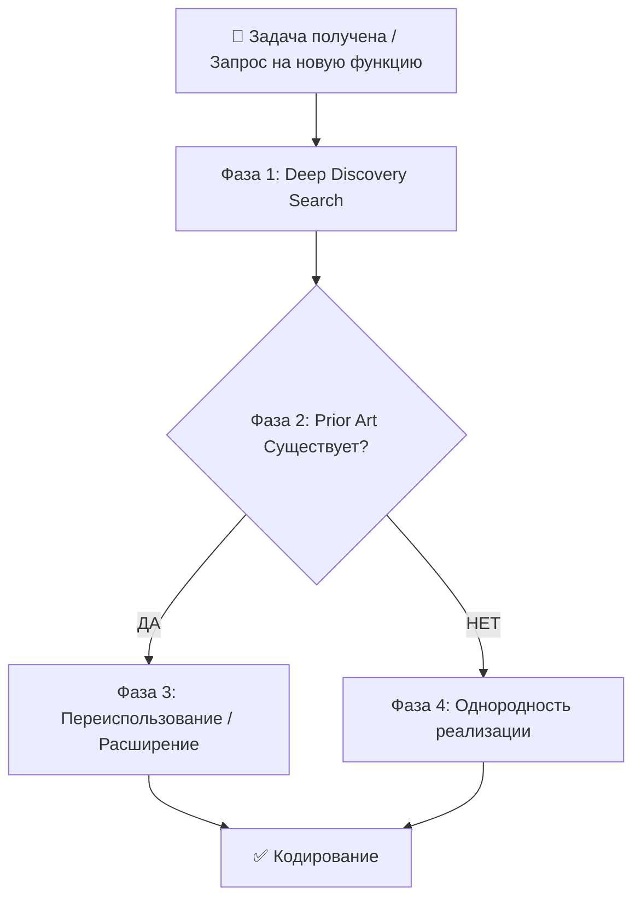

# ♻️ Стандарт переиспользования кода (Zero Divergence Protocol) v1.0

**Статус:** ✅ Production Ready  
**Версия:** 1.0  
**Принцип:** Zero Divergent Implementations  
**Автор:** hypo69  
**Copyright:** © 2026 hypo69

---

## 📋 Содержание
1. [Фундаментальный принцип](#1-фундаментальный-принцип)
2. [4-фазный протокол аудита](#2-4-фазный-протокол-аудита)
3. [Правила и запреты](#3-правила-и-запреты)
4. [Матрица решений](#4-матрица-решений)
5. [Чек-лист перед кодированием](#5-чек-лист-перед-кодированием)

---

## 1. Фундаментальный принцип

> **MANDATORY RULE:**  
> **Перед созданием любой новой функциональности, UI компонента, функции, класса, утилиты или API эндпоинта, AI ассистент MUST выполнить comprehensive prior art audit кодовой базы, чтобы проверить — существует ли уже эта функциональность или эквивалентный pattern.**
>
> **НИКОГДА не создавайте дублирующую или конфликтующую реализацию для функциональности, которая уже имеет существующий pattern или модуль в проекте.**

---

## 2. 4-фазный протокол аудита

Этот протокол **MUST** выполняться в строгом порядке перед любым кодированием:



### Фаза 1: Deep Discovery Search

**Задача:** Найти все существующие реализации похожей функциональности.

#### 1.1 Поиск по имени файла и директориям

Ищите в следующих местах:

```
src/                   ← Основной код
  /ai/                 ← AI провайдеры и интеграции
  /fastapi/            ← API роутеры и эндпоинты
  /.skills/            ← Система умений (skills)
  /rag/                ← Работа с RAG и векторными БД
  /logger/             ← Логирование
  /secrets/            ← Управление секретами
  /tts/                ← Text-to-speech
  /user_manager/       ← Управление пользователями

plugins/               ← Плагины системы
apps/                  ← Готовые приложения

templates/             ← Веб-шаблоны
static/                ← Статические файлы (JS, CSS)
```

**Примеры поиска:**
```bash
# Поиск похожих функций/классов
grep_search "dropdown\|select\|menu" "**/*.py" "**/*.js"

# Поиск похожих компонентов
grep_search "modal\|dialog\|form" "**/*.html"

# Поиск похожих утилит
grep_search "format_date\|parse_time\|convert_" "**/*.py"
```

#### 1.2 Поиск по функциональности (Grep Search)

Ищите ключевые слова и patterns, связанные с задачей:

```python
# Пример 1: Нужен выпадающий список
grep_search("dropdown\|select\|option") → "src/api/webinterface/admin/main.js"

# Пример 2: Нужна обработка табов
grep_search("tab\|tabPane\|nav-tab") → "src/api/webinterface/admin/"

# Пример 3: Нужна работа с БД
grep_search("database\|query\|execute") → "src/fastapi/helpdesk/database.py"
```

#### 1.3 Анализ архитектуры

Прочитайте:
- [`reference/ARCHITECTURE.md`](../reference/ARCHITECTURE.md) — Общая архитектура.
- [`reference/API_REFERENCE.md`](../reference/API_REFERENCE.md) — Все существующие эндпоинты.
- `README.md` в соответствующей директории (если есть).

### Фаза 2: Сравнение и анализ коллизий

**Вопросы, которые нужно задать:**

1. **Функциональное перекрытие на 80%+?**  
   Если существующий модуль решает 80% запроса, переиспользуйте его.

2. **Есть ли установленный API сигнатура, структура данных или pattern?**  
   Если есть — следуйте ему, не изобретайте новый.

3. **Создам ли я две разные способы делать одно и то же?**  
   Если да — это плохой знак. Выберите один способ.

4. **Есть ли эквивалентный компонент в другом модуле?**  
   Например, две разные реализации "выпадающего списка"?

### Фаза 3: Матрица решений

#### Правило A: Прямое переиспользование (Direct Reuse)
Если существующий компонент/функция **уже решает задачу**:

```python
# ❌ ЗАПРЕЩЕНО: Создавать параллельную реализацию
def custom_dropdown():
    # Своя реализация выпадающего списка
    pass

# ✅ ОБЯЗАТЕЛЬНО: Переиспользовать существующую
from src.components import create_dropdown
dropdown = create_dropdown(options=items)
```

#### Правило B: Расширение (Extension)
Если существующий компонент покрывает **часть** требования:

```python
# Существующая функция
def format_date(date: str) -> str:
    return date.strftime("%d.%m.%Y")

# ❌ ЗАПРЕЩЕНО: Дублирование с другим именем
def format_date_russian(date: str) -> str:
    return date.strftime("%d.%m.%Y")

# ✅ ОБЯЗАТЕЛЬНО: Расширить существующую с параметром
def format_date(date: str, locale: str = 'ru') -> str:
    if locale == 'ru':
        return date.strftime("%d.%m.%Y")
    else:
        return date.strftime("%m/%d/%Y")
```

#### Правило C: Однородная реализация (Uniform Creation)
Если **prior art не существует**:
- Следуйте всем архитектурным принципам из [`standards/ENGINEERING.md`](ENGINEERING.md).
- Используйте установленные naming conventions и patterns.
- Создайте в правильной директории.
- Добавьте README.md для модуля.
- Обновите главный индекс.

### Фаза 4: Верификация однородности

Проверьте:
- [ ] Решение не фрагментирует архитектуру.
- [ ] Публичные интерфейсы остаются однородными.
- [ ] Нет избыточных helper функций, когда есть общие в `src/`.
- [ ] Следованы все правила из ENGINEERING.md.

---

## 3. Правила и запреты

### 3.1 Таблица запретов и требований

| Область | ❌ Запрещено (MUST NOT) | ✅ Требуется (MUST) |
|---------|---|---|
| **UI Компоненты** | Создавать новый custom dropdown/modal CSS/JS, когда стандартный существует. | Переиспользовать стандартный шаблон, CSS классы, JS обработчики. |
| **Файловые операции** | Писать raw `open()`, `json.loads()`, `json.dumps()` в бизнес-логике. | Использовать wrappers: `j_loads()`, `j_dumps()`, `read_text_file()`, `save_text_file()`. |
| **AI клиенты** | Прямые вызовы `GoogleGenerativeAI`, `FoundryClient` в разных местах. | Все запросы через `UnifiedChatModel`. |
| **Логирование** | Raw `print()` statements или custom logging mechanisms. | Стандартный logger `src.logger.logger`. |
| **Конфигурация** | Hardcoded port/path/URL константы в коде. | Централизованная конфигурация `config.json` + `.env`. |
| **Работа с БД** | Raw SQL запросы, bypassing DB helpers. | Общие utilities и repository patterns. |
| **Функции** | Создавать две функции, которые делают почти одно и то же. | Одна функция с параметрами. |

### 3.2 Примеры нарушений

**Пример 1: Дублирование функции**
```python
# ❌ ЗАПРЕЩЕНО: Существует на 100%
def upload_file_v1(file, path):
    pass

def upload_file_v2(file, path):  # Новая функция, почти идентична
    pass

# ✅ ОБЯЗАТЕЛЬНО: Одна функция
def upload_file(file, path, version=1):
    pass
```

**Пример 2: Дублирование компонента**
```javascript
// ❌ ЗАПРЕЩЕНО: Два разных "модальных окна"
function createModalDialog() { ... }  // старая
function createModalWindow() { ... }  // новая (почти идентичная)

// ✅ ОБЯЗАТЕЛЬНО: Один компонент
function createModal(options) { ... }
```

**Пример 3: Обход общих утилит**
```python
# ❌ ЗАПРЕЩЕНО: Собственная реализация вместо общей утилиты
import json
with open('config.json') as f:
    config = json.load(f)

# ✅ ОБЯЗАТЕЛЬНО: Использовать общую утилиту
from src.utils import j_loads
config = j_loads('config.json')
```

---

## 4. Матрица решений

### 4.1 Чек-лист принятия решения

**Для КАЖДОГО нового компонента/функции:**

| Шаг | Действие | Результат |
|-----|---------|-----------|
| 1 | Выполнить Deep Discovery поиск | Найти ВСЕ похожие решения |
| 2 | Проанализировать каждое найденное решение | Оценить соответствие |
| 3 | Ответить на 4 вопроса (фаза 2) | Решить: переиспользовать? |
| 4 | Выбрать правило (A, B или C) | Определить действие |
| 5 | Реализовать согласно правилу | Код согласен архитектуре |
| 6 | Обновить индексы и README | Система остаётся актуальной |

### 4.2 Примеры решений

**Сценарий 1: Нужна новая функция для форматирования дат**

```
Фаза 1 → Ищу "format_date", "parse_date" → Нахожу src/utils/date_utils.py
Фаза 2 → Существующая функция делает 100% того, что нужно
Фаза 3 → Правило A: Прямое переиспользование
Фаза 4 → Импортирую и использую существующую функцию
```

**Сценарий 2: Нужен новый UI компонент для фильтра**

```
Фаза 1 → Ищу "filter", "dropdown", "select" → Нахожу стандартные компоненты
Фаза 2 → Существующие делают 90% требований (нужен для фильтра)
Фаза 3 → Правило B: Расширение (добавить режим фильтра)
Фаза 4 → Расширяю существующий компонент новым параметром `mode='filter'`
```

**Сценарий 3: Нужна совершенно новая функциональность (например, новый провайдер AI)**

```
Фаза 1 → Ищу аналогичные провайдеры → Нахожу структуру в src/ai/providers/
Фаза 2 → Prior art не существует (новый провайдер)
Фаза 3 → Правило C: Однородная реализация
Фаза 4 → Создаю новый провайдер, следуя структуре других, с README и документацией
```

---

## 5. Чек-лист перед кодированием

**Перед любым новым кодированием, AI MUST проверить:**

- [ ] **Prior Art Search выполнен:** Использованы `grep_search` и поиск по директориям.
- [ ] **No Divergent Duplication:** Подтверждено, что не создаётся параллельная реализация.
- [ ] **Shared Utilities используются:** Переиспользованы существующие helpers вместо локальных дупликатов.
- [ ] **Uniform Style:** Применены все правила из [`standards/ENGINEERING.md`](ENGINEERING.md).
- [ ] **Architecture не фрагментирована:** Решение согласовано с общей архитектурой.
- [ ] **Documentation готова:** README.md и docstrings подготовлены.

---

## 📌 Краткая запомина

| Ситуация | Действие |
|----------|---------|
| Существует похожий код на 80%+ | Переиспользуйте |
| Существует код на 50-80% | Расширьте существующий |
| Prior art не существует | Создайте новый, следуя стандартам |
| Нашли два способа делать одно | Выберите один, удалите другой |
| Хотите написать "свою версию" | ❌ ЗАПРЕЩЕНО — используйте общую |

---

**Последнее обновление:** сентябрь 2026

---

**Ссылки:**
- [`standards/ENGINEERING.md`](ENGINEERING.md) — Инженерные стандарты разработки
- [`reference/ARCHITECTURE.md`](../reference/ARCHITECTURE.md) — Архитектура системы
