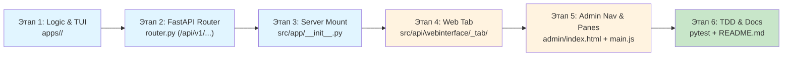

# 🔗 6-этапная интеграция приложений в проект v1.0

**Статус:** ✅ Production Ready  
**Версия:** 1.0  
**Применяется к:** Новые приложения в `apps/` и плагины  
**Автор:** hypo69  
**Copyright:** © 2026 hypo69

---

## 📋 Содержание
1. [Обзор 6-этапного протокола](#1-обзор-6-этапного-протокола)
2. [Этап 1: Реализация приложения](#2-этап-1-реализация-приложения)
3. [Этап 2: FastAPI Router](#3-этап-2-fastapi-router)
4. [Этап 3: Регистрация на сервере](#4-этап-3-регистрация-на-сервере)
5. [Этап 4: Веб-вкладка (Web Tab)](#5-этап-4-веб-вкладка-web-tab)
6. [Этап 5: Интеграция в меню администратора](#6-этап-5-интеграция-в-меню-администратора)
7. [Этап 6: TDD и верификация](#7-этап-6-tdd-и-верификация)

---

## 1. Обзор 6-этапного протокола

Когда создаётся **новое приложение в `apps/<app_name>/`**, оно **MUST** пройти полный протокол интеграции, чтобы:
- Активироваться на общем ресурсе сервера
- Быть доступным в административном веб-интерфейсе
- Следовать единообразной архитектуре проекта



---

## 2. Этап 1: Реализация приложения

### 2.1 Структура директории приложения

```
apps/<app_name>/
├── __main__.py              ← CLI/TUI точка входа
├── config.json              ← Конфигурация приложения (примеры параметров)
├── README.md                ← Документация на английском
└── src/
    ├── __init__.py
    ├── engine.py            ← Основная бизнес-логика
    ├── models.py            ← Структуры данных (Pydantic models)
    ├── utils.py             ← Вспомогательные функции
    └── tui.py               ← Terminal User Interface (если нужен)
```

### 2.2 Файл `__main__.py` (CLI/TUI точка входа)

```python
# -*- coding: utf-8 -*-
# =============================================================================
# Process Name: Application entry point for <app_name>
# =============================================================================
# Description:
#   Command-line interface for <app_name> application.
#   Supports standalone execution outside FastAPI server.
#
# Examples:
#   python -m apps.<app_name>
#   python -m apps.<app_name> --help
#
# File: __main__.py
# Module: apps.<app_name>
# Author: hypo69
# Copyright: © 2026 hypo69
# =============================================================================

import argparse
from src.logger import logger


def main():
    """Main entry point for CLI/TUI execution."""
    parser = argparse.ArgumentParser(description='<App Name> CLI')
    parser.add_argument('--command', type=str, help='Command to execute')
    
    args = parser.parse_args()
    logger.info(f"Running <app_name> with command: {args.command}")
    
    # Your CLI logic here
    pass


if __name__ == '__main__':
    main()
```

### 2.3 Файл `config.json`

```json
{
  "app_name": "<app_name>",
  "version": "1.0.0",
  "description": "Description of what this app does",
  "enabled": true,
  "settings": {
    "parameter_1": "${PARAM_1_ENV_VAR}",
    "parameter_2": "default_value"
  }
}
```

### 2.4 Файл `README.md`

```markdown
# <App Name>

**Description:** What this application does (15-25 words).

## Architecture

Main components:
- `engine.py` — Core business logic
- `models.py` — Data structures
- `utils.py` — Helper functions

## Usage

### Standalone execution

\`\`\`bash
python -m apps.<app_name> --command example
\`\`\`

### API usage (see Этап 2)

\`\`\`python
import requests
response = requests.get('/api/v1/<app_name>/endpoint')
\`\`\`

## Files

- `__main__.py` — CLI entry point
- `src/engine.py` — Main application logic
- `config.json` — Configuration

## Related

- [`../../DOCUMENTATION_INDEX.md`](../../DOCUMENTATION_INDEX.md) — Main index
```

---

## 3. Этап 2: FastAPI Router

### 3.1 Создание `router.py`

Создайте файл `apps/<app_name>/router.py` с FastAPI endpoints:

```python
# -*- coding: utf-8 -*-
# =============================================================================
# Process Name: FastAPI router for <app_name> application
# =============================================================================
# Description:
#   REST API endpoints for <app_name>.
#   Provides HTTP interface to application functionality.
#
# Examples:
#   GET /api/v1/<app_name>/status
#   POST /api/v1/<app_name>/execute
#
# File: router.py
# Module: apps.<app_name>
# Author: hypo69
# Copyright: © 2026 hypo69
# =============================================================================

from fastapi import APIRouter, HTTPException
from pydantic import BaseModel
from src.logger import logger
from .src.engine import AppEngine


router = APIRouter(prefix="/api/v1/<app_name>", tags=["<app_name>"])
engine = AppEngine()


class RequestModel(BaseModel):
    """Request model for <app_name> API."""
    parameter: str


class ResponseModel(BaseModel):
    """Response model for <app_name> API."""
    result: str
    status: bool


@router.get("/status")
async def get_status():
    """Get application status.
    
    Returns:
        dict: Application status and version.
    
    Examples:
        >>> response = requests.get('/api/v1/<app_name>/status')
        >>> print(response.json())
        {'status': 'ok', 'version': '1.0.0'}
    """
    return {
        "status": "ok",
        "version": "1.0.0"
    }


@router.post("/execute")
async def execute(request: RequestModel) -> ResponseModel:
    """Execute application logic.
    
    Args:
        request (RequestModel): Input parameters.
    
    Returns:
        ResponseModel: Result of execution.
    
    Exceptions:
        HTTPException: If execution fails.
    
    Examples:
        >>> payload = {'parameter': 'value'}
        >>> response = requests.post('/api/v1/<app_name>/execute', json=payload)
        >>> print(response.json())
    """
    try:
        result = engine.execute(request.parameter)
        return ResponseModel(result=result, status=True)
    except Exception as e:
        logger.error(f"Execution failed: {e}", exc_info=True)
        raise HTTPException(status_code=500, detail="Execution failed")


def init_router():
    """Initialize and return router.
    
    Returns:
        APIRouter: Configured router for <app_name>.
    """
    return router
```

### 3.2 Требования к роутеру

- ✅ **Функция `init_router()`** — MUST возвращать `APIRouter`.
- ✅ **Префикс `/api/v1/<app_name>`** — MUST следовать этому формату.
- ✅ **Все endpoints документированы** — Docstrings с примерами.
- ✅ **Обработка ошибок** — HTTPException с корректными статус-кодами.
- ✅ **Pydantic models** — Для валидации входных данных.

---

## 4. Этап 3: Регистрация на сервере

### 4.1 Обновление `src/app/__init__.py`

Добавьте роутер в главное FastAPI приложение:

```python
# src/app/__init__.py

from fastapi import FastAPI
from src.logger import logger

# Import routers
from src.fastapi.router_chat import init_router as init_chat_router
from src.fastapi.router_admin import init_router as init_admin_router
# ... другие роутеры ...
from apps.<app_name>.router import init_router as init_<app_name>_router  # ← НОВОЕ


def register_routers(app: FastAPI, state: dict) -> None:
    """Register all API routers with FastAPI application.
    
    Args:
        app (FastAPI): FastAPI application instance.
        state (dict): Application state dictionary.
    """
    # Existing routers
    app.include_router(init_chat_router())
    app.include_router(init_admin_router())
    # ... другие роутеры ...
    
    # NEW router for <app_name>
    try:
        app.include_router(init_<app_name>_router())
        logger.info("✅ <app_name> router registered successfully")
    except Exception as e:
        logger.error(f"Failed to register <app_name> router: {e}", exc_info=True)
```

### 4.2 Проверка регистрации

```bash
# Запустите сервер и проверьте endpoint'ы
curl http://localhost:8000/api/v1/<app_name>/status

# Или через Python
import requests
response = requests.get('http://localhost:8000/api/v1/<app_name>/status')
print(response.json())
```

---

## 5. Этап 4: Веб-вкладка (Web Tab)

### 5.1 Структура веб-вкладки

```
src/api/webinterface/<app_name>_tab/
├── index.html           ← HTML шаблон вкладки
└── main.js              ← JavaScript контроллер
```

### 5.2 Файл `index.html`

```html
<!--
===============================================================================
Process Name: Web interface tab for <app_name> application
===============================================================================
Description:
    UI controls and displays for <app_name> functionality.
    Communicates with backend via /api/v1/<app_name>/ endpoints.

File: index.html
Module: WebInterface
Author: hypo69
Copyright: © 2026 hypo69
===============================================================================
-->

<div id="tab-<app-name>" class="tab-pane fade">
    <div class="container mt-4">
        <h2 data-i18n="<app_name>.title"><App Name></h2>
        
        <div class="card">
            <div class="card-header">
                <h5 data-i18n="<app_name>.controls">Controls</h5>
            </div>
            <div class="card-body">
                <form id="<app_name>-form">
                    <div class="form-group mb-3">
                        <label for="<app_name>-input" data-i18n="<app_name>.input_label">
                            Input Parameter
                        </label>
                        <input 
                            type="text" 
                            class="form-control" 
                            id="<app_name>-input"
                            placeholder="Enter parameter"
                        />
                    </div>
                    
                    <button 
                        type="button" 
                        class="btn btn-primary"
                        onclick="window.execute<AppName>Command()"
                    >
                        Execute
                    </button>
                </form>
            </div>
        </div>
        
        <!-- Results display -->
        <div class="card mt-4" id="<app_name>-results" style="display: none;">
            <div class="card-header">
                <h5 data-i18n="<app_name>.results">Results</h5>
            </div>
            <div class="card-body">
                <pre id="<app_name>-output"></pre>
            </div>
        </div>
    </div>
</div>
```

### 5.3 Файл `main.js`

```javascript
/**
 * =============================================================================
 * Process Name: Web interface controller for <app_name> application
 * =============================================================================
 * Description:
 *   Handles user interactions and API communication for <app_name> tab.
 *   Sends requests to /api/v1/<app_name>/ endpoints.
 *
 * File: main.js
 * Module: WebInterface
 * Author: hypo69
 * Copyright: © 2026 hypo69
 * =============================================================================
 */

/**
 * Initialize <app_name> tab when loaded.
 */
window.init<AppName>Tab = function() {
    console.log('Initializing <app_name> tab...');
    
    // Bind event listeners
    const form = document.getElementById('<app_name>-form');
    if (form) {
        form.addEventListener('submit', (e) => {
            e.preventDefault();
            window.execute<AppName>Command();
        });
    }
};

/**
 * Execute <app_name> command via API.
 */
window.execute<AppName>Command = async function() {
    const input = document.getElementById('<app_name>-input').value;
    
    if (!input) {
        alert('Please enter parameter');
        return;
    }
    
    try {
        const response = await fetch('/api/v1/<app_name>/execute', {
            method: 'POST',
            headers: {
                'Content-Type': 'application/json',
            },
            body: JSON.stringify({ parameter: input })
        });
        
        if (!response.ok) {
            throw new Error(`API error: ${response.status}`);
        }
        
        const data = await response.json();
        
        // Display results
        document.getElementById('<app_name>-output').textContent = 
            JSON.stringify(data, null, 2);
        document.getElementById('<app_name>-results').style.display = 'block';
        
    } catch (error) {
        console.error('Error:', error);
        alert(`Error: ${error.message}`);
    }
};

// Export for module loading
export const init<AppName>Tab = window.init<AppName>Tab;
export const execute<AppName>Command = window.execute<AppName>Command;
```

---

## 6. Этап 5: Интеграция в меню администратора

### 6.1 Обновление `src/api/webinterface/admin/index.html`

```html
<!-- В выпадающем списке вкладок: -->
<div class="dropdown-menu" id="appsTabsDropdown">
    <!-- Existing tabs -->
    <a class="dropdown-item" href="#" data-tab="tab-chat">Chat</a>
    
    <!-- NEW tab for <app_name> -->
    <a class="dropdown-item" href="#" data-tab="tab-<app-name>"><App Name></a>
</div>

<!-- В контейнере вкладок: -->
<div class="tab-content">
    <!-- Existing panes -->
    <div id="tab-chat" class="tab-pane fade"></div>
    
    <!-- NEW pane for <app_name> -->
    <div id="tab-<app-name>" class="tab-pane fade"></div>
</div>
```

### 6.2 Обновление `src/api/webinterface/admin/main.js`

```javascript
// В функции initInterface():
async function initInterface() {
    // Existing tabs
    await loadTabContent('tab-chat', '/api/webinterface/admin/chat_tab/');
    
    // NEW: Load <app_name> tab
    await loadTabContent('tab-<app-name>', '/api/webinterface/<app_name>_tab/');
    
    // Initialize tabs after loading
    initializeTabs();
}

// В функции onTabSwitched():
function onTabSwitched(tabName) {
    console.log(`Switched to tab: ${tabName}`);
    
    // Existing tabs
    if (tabName === 'tab-chat') {
        window.initChatTab?.();
    }
    
    // NEW: Initialize <app_name> tab when switched to
    if (tabName === 'tab-<app-name>') {
        window.init<AppName>Tab?.();
    }
}
```

---

## 7. Этап 6: TDD и верификация

### 7.1 Написание тестов

Создайте `apps/<app_name>/tests/test_engine.py`:

```python
# -*- coding: utf-8 -*-
# Test Suite: <App Name> engine tests
# =============================================================================

import unittest
from ..src.engine import AppEngine


class TestAppEngine(unittest.TestCase):
    """Test suite for AppEngine class."""
    
    def setUp(self):
        """Initialize engine before each test."""
        self.engine = AppEngine()
    
    def test_execute_valid_input_happy_path(self):
        """Test execution with valid parameters."""
        result = self.engine.execute("valid_input")
        assert result is not None, "Engine returned None"
        assert isinstance(result, str), f"Expected str, got {type(result)}"
    
    # ... other tests (6 categories from TDD workflow)
```

### 7.2 Запуск тестов

```bash
# Запустите тесты приложения
pytest apps/<app_name>/tests/ -v

# Проверьте покрытие
pytest apps/<app_name>/tests/ --cov=apps/<app_name>/src --cov-report=term-missing

# Требование: ≥ 70% покрытия
```

### 7.3 Создание документации

- ✅ README.md в `apps/<app_name>/README.md`
- ✅ Docstrings всех функций в `hypo69 docblock` формате
- ✅ Примеры API использования в README

### 7.4 Финальная проверка

```bash
# 1. Запустите сервер
python main.py

# 2. Проверьте API
curl http://localhost:8000/api/v1/<app_name>/status

# 3. Откройте веб-интерфейс
# http://localhost:8000/admin/

# 4. Выберите вкладку <app_name> и протестируйте

# 5. Все тесты должны быть зелёными
pytest apps/<app_name>/tests/ -v
```

---

## ✅ Чек-лист интеграции

- [ ] **Этап 1:** Приложение создано в `apps/<app_name>/` с config.json и README.md
- [ ] **Этап 2:** Router создан и экспортирует `init_router()`
- [ ] **Этап 3:** Router зарегистрирован в `src/app/__init__.py`
- [ ] **Этап 4:** Веб-вкладка создана (`index.html` + `main.js`)
- [ ] **Этап 5:** Вкладка добавлена в админ-меню (`admin/index.html` + `admin/main.js`)
- [ ] **Этап 6:** Тесты написаны и 100% проходят, документация полная
- [ ] API доступен на `/api/v1/<app_name>/status`
- [ ] Веб-интерфейс загружается без ошибок
- [ ] Все docstrings в формате `hypo69 docblock`

---

**Последнее обновление:** сентябрь 2026

**Ссылки:**
- [`standards/ENGINEERING.md`](../standards/ENGINEERING.md) — Инженерные стандарты
- [`workflows/TDD.md`](TDD.md) — TDD workflow
