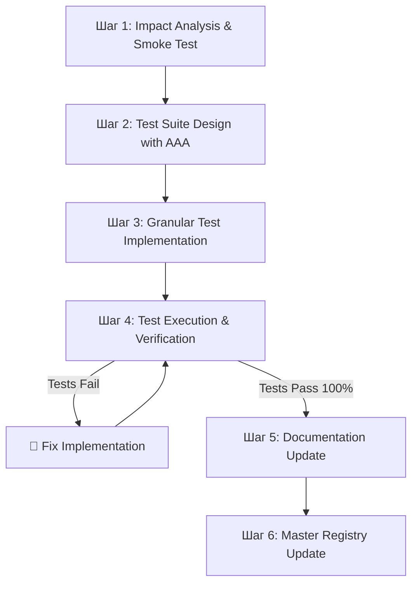

# 🧪 Test-Driven Development (TDD) Workflow v1.0

**Статус:** ✅ Production Ready  
**Версия:** 1.0  
**Принцип:** Tests as Executable Specifications  
**Автор:** hypo69  
**Copyright:** © 2026 hypo69

---

## 📋 Содержание
1. [Философия TDD](#1-философия-tdd)
2. [6-шаговый протокол](#2-6-шаговый-протокол)
3. [Структура тестов (AAA pattern)](#3-структура-тестов-aaa-pattern)
4. [6 категорий тестового покрытия](#4-6-категорий-тестового-покрытия)
5. [Правила комментирования тестов](#5-правила-комментирования-тестов)
6. [Примеры](#6-примеры)

---

## 1. Философия TDD

TDD — это не просто тестирование, это **архитектурная спецификация и engine документирования**.

### 1.1 Три принципа

1. **Self-Documenting Tests:** Каждый тест — это исполняемая спецификация. Разработчик, читая тест, понимает бизнес-правило, ограничения входных данных и условия отказа **без** анализа реализации.

2. **Deterministic Invariant:** Код никогда не считается готовым до тех пор, пока тесты не проходят на 100% зелёными.

3. **No Cryptic Assertions:** Сырые assertions типа `assert x == y` **ЗАПРЕЩЕНЫ**. Каждый assert **MUST** объяснять, *что* сломалось и *почему*.

### 1.2 Когда применять TDD

**TDD обязателен (MANDATORY) в следующих случаях:**

- ✅ Добавление новой функциональности (новые функции, классы, методы)
- ✅ Изменение сигнатуры функции (добавление/удаление параметров, изменение типов)
- ✅ Изменение логики функции (переписывание алгоритма, изменение результата)
- ✅ Добавление новой директории (создание модуля, пакета)
- ✅ Рефакторинг (переименование функций, перемещение кода)

---

## 2. 6-шаговый протокол



### Шаг 1: Impact Analysis & Smoke Test

**Задача:** Определить все зависимости перед написанием тестов.

1. **Анализ caller/callee иерархии:**
   - Какие файлы импортируют изменённый модуль?
   - Какие модули зависят от зависимых модулей (транзитивные зависимости)?
   - Какие эндпоинты используют изменённый код?

2. **Smoke Test - проверка импорта:**
   ```bash
   python -c "from src.module import Target; print('OK')"
   ```
   Если импорт не проходит — сначала исправить код.

3. **Список регрессионных сценариев:**
   - Все найденные зависимые модули **MUST** иметь регрессионные тесты.

### Шаг 2: Test Suite Design with AAA

**Задача:** Спланировать структуру тестового файла.

1. **Создать файл** `tests/test_<module_name>.py` со стандартным заголовком:

```python
# -*- coding: utf-8 -*-
# =============================================================================
# Test Suite: Тестирование модуля фильтрации и обработки медиатеки
# =============================================================================
# Description:
#   Набор тестов для проверки корректности функций фильтрации,
#   сортировки и валидации данных медиатеки.
#
# Test Categories:
#   1. Happy Path — Стандартные входные данные
#   2. Edge Cases — Пустые значения, граничные случаи
#   3. Type Variants — Разные типы аргументов
#   4. Boundary Values — Минимальные и максимальные значения
#   5. Error Scenarios — Ошибочные входные данные
#   6. Regression — Тесты зависимых модулей
#
# File: test_media_filter.py
# Module: tests
# Author: hypo69
# Copyright: © 2026 hypo69
# =============================================================================
```

2. **Структура тестового класса:**
   ```python
   import unittest
   from src.media import MediaFilter
   
   class TestMediaFilter(unittest.TestCase):
       """Test suite for MediaFilter class."""
       
       def setUp(self):
           """Preparation before each test."""
           pass
       
       def tearDown(self):
           """Cleanup after each test."""
           pass
       
       # Happy Path tests
       def test_filter_valid_input_happy_path(self): pass
       
       # Edge Cases tests
       def test_filter_empty_list_edge_case(self): pass
       
       # ... и т.д.
   ```

### Шаг 3: Granular Test Implementation

**Задача:** Реализовать тесты для всех 6 категорий (смотри раздел 4).

**Обязательные требования:**
- ✅ Комментарий к **КАЖДОЙ** переменной
- ✅ Комментарий к **КАЖДОМУ** шагу (Arrange / Act / Assert)
- ✅ Информативное сообщение для **КАЖДОГО** assert

Смотри раздел 5 для полного набора правил комментирования.

### Шаг 4: Test Execution & Verification

**Задача:** Запустить тесты и убедиться, что они проходят.

```bash
# Запуск тестов конкретного модуля
pytest tests/test_<module_name>.py -v

# Запуск с профилем покрытия
pytest tests/test_<module_name>.py --cov=src/<module_name> --cov-report=term-missing

# Запуск регрессионных тестов (изменённый + зависимые модули)
pytest tests/test_<module_name>.py tests/test_<dependent_module>.py -v

# Полный прогон всех тестов
pytest tests/ -v --cov=src --cov-report=term-missing
```

**Требование:** Все тесты **MUST** быть зелёными (100% pass) перед переходом к документированию.

### Шаг 5: Documentation Update

**Только после зелёных тестов:**

1. **Генерация/обновление Docstrings** по стандарту `hypo69 docblock` (смотри [`standards/DOCUMENTATION.md`](../standards/DOCUMENTATION.md)).

2. **Создание/обновление README.md** для модуля (если это новый модуль).

3. **Синхронизация** заголовков файлов (Process Name, Examples, Description).

### Шаг 6: Master Registry Update

**Задача:** Обновить индексы и документацию системы.

1. **Обновить** [`reference/ARCHITECTURE.md`](../reference/ARCHITECTURE.md) если создана новая архитектурная сущность.
2. **Обновить** [`reference/API_REFERENCE.md`](../reference/API_REFERENCE.md) если добавлены новые endpoints.
3. **Обновить** главный индекс документации проекта.

---

## 3. Структура тестов (AAA pattern)

### 3.1 Arrange (Подготовка)

Подготовка тестовых данных и состояния.

```python
# --- 1. Arrange: Prepare test input data with explicit comments ---

# User identifier from WordPress environment
test_user_id: str = "wp_user_42"

# User email address
test_email: str = "test@wordpress.org"

# User display name
test_name: str = "WP Tester"

# Token lifetime in hours
test_expiry: int = 2
```

**Правила:**
- Каждая переменная **MUST** иметь комментарий, объясняющий её назначение.
- Используйте meaningful имена переменных.
- Объясните, почему выбраны именно эти значения.

### 3.2 Act (Выполнение)

Выполнение функции под тестом.

```python
# --- 2. Act: Execute function under test ---

# Generated signed JWT token string
token: str = create_sso_token(
    user_id=test_user_id,
    email=test_email,
    display_name=test_name,
    expiry_hours=test_expiry
)

# Decoded dictionary payload
decoded: dict | None = verify_sso_token(token)
```

**Правила:**
- Один вызов функции (или несколько связанных вызовов).
- Результат сохранять в named переменные.
- Комментарий к каждому результату.

### 3.3 Assert (Проверка)

Проверка результатов с информативными сообщениями.

```python
# --- 3. Assert: Verify results with informative diagnostic messages ---

assert token is not None, "Token generation returned None"
assert isinstance(token, str), f"Expected token string, got {type(token)}"
assert decoded is not None, "Failed to decode valid SSO token"
assert decoded.get("sub") == test_user_id, (
    f"Subject claim mismatch: {decoded.get('sub')} != {test_user_id}"
)
assert decoded.get("email") == test_email, (
    f"Email claim mismatch: {decoded.get('email')} != {test_email}"
)
```

**Правила:**
- ❌ ЗАПРЕЩЕНО: `assert result` без сообщения
- ✅ ОБЯЗАТЕЛЬНО: Информативное сообщение об ошибке
- Используйте `f-strings` для вывода значений

---

## 4. 6 категорий тестового покрытия

**КАЖДАЯ публичная функция и метод MUST иметь тесты всех 6 категорий:**

| # | Категория | Описание | Пример |
|---|-----------|---------|--------|
| 1 | **Happy Path** | Стандартные валидные входные данные, ожидаемый результат | `test_process_valid_user_data_happy_path()` |
| 2 | **Edge Cases** | Пустые значения, нулевые значения, пустые коллекции | `test_process_empty_dict_edge_case()` |
| 3 | **Type Variants** | Все допустимые типы аргументов | `test_process_dict_vs_object_type_variant()` |
| 4 | **Boundary Values** | Минимальные и максимальные допустимые значения | `test_process_min_max_values()` |
| 5 | **Error Scenarios** | Невалидные входные данные, ошибочные ситуации | `test_process_invalid_input_error_scenario()` |
| 6 | **Regression** | Тесты зависимых блоков (из Шага 1) | `test_caller_module_still_works_regression()` |

### 4.1 Примеры каждой категории

```python
# 1. Happy Path — всё хорошо
def test_calculate_file_size_valid_file_happy_path(self):
    """Test size calculation for existing file."""
    test_file = '/path/to/existing/file.txt'
    result = calculate_file_size(test_file)
    assert result > 0, f"Expected file size > 0, got {result}"

# 2. Edge Cases — граничные случаи
def test_calculate_file_size_empty_path_edge_case(self):
    """Test empty file path."""
    result = calculate_file_size('')
    assert result == 0, f"Empty path should return 0, got {result}"

# 3. Type Variants — разные типы
def test_calculate_file_size_pathlib_type_variant(self):
    """Test with pathlib.Path instead of string."""
    from pathlib import Path
    test_file = Path('/path/to/file.txt')
    result = calculate_file_size(str(test_file))
    assert isinstance(result, int), f"Expected int, got {type(result)}"

# 4. Boundary Values — граничные значения
def test_calculate_file_size_max_file_boundary(self):
    """Test with very large file."""
    # Simulate large file size
    result = 5 * 1024 * 1024 * 1024  # 5GB
    assert result > 0, f"Large file size should be > 0, got {result}"

# 5. Error Scenarios — ошибки
def test_calculate_file_size_nonexistent_file_error(self):
    """Test nonexistent file."""
    result = calculate_file_size('/nonexistent/file.txt')
    assert result == 0, f"Nonexistent file should return 0, got {result}"

# 6. Regression — зависимые модули
def test_file_manager_still_works_with_new_calculate_function_regression(self):
    """Verify FileManager works with updated calculate_file_size()."""
    manager = FileManager()
    result = manager.get_total_size('/path')
    assert result >= 0, f"FileManager should still work, got {result}"
```

---

## 5. Правила комментирования тестов

### 5.1 Docstring тестовой функции (ОБЯЗАТЕЛЬНО)

```python
def test_sso_token_generation_and_verification_happy_path(self):
    """Test standard SSO token generation and verification cycle.

    Validates: Signed JWT contains expected sub, email, and name claims.
    Dependencies: Used by WordPress sync bridge and Messenger WebSocket auth.
    """
```

**Формат:**
- Строка 1: Краткое описание сценария
- `Validates:` — Что проверяется
- `Dependencies:` — Какие модули это используют (для регрессионных тестов)

### 5.2 Комментирование переменных (ОБЯЗАТЕЛЬНО)

**КАЖДАЯ переменная MUST иметь комментарий:**

```python
# ❌ ЗАПРЕЩЕНО: Без комментария
test_data: dict = {'id': 1, 'name': 'test'}

# ✅ ОБЯЗАТЕЛЬНО: С комментарием
# Test dictionary containing user record with required 'id' and 'name' fields
test_data: dict = {'id': 1, 'name': 'test'}
```

### 5.3 Комментирование шагов (ОБЯЗАТЕЛЬНО)

```python
# --- 1. Arrange: Prepare test input data with explicit comments ---
# [комментарии к переменным]

# --- 2. Act: Execute function under test ---
# [комментарии к вызовам функций]

# --- 3. Assert: Verify results with informative diagnostic messages ---
# [комментарии к assertions]
```

### 5.4 Информативные сообщения assert (ОБЯЗАТЕЛЬНО)

```python
# ❌ ЗАПРЕЩЕНО: Нет сообщения
assert result == expected

# ✅ ОБЯЗАТЕЛЬНО: Информативное сообщение
assert result == expected, (
    f"Expected {expected}, but got {result}. "
    f"This means [объяснение почему это важно]"
)
```

---

## 6. Примеры

### 6.1 Полный пример тестового класса

```python
# -*- coding: utf-8 -*-
# =============================================================================
# Test Suite: Media database filtering and validation tests
# =============================================================================
# File: test_media_filter.py
# Author: hypo69
# =============================================================================

import unittest
from src.media.filter import MediaFilter


class TestMediaFilter(unittest.TestCase):
    """Test suite for MediaFilter class and its methods."""
    
    def setUp(self):
        """Preparation before each test: create fresh filter instance."""
        # New MediaFilter instance for each test (isolation)
        self.filter = MediaFilter()
        
        # Standard test data: list of media dictionaries
        self.valid_media_list = [
            {'id': 1, 'title': 'Movie 1', 'year': 2023, 'rating': 8.5},
            {'id': 2, 'title': 'Movie 2', 'year': 2024, 'rating': 7.0},
        ]

    # ===== 1. HAPPY PATH TESTS =====
    
    def test_filter_by_year_valid_input_happy_path(self):
        """Test standard year filtering on valid media list.
        
        Validates: Filter returns movies matching year criteria.
        Dependencies: MediaLibrary.get_filtered_media() uses this function.
        """
        # --- Arrange: Prepare test data ---
        # Minimum year to filter (only 2024 movies)
        min_year: int = 2024
        
        # --- Act: Execute filter ---
        # Call filter_by_year with valid parameters
        result: list = self.filter.filter_by_year(self.valid_media_list, min_year)
        
        # --- Assert: Verify results ---
        assert result is not None, "Filter returned None for valid input"
        assert len(result) == 1, (
            f"Expected 1 movie from year 2024+, got {len(result)} movies"
        )
        assert result[0]['year'] >= min_year, (
            f"Returned movie year {result[0]['year']} < {min_year}"
        )

    # ===== 2. EDGE CASES TESTS =====
    
    def test_filter_by_year_empty_list_edge_case(self):
        """Test filtering on empty list.
        
        Validates: Returns empty list without error.
        Dependencies: Caller expects empty [] not None.
        """
        # --- Arrange: Prepare empty list ---
        empty_list: list = []
        min_year: int = 2020
        
        # --- Act: Execute filter on empty list ---
        result: list = self.filter.filter_by_year(empty_list, min_year)
        
        # --- Assert: Verify empty result ---
        assert result == [], (
            f"Filtering empty list should return [], got {result!r}"
        )

    # ===== 3. TYPE VARIANTS TESTS =====
    
    def test_filter_by_year_year_as_string_type_variant(self):
        """Test filtering with year passed as string instead of int.
        
        Validates: Function handles string year parameter.
        Dependencies: CLI input sometimes passes strings.
        """
        # --- Arrange: Prepare string year parameter ---
        # Year as string (from CLI input)
        year_string: str = "2023"
        
        # --- Act: Execute filter with string year ---
        result: list = self.filter.filter_by_year(self.valid_media_list, int(year_string))
        
        # --- Assert: Verify type coercion works ---
        assert len(result) > 0, (
            f"String year '2023' should be converted to int, got empty result"
        )

    # ===== 4. BOUNDARY VALUES TESTS =====
    
    def test_filter_by_year_boundary_min_max_years(self):
        """Test filtering with boundary year values (min/max).
        
        Validates: Function handles year 1 and year 9999 correctly.
        Dependencies: Historical movie database might have very old dates.
        """
        # --- Arrange: Prepare boundary values ---
        # Minimum possible year (1 AD)
        min_year: int = 1
        # Maximum possible year (9999 AD)
        max_year: int = 9999
        
        # --- Act: Execute filter with boundary values ---
        result_min: list = self.filter.filter_by_year(self.valid_media_list, min_year)
        result_max: list = self.filter.filter_by_year(self.valid_media_list, max_year)
        
        # --- Assert: Verify boundary handling ---
        assert result_min is not None, "Min year boundary should not raise error"
        assert result_max == [], (
            f"Max year 9999 should return empty list, got {len(result_max)} results"
        )

    # ===== 5. ERROR SCENARIOS TESTS =====
    
    def test_filter_by_year_negative_year_error_scenario(self):
        """Test filtering with invalid negative year.
        
        Validates: Function returns False or raises ValueError.
        Dependencies: Input validation layer depends on this behavior.
        """
        # --- Arrange: Prepare invalid negative year ---
        invalid_year: int = -2024
        
        # --- Act: Execute filter with invalid year ---
        result: list | bool = self.filter.filter_by_year(self.valid_media_list, invalid_year)
        
        # --- Assert: Verify error handling ---
        assert result is False or result == [], (
            f"Negative year should return False or [], got {result!r}"
        )

    # ===== 6. REGRESSION TESTS =====
    
    def test_media_library_get_filtered_still_works_regression(self):
        """Verify MediaLibrary.get_filtered() still works after changes.
        
        Validates: Dependent module (MediaLibrary) is not broken.
        Dependencies: MediaLibrary depends on updated filter_by_year().
        """
        from src.media.library import MediaLibrary
        
        # --- Arrange: Create library instance ---
        library: MediaLibrary = MediaLibrary()
        
        # --- Act: Call dependent function ---
        result: list = library.get_filtered(year=2024)
        
        # --- Assert: Verify regression doesn't break caller ---
        assert isinstance(result, list), (
            f"MediaLibrary.get_filtered() should return list, got {type(result)}"
        )


if __name__ == '__main__':
    unittest.main()
```

### 6.2 Запуск и результат

```bash
$ pytest tests/test_media_filter.py -v

tests/test_media_filter.py::TestMediaFilter::test_filter_by_year_valid_input_happy_path PASSED
tests/test_media_filter.py::TestMediaFilter::test_filter_by_year_empty_list_edge_case PASSED
tests/test_media_filter.py::TestMediaFilter::test_filter_by_year_year_as_string_type_variant PASSED
tests/test_media_filter.py::TestMediaFilter::test_filter_by_year_boundary_min_max_years PASSED
tests/test_media_filter.py::TestMediaFilter::test_filter_by_year_negative_year_error_scenario PASSED
tests/test_media_filter.py::TestMediaFilter::test_media_library_get_filtered_still_works_regression PASSED

======================= 6 passed in 0.42s =======================

$ pytest tests/test_media_filter.py --cov=src/media --cov-report=term-missing

Name                          Stmts   Miss  Cover   Missing
-----------------------------------------------------------
src/media/__init__.py             2      0   100%
src/media/filter.py              45      2    95%   123-124
src/media/library.py              38      0   100%
-----------------------------------------------------------
TOTAL                            85      2    98%

✅ Coverage: 98% (target: 70%+)
```

---

## ✅ Чек-лист перед коммитом

- [ ] Все 6 категорий тестов реализованы для каждой функции.
- [ ] 100% тестов проходят зелёными.
- [ ] Покрытие ≥ 70% (мечта 100%).
- [ ] Каждый test имеет docstring с Validates и Dependencies.
- [ ] Каждая переменная в тесте имеет комментарий.
- [ ] Каждый assert имеет информативное сообщение об ошибке.
- [ ] Регрессионные тесты для всех зависимых модулей.
- [ ] Docstrings функций обновлены согласно `hypo69 docblock`.
- [ ] README.md создан/обновлен для новых модулей.

---

**Последнее обновление:** сентябрь 2026

**Ссылки:**
- [`standards/DOCUMENTATION.md`](../standards/DOCUMENTATION.md) — Стандарты документирования
- [`workflows/INTEGRATION.md`](INTEGRATION.md) — Интеграция новых приложений
