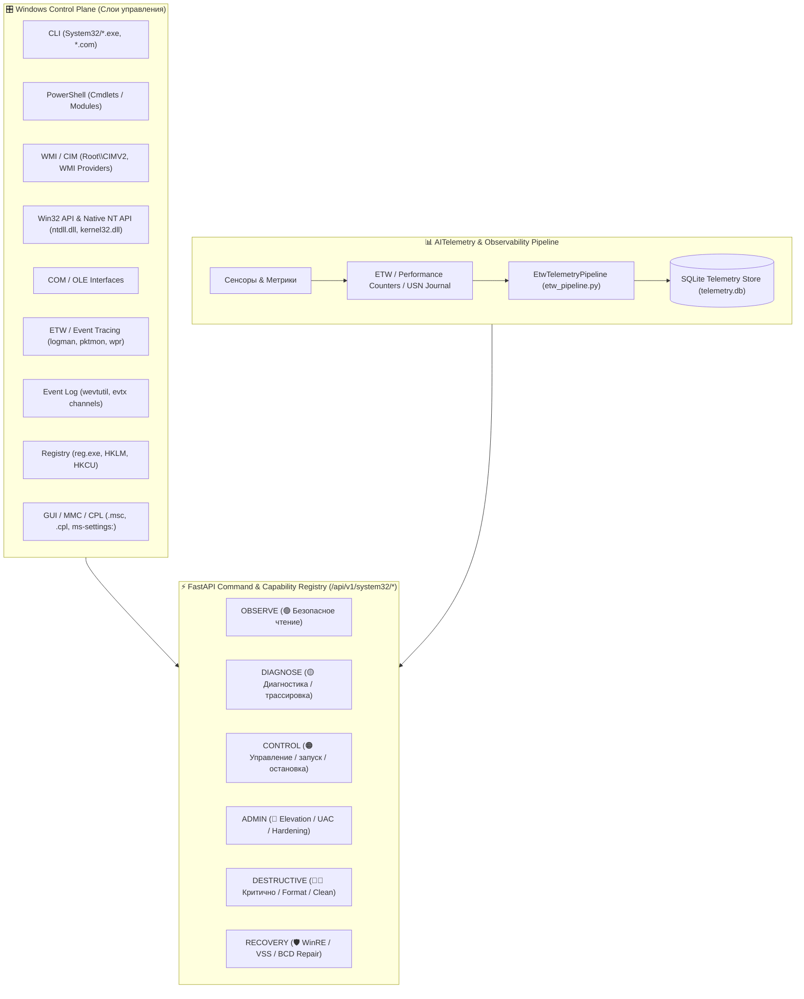

# 🛠️ Каталог штатных системных средств Windows 10/11 (%SystemRoot%\System32)
## Windows Control Plane, Command Registry, Telemetry Tiers & Machine-Readable Catalog

---

## 📋 Обзор архитектуры

Каталог **`System32 Capabilities Catalog`** представляет собой структурированную базу данных штатных средств Windows 10/11, охватывающую **66 функциональных категорий**, слои **Windows Control Plane**, градации **AITelemetry Tiers** и матрицу эквивалентов (CLI, PowerShell, WMI/CIM, Win32 API, Native NT API, COM, ETW, Event Log, Registry, GUI/MMC/CPL).



---

## 🎯 Градации AITelemetry Tiers

Для каждого системного инструмента и подкоманды в реестре назначен соответствующий **Tier безопасности и назначения**:

| Tier | Цвет | Назначение | Примеры инструментов и операций |
|---|---|---|---|
| **`OBSERVE`** | 🟢 | Безопасное чтение телеметрии, инвентаризация, аудит | `systeminfo`, `tasklist`, `netstat`, `fsutil usn queryjournal`, `logman query`, `wevtutil qe`, `whoami /all`, `getmac`, `where` |
| **`DIAGNOSE`** | 🟡 | Диагностика сетевого стека, задержек, сбоев DLL и трассировка | `ping`, `tracert`, `pathping`, `pktmon start --etw`, `sxstrace`, `winsat`, `verifier` |
| **`CONTROL`** | 🟠 | Управление жизненным циклом служб, заданиями, переменными | `sc start/stop`, `schtasks /run`, `tzutil /s`, `logoff`, `attrib`, `robocopy` |
| **`ADMIN`** | 🔴 | Изменение конфигурации системы, брандмауэра, политик, прав | `reg add`, `sc config`, `netsh advfirewall`, `auditpol /set`, `dism /RestoreHealth`, `shutdown`, `icacls`, `takeown`, `secedit` |
| **`DESTRUCTIVE`** | 🔴🔴 | Потенциально деструктивные операции с риском потери данных | `diskpart clean/format`, `format.com`, `bcdedit /delete`, `cipher /w`, `del /s /q` |
| **`RECOVERY`** | 🛡️ | Восстановление среды загрузки, целостности образов и VSS бэкапы | `reagentc /enable`, `bcdboot`, `bootrec`, `wbadmin`, `vssadmin`, `sfc /scannow`, `refsutil salvage`, `repair-bde` |

---

## 📑 66 Системных категорий Windows 10/11

1. **`01. SHELLS & COMMAND EXECUTION`**: `cmd.exe`, `powershell.exe`, `pwsh.exe`, `wscript.exe`, `cscript.exe`, `mshta.exe`, `rundll32.exe`, `regsvr32.exe`, `mmc.exe`, `start.exe`, `runas.exe`, `where.exe`, `wt.exe`.
2. **`02. FILES & DIRECTORIES`**: `attrib.exe`, `cacls.exe`, `compact.exe`, `copy`, `del`, `dir`, `erase`, `expand.exe`, `fc.exe`, `find.exe`, `findstr.exe`, `icacls.exe`, `makecab.exe`, `mkdir`, `mklink`, `more.com`, `move`, `robocopy.exe`, `rmdir`, `takeown.exe`, `tree.com`, `type`, `xcopy.exe`.
3. **`03. STORAGE / DISKS`**: `diskpart.exe`, `diskperf.exe`, `diskraid.exe`, `diskshadow.exe`, `chkdsk.exe`, `chkntfs.exe`, `defrag.exe`, `format.com`, `fsutil.exe`, `mount.exe`, `mountvol.exe`, `subst.exe`, `vol`, `label.exe`, `recover.exe`, `refsutil.exe`, `vssadmin.exe`, `wbadmin.exe`.
4. **`04. VIRTUAL DISKS / VHD / VHDX`**: `diskpart.exe` (attach/detach/compact/expand vdisk), `diskshadow.exe`, `mountvol.exe`, `fsutil.exe`.
5. **`05. BITLOCKER / ENCRYPTION`**: `manage-bde.exe`, `repair-bde.exe`, `bdehdcfg.exe`, `cipher.exe`, `certutil.exe`.
6. **`06. VOLUME SHADOW COPY / BACKUP`**: `vssadmin.exe`, `diskshadow.exe`, `wbadmin.exe`, `robocopy.exe`, `reagentc.exe`.
7. **`07. PROCESSES`**: `tasklist.exe`, `taskkill.exe`, `qprocess.exe`, `query.exe`, `tskill.exe`, `openfiles.exe`, `driverquery.exe`.
8. **`08. SERVICES`**: `sc.exe`, `net.exe`, `net1.exe`, `services.msc`.
9. **`09. SCHEDULED TASKS`**: `schtasks.exe`, `taskschd.msc`.
10. **`10. REGISTRY`**: `reg.exe`, `regedit.exe`, `regini.exe`, `regsvr32.exe`.
11. **`11. ENVIRONMENT / SYSTEM VARIABLES`**: `set`, `setx.exe`, `path`, `subst.exe`, `reg.exe`.
12. **`12. USERS / GROUPS / SESSIONS`**: `whoami.exe`, `runas.exe`, `net.exe`, `quser.exe`, `qwinsta.exe`, `query.exe`, `logoff.exe`, `tscon.exe`, `tsdiscon.exe`, `rwinsta.exe`, `msg.exe`.
13. **`13. SECURITY / ACCESS CONTROL`**: `auditpol.exe`, `secedit.exe`, `icacls.exe`, `takeown.exe`, `cipher.exe`, `certutil.exe`, `cmdkey.exe`, `klist.exe`, `ksetup.exe`, `setspn.exe`, `whoami.exe`.
14. **`14. GROUP POLICY`**: `gpupdate.exe`, `gpresult.exe`, `gpfixup.exe`, `dcgpofix.exe`, `secedit.exe`.
15. **`15. EVENT LOG`**: `wevtutil.exe`, `eventcreate.exe`, `wecutil.exe`.
16. **`16. ETW / PERFORMANCE / TRACING`**: `logman.exe`, `tracerpt.exe`, `typeperf.exe`, `relog.exe`, `perfmon.exe`, `lodctr.exe`, `unlodctr.exe`, `diskperf.exe`, `wpr.exe`, `wpa.exe`, `xperf.exe`.
17. **`17. NETWORK — BASIC`**: `ipconfig.exe`, `netstat.exe`, `ping.exe`, `tracert.exe`, `pathping.exe`, `route.exe`, `arp.exe`, `getmac.exe`, `hostname.exe`, `nbtstat.exe`, `nslookup.exe`, `netsh.exe`.
18. **`18. NETWORK — NETSH`**: Контексты `netsh.exe`: `advfirewall`, `branchcache`, `bridge`, `dhcpclient`, `dnsclient`, `http`, `interface`, `ipsec`, `lan`, `mbn`, `namespace`, `netio`, `nlm`, `ras`, `rpc`, `trace`, `wcn`, `wfp`, `winhttp`, `winsock`, `wlan`.
19. **`19. NETWORK DIAGNOSTICS`**: `pktmon.exe`, `netstat.exe`, `pathping.exe`, `tracert.exe`, `ping.exe`, `nslookup.exe`, `netsh.exe`, `ipconfig.exe`.
20. **`20. FIREWALL`**: `netsh.exe advfirewall`, `wf.msc`.
21. **`21. DNS`**: `nslookup.exe`, `ipconfig.exe /flushdns`, `netsh.exe dnsclient`, `dnscmd.exe`.
22. **`22. TCP/IP / ROUTING`**: `ipconfig.exe`, `netstat.exe -r`, `route.exe`, `arp.exe`, `netsh.exe interface ip`, `getmac.exe`.
23. **`23. WI-FI`**: `netsh.exe wlan`.
24. **`24. SMB / FILE SHARING`**: `net.exe share`, `net1.exe`, `openfiles.exe`, `fsmgmt.msc`, `showmount.exe`.
25. **`25. REMOTE MANAGEMENT`**: `winrs.exe`, `mstsc.exe`, `qwinsta.exe`, `quser.exe`, `tscon.exe`, `tsdiscon.exe`, `msg.exe`, `winrm`.
26. **`26. RDP`**: `mstsc.exe`, `rdpsign.exe`, `tscon.exe`, `tsdiscon.exe`, `qwinsta.exe`, `quser.exe`.
27. **`27. WINDOWS INSTALLER`**: `msiexec.exe`.
28. **`28. WINDOWS COMPONENTS / SERVICING`**: `dism.exe`, `sfc.exe`, `reagentc.exe`, `dismhost.exe`, `pkgmgr.exe`.
29. **`29. WINDOWS FEATURES`**: `dism.exe /Online /Get-Features`, `optionalfeatures.exe`, `servermanagercmd.exe`.
30. **`30. BOOT`**: `bcdedit.exe`, `bcdboot.exe`, `bootsect.exe`, `bootrec.exe`, `reagentc.exe`, `msconfig.exe`.
31. **`31. SYSTEM RECOVERY`**: `reagentc.exe`, `wbadmin.exe`, `vssadmin.exe`, `diskshadow.exe`, `bcdedit.exe`, `sfc.exe`.
32. **`32. DRIVERS`**: `driverquery.exe`, `pnputil.exe`, `verifier.exe`, `sc.exe`, `fltmc.exe`, `dism.exe`.
33. **`33. DEVICE / PNP`**: `pnputil.exe`, `pnpunattend.exe`, `devmgmt.msc`, `msinfo32.exe`.
34. **`34. DRIVER VERIFIER`**: `verifier.exe`.
35. **`35. SYSTEM INFORMATION`**: `systeminfo.exe`, `msinfo32.exe`, `winver.exe`, `hostname.exe`, `ver`, `set`.
36. **`36. HARDWARE / PERFORMANCE`**: `perfmon.exe`, `typeperf.exe`, `winsat.exe`, `msinfo32.exe`, `systeminfo.exe`, `diskperf.exe`, `driverquery.exe`.
37. **`37. WINDOWS EXPERIENCE / BENCHMARK`**: `winsat.exe`.
38. **`38. TIME / LOCALE`**: `time`, `date`, `tzutil.exe`.
39. **`39. CERTIFICATES / PKI`**: `certutil.exe`, `certreq.exe`, `certmgr.msc`.
40. **`40. CREDENTIALS`**: `cmdkey.exe`, `klist.exe`, `ksetup.exe`, `runas.exe`.
41. **`41. TPM`**: `tpmtool.exe`, `tpmvscmgr.exe`.
42. **`42. PRINTING`**: `print.exe`, `prnjobs.vbs`, `prnmngr.vbs`, `prndrvr.vbs`, `prnport.vbs`, `prncnfg.vbs`, `printmanagement.msc`.
43. **`43. COM / DLL REGISTRATION`**: `regsvr32.exe`, `rundll32.exe`, `oleview.exe`.
44. **`44. WINDOWS SCRIPT HOST`**: `wscript.exe`, `cscript.exe`, `scrcons.exe`, `jscript.dll`, `vbscript.dll`.
45. **`45. MS-DOS / CMD BUILTINS`**: `assoc`, `call`, `cd`, `chcp`, `chdir`, `cls`, `color`, `copy`, `date`, `del`, `dir`, `echo`, `endlocal`, `exit`, `for`, `goto`, `if`, `md`, `mkdir`, `move`, `path`, `pause`, `popd`, `prompt`, `pushd`, `rd`, `ren`, `rename`, `rmdir`, `set`, `shift`, `start`, `subst`, `time`, `title`, `type`, `ver`, `verify`, `vol`, `where`.
46. **`46. TEXT / DATA PROCESSING`**: `find.exe`, `findstr.exe`, `sort.exe`, `more.com`, `fc.exe`, `clip.exe`, `type.exe`.
47. **`47. ARCHIVING / PACKAGING`**: `makecab.exe`, `expand.exe`, `extrac32.exe`, `compact.exe`.
48. **`48. NETWORK TRANSFER`**: `ftp.exe`, `tftp.exe`, `bitsadmin.exe`, `robocopy.exe`.
49. **`49. BITS`**: `bitsadmin.exe`.
50. **`50. EVENT TRACING / DIAGNOSTICS`**: `logman.exe`, `tracerpt.exe`, `typeperf.exe`, `relog.exe`, `wevtutil.exe`, `pktmon.exe`, `netsh.exe trace`, `sxstrace.exe`, `dtrace.exe`.
51. **`51. WINDOWS ERROR REPORTING`**: `werfault.exe`, `werfaultsecure.exe`, `wermgr.exe`.
52. **`52. SIDE-BY-SIDE / APPLICATION DIAGNOSTICS`**: `sxstrace.exe`.
53. **`53. WINDOWS MANAGEMENT`**: `winmgmt.exe`, `wmiprvse.exe`, `mofcomp.exe`, `wbemtest.exe`.
54. **`54. WMI / CIM`**: `winmgmt.exe`, `mofcomp.exe`, `wbem`, `wmic.exe`.
55. **`55. WINDOWS UPDATE / SERVICING`**: `dism.exe`, `usoclient.exe`, `wuauclt.exe`, `bitsadmin.exe`, `net.exe start wuauserv`.
56. **`56. WINDOWS DEFENDER / SECURITY`**: `MpCmdRun.exe`, `netsh.exe advfirewall`, `auditpol.exe`, `wevtutil.exe`, `secedit.exe`.
57. **`57. WINDOWS FIREWALL / WFP`**: `netsh.exe advfirewall`, `wf.msc`, `pktmon.exe`.
58. **`58. FILE SYSTEM SECURITY`**: `icacls.exe`, `takeown.exe`, `cipher.exe`, `fsutil.exe`, `compact.exe`.
59. **`59. FILE SYSTEM JOURNAL / USN`**: `fsutil.exe usn` (`queryjournal`, `createjournal`, `deletejournal`, `readjournal`).
60. **`60. VOLUME MANAGEMENT`**: `diskpart.exe`, `mountvol.exe`, `fsutil.exe volume`, `vol`, `label.exe`, `defrag.exe`.
61. **`61. WINDOWS RECOVERY ENVIRONMENT`**: `reagentc.exe`, `bcdedit.exe`, `bcdboot.exe`, `bootrec.exe`, `diskpart.exe`, `sfc.exe`.
62. **`62. BACKUP / RESTORE`**: `wbadmin.exe`, `vssadmin.exe`, `diskshadow.exe`, `robocopy.exe`.
63. **`63. SYSTEM CONFIGURATION`**: `msconfig.exe`, `control.exe`, `ms-settings:`, `systempropertiesadvanced.exe`.
64. **`64. CONTROL PANEL`**: `appwiz.cpl`, `firewall.cpl`, `hdwwiz.cpl`, `ncpa.cpl`, `powercfg.cpl`, `sysdm.cpl`, `timedate.cpl`, `main.cpl`, `mmsys.cpl`, `desk.cpl`.
65. **`65. MMC MANAGEMENT CONSOLES`**: `mmc.exe`, `compmgmt.msc`, `devmgmt.msc`, `diskmgmt.msc`, `eventvwr.msc`, `fsmgmt.msc`, `gpedit.msc`, `lusrmgr.msc`, `perfmon.msc`, `printmanagement.msc`, `services.msc`, `taskschd.msc`, `wf.msc`, `certmgr.msc`, `wmimgmt.msc`.
66. **`66. SHUTDOWN / SESSION CONTROL`**: `shutdown.exe`, `logoff.exe`, `tsdiscon.exe`, `rwinsta.exe`, `msg.exe`.

---

## ⚡ Примеры подкоманд ключевых утилит

### `diskpart.exe`
```text
diskpart
├── disk
│   ├── list / select / clean / convert gpt / convert mbr / detail / offline / online
├── partition
│   ├── list / select / create primary / create efi / delete / extend / shrink
├── volume
│   ├── list / select / format / assign / remove / detail
└── vdisk
    ├── attach / detach / compact / expand / merge
```

### `netsh.exe`
```text
netsh
├── advfirewall (show allprofiles, set allprofiles state on/off, firewall add rule)
├── wlan (show interfaces, show networks, show profiles, export profile)
├── interface (ip show config, ip set address, ip reset)
├── winhttp (show proxy, set proxy, reset proxy)
└── trace (start capture=yes, stop, show status)
```

### `fsutil.exe` & USN Journal
```text
fsutil
├── usn (queryjournal, createjournal, deletejournal, readjournal)
├── fsinfo (drives, drivetype, volumeinfo, ntfsinfo, statistics)
├── behavior (query DisableDeleteNotify, set DisableDeleteNotify 0)
└── dirty (query, set)
```

---

## 🔌 Доступные REST API Эндпоинты

| Метод | URL | Описание |
|---|---|---|
| `GET` | `/api/v1/system32/catalog` | Каталог с фильтрацией по категории, tier, control plane, правам, рискам |
| `GET` | `/api/v1/system32/tiers` | Иерархическое дерево по AITelemetry Tiers (OBSERVE, DIAGNOSE, etc.) |
| `GET` | `/api/v1/system32/control-planes` | Инструменты по слоям Windows Control Plane |
| `GET` | `/api/v1/system32/subcommands/{executable}` | Детальное дерево операций утилиты (`diskpart`, `fsutil`, `netsh`...) |
| `GET` | `/api/v1/system32/usn-journal` | Инструменты и операции наблюдения за NTFS USN Journal |
| `GET` | `/api/v1/system32/tool/{executable}` | Карточка инструмента со всеми эквивалентами и шаблонами |
| `GET` | `/api/v1/system32/inventory` | Сверка каталога с файловой системой локального хоста |
| `GET` | `/api/v1/system32/etw-pipeline` | Активные сессии ETW (`logman query -ets`) и Data Collector Sets |
| `GET` | `/api/v1/system32/summary` | Сводные метрики по категориям, рискам, правам и Tiers |
