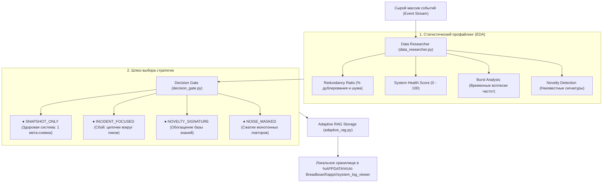

# Log Intelligence & Adaptive RAG: Data Researcher Architecture

## 📋 Обзор модуля

Модуль **Log Intelligence (`apps/windows/log_intelligence`)** реализует адаптивную трехфазную архитектуру обработки массивов системных журналов Windows:
**«Data Researcher (EDA) ➔ Decision Gate ➔ Adaptive Knowledge RAG»**.

Вместо прямой слепой векторизации сотен тысяч сырых строк логов, система сначала выполняет **статистическое профилирование данных (EDA)**, оценивает уровень здоровья системы, выявляет аномалии и принимает детерминированное решение о том, какие документы и в каком объеме должны быть сформированы для локального RAG-индекса.

---

## 🏗️ Архитектура системы



---

## 🔍 Фаза 1: Data Researcher & Профилирование (`data_researcher.py`)

Data Researcher выполняет легковесный математический и статистический анализ без расхода токенов LLM:

1. **Шаблонизация и маскирование динамических сущностей (`extract_template`):**
   - Замена UUID/GUID на `<GUID>`
   - Замена Hex-кодов ошибок и адресов памяти на `<HEX>`
   - Замена IP-адресов на `<IP>`
   - Замена путей файловой системы Windows на `<PATH>`
   - Замена числовых счетчиков и идентификаторов на `<NUM>`
2. **Коэффициент избыточности ($R_{dup}$ / `redundancy_ratio_pct`):**
   $$R_{dup} = \left(1 - \frac{N_{templates}}{N_{total}}\right) \times 100\%$$
   Показывает, какую долю массива составляет повторяющийся фоновый шум.
3. **Индекс здоровья системы ($SHI$ / `health_score`):**
   $$SHI = \max\left(0, 100 - \frac{15 \cdot N_{crit} + 8 \cdot N_{err} + 1.5 \cdot N_{warn}}{N_{total}} \times 100\right)$$
4. **Детекция временных всплесков (`bursts` / Burst Analysis):**
   Агрегация по минутам для выявления аномальных штормов событий ($> 2.5\sigma$ от среднего темпа).
5. **Обнаружение неизвестных сигнатур (`novel_signatures` / Novelty Detection):**
   Сверка пар `Provider:EventID` с каталогом известных базовых событий ОС.

---

## 🚦 Фаза 2: Decision Gate (`decision_gate.py`)

Шлюз решений сопоставляет метрики профиля с экспертными политиками и выбирает оптимальную стратегию:

| Стратегия (`IngestionStrategy`) | Условия активации | Что генерируется для RAG | Экономия ресурсов |
|---|---|---|---|
| **`SNAPSHOT_ONLY`** | $SHI \ge 90\%$, 0 сбоев | **1 чанк-снимок**: агрегированная сводка здоровья ОС, 0 сырых записей. | **99.9%** памяти и токенов |
| **`INCIDENT_FOCUSED`** | $N_{crit} > 0$ или $N_{err} > 0$, $SHI < 75\%$ | **Цепочки всплесков**: связка «Причина $\rightarrow$ Ошибка $\rightarrow$ Последствия» за $\pm 3$ мин от пика. | Фокусный контекст для LLM |
| **`NOVELTY_SIGNATURE`** | Обнаружены новые `Provider:ID`, $SHI < 95\%$ | **Сигнатурные чанки**: образец сообщения + метаданные для долговременной памяти. | Обогащение базы знаний |
| **`NOISE_MASKED`** | Избыточность $R_{dup} \ge 90\%$ | **Шаблонные дайджесты**: сжатые формы монотонных сервисов (например, Kernel-PnP $\times 500$). | Сжатие в сотни раз |

---

## 💾 Фаза 3: Локальное хранилище и поиск (`adaptive_rag.py`)

- **Путь сохранения**:
  `%APPDATA%\AI-Breadboard\apps\system_log_viewer\adaptive_log_rag_chunks.json`
- **Ring-Buffer / TTL**:
  Ограничение максимального числа чанков (по умолчанию 1000) с автоматическим вытеснением устаревших данных.
- **Двуязычный гибридный поиск (BM25 + Синонимы)**:
  Встроенная поддержка русско-английских соответствий (`сеть <-> network/nic/vmswitch`, `питание <-> power/reboot/41`, `служба <-> service/scm`).

---

## 🚀 Пример использования

```python
from apps.windows.log_intelligence.src.models import LogEntry
from apps.windows.log_intelligence.src.pipeline import LogIntelligencePipeline

# Инициализация единого пайплайна
pipeline = LogIntelligencePipeline()

# Обработка массива событий (Data Researcher -> Decision Gate -> Adaptive RAG)
result = pipeline.process_events(entries, channel="System")

print("Выбранная стратегия:", result["decision"]["strategy"])
print("Сгенерировано чанков:", result["decision"]["chunks_generated"])

# Семантический поиск по адаптивной базе
search_results = pipeline.search_rag("почему отключился сетевой адаптер?")
for r in search_results:
    print(f"[{r['relevance_score']}] {r['title']}")
```
