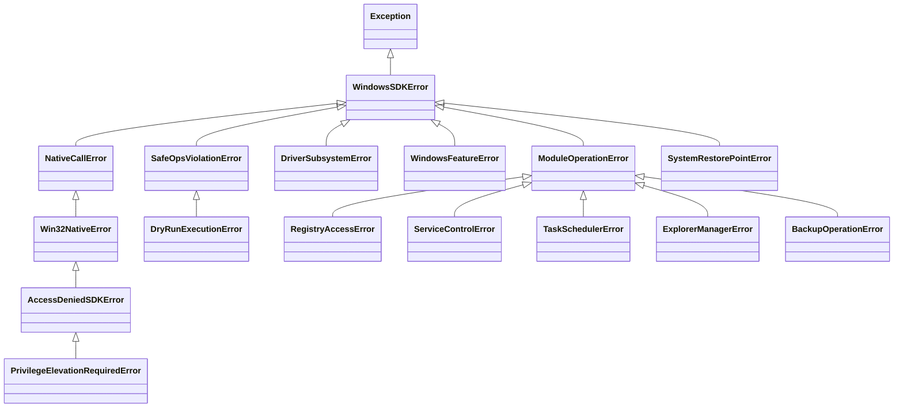

# 🪟 Windows SDK (Software Development Kit)

Единый комплексный SDK для низкоуровневой диагностики, мониторинга, управления оборудованием, безопасного администрирования, SafeOps-оркестрации и типизированной обработки системных исключений Windows в среде **AI-Breadboard**.

---

## 🏛️ Архитектура SDK

```
apps/windows/sdk/
├── __init__.py           # Корневой экспорт SDK и исключений
├── client.py             # Единый фасад WindowsSDK (windows_sdk)
├── exceptions.py         # Иерархия типизированных исключений (Exceptions Hierarchy)
├── README.md             # Полная документация архитектуры и примеры использования
│
├── native/               # [Слой 1] Низкоуровневые C-FFI / ctypes биндинги Win32 API
│   ├── kernel32.py       # Память, дескрипторы, потоки, системная информация
│   ├── advapi32.py       # Токены, SID, аудит, привилегии
│   ├── psapi.py          # Перечисление процессов и модулей
│   ├── pdh.py            # Счетчики производительности PDH
│   ├── iphlpapi.py       # Сетевые сокеты и адаптеры
│   ├── scm.py            # Service Control Manager FFI
│   ├── setupapi.py       # PnP устройства и DriverStore
│   ├── wevtapi.py        # Windows Event Log FFI (курсоры, подписки, закладки)
│   ├── ntdll.py          # Прямые вызовы Native NT API
│   ├── etw.py            # Event Tracing for Windows
│   └── error.py          # Расшифровка Win32 / NTSTATUS / HRESULT ошибок
│
├── drivers/              # [Слой 2] Управление драйверами и аппаратные каталоги
│   └── __init__.py       # GPU Hardware Detector, каталоги NVIDIA/AMD, Downloader
│
├── features/             # [Слой 3] Windows Optional Features (DISM / PowerShell)
│   └── manager.py        # Включение/отключение компонентов с контролем зависимостей
│
├── core/                 # [Слой 4] Ядро SafeOps, системный аудит и аналитика
│   ├── winapi.py         # Высокоуровневые обертки WinAPI
│   ├── safe_executor.py  # SafeOps движок (Dry-Run, симуляция, точки отката)
│   ├── diagnostics.py    # Расчет индекса здоровья системы (Health Score)
│   ├── correlation_engine.py # Анализ взаимосвязей сбоев и аномалий
│   ├── root_cause_engine.py  # Граф расследования первопричин (Root-Cause)
│   ├── system_restore.py     # Точки восстановления Windows System Restore
│   ├── power_monitor.py      # Отслеживание состояний питания (Power-Aware Monitoring)
│   ├── system_param_manager.py # Менеджер безопасного тюнинга параметров ОС
│   ├── process_audit_manager.py # Аудит и построение дерева процессов
│   └── system32_catalog.py   # Каталог 149 системных утилит Windows
│
└── modules/              # [Слой 5] 27 специализированных доменных подсистем
    ├── hardware/         # LibreHardwareMonitor, GPU, температуры, датчики
    ├── network/          # Сканер портов, сокеты, замеры скорости
    ├── storage_manager/  # Диски, SMART, тома, клон и бенчмарк DiskSpd
    ├── explorer_manager/ # Стартовое представление и Folder Options Проводника
    ├── shell_namespace/  # Known Folders, Shell Libraries, Shell URI
    ├── backup_manager/   # Резервное копирование, File History, VSS-снимки
    ├── defender/         # Windows Defender, правила, исключения
    ├── firewall_manager/ # Брандмауэр Windows
    ├── services_manager/ # Службы Windows (запуск, остановка, автозапуск)
    ├── task_scheduler/   # Планировщик заданий
    ├── registry/         # Безопасный доступ к реестру
    ├── process_manager/  # Управление процессами
    ├── taskbar/          # Панель задач и трей
    ├── window_control_plane/ # Управление окнами и фокусом
    └── ...               # Прочие доменные модули
```

---

## ⚠️ Система исключений SDK (Exceptions Hierarchy)

Все сбои и ошибки подсистем строго типизированы и наследуются от базового класса [`WindowsSDKError`](file:///c:/Users/onela/AppData/Local/AI-Breadboard/apps/windows/sdk/exceptions.py#L22-L46):



### Пример обработки исключений:
```python
from apps.windows.sdk.exceptions import (
    WindowsSDKError,
    SafeOpsViolationError,
    AccessDeniedSDKError,
    RegistryAccessError,
)

try:
    windows_sdk.modules.registry.set_value(...)
except AccessDeniedSDKError as err:
    print(f"Требуются права Администратора: {err} (Код: {err.win32_code})")
except SafeOpsViolationError as err:
    print(f"SafeOps отклонил операцию: {err}")
except WindowsSDKError as err:
    print(f"Ошибка Windows SDK: {err}")
```

---

## 🚀 Быстрый старт

### 1. Использование через единый фасад `WindowsSDK`

```python
from apps.windows.sdk import windows_sdk

# Сбор экспресс-сводки состояния системы
health = windows_sdk.get_health_summary()
print(health)

# Получение аппаратного снимка оборудования
hw_snapshot = windows_sdk.modules.hardware.get_snapshot()

# Проверка компонентов Windows Optional Features
features = windows_sdk.features.get_features()
for feat in features[:5]:
    print(f"{feat['FeatureName']}: {feat['State']}")
```

### 2. Прямой импорт специализированных слоев

```python
from apps.windows.sdk.native import Kernel32, WindowsErrorDecoder
from apps.windows.sdk.core import SafeExecutor, WinAPI
from apps.windows.sdk.drivers import GpuHardwareDetector, VendorType

# Детектирование GPU
detector = GpuHardwareDetector()
clean_ver = detector.format_driver_version("32.0.15.6094", VendorType.NVIDIA)
print(f"NVIDIA Version: {clean_ver}")
```

---

## 🔒 Стандарты безопасности SafeOps

Все операции изменения состояния системы в рамках SDK подчиняются строгим правилам:
1. **Dry-Run симуляция**: предварительный расчет последствий перед любым деструктивным действием.
2. **Точки отката**: автоматическое создание точек восстановления `SystemRestore` перед внесением изменений.
3. **Разграничение рисков**: разделение на уровни `Safe` (пассивный аудит / очистка кэшей), `Caution` (отключение автозагрузки), `Critical` (реестр, службы, ядро).

---

**Updated:** 2026-10-10 07:16:00  
**Package:** `apps.windows.sdk`  
**Author:** hypo69
