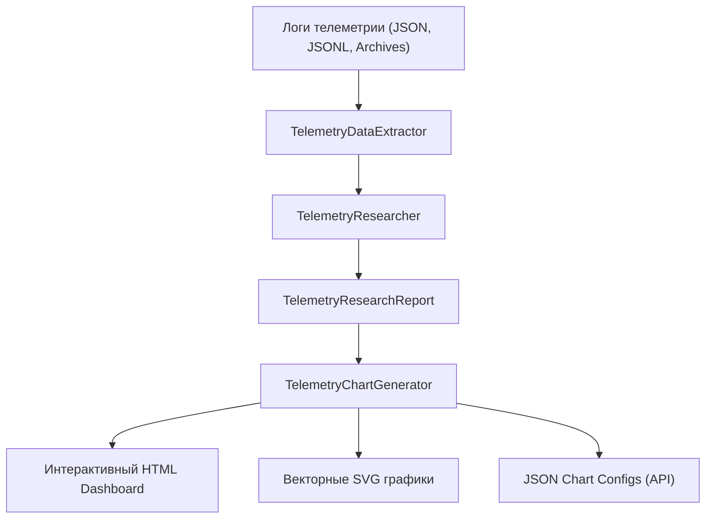

# 🔬 Windows Telemetry Research & Visualization Engine

Модуль комплексного статистического исследования, профилирования (EDA), детекции аномалий и генерации интерактивных графиков из логов телеметрии Windows.

---

## 📌 Назначение и возможности

Приложение `apps/windows/telemetry/research` решает задачи анализа накопленных логов телеметрии системы и оборудования:

1. **Сбор и извлечение данных (Data Ingestion)**:
   - Автоматический поиск и парсинг логов: сенсорных замеров (`ai_sensors_polls.json*`), событий оборудования (`device_telemetry_events.jsonl`), архивов аудита железа (`data/telemetry/hardware_archives/`), произвольных JSON/JSONL/CSV файлов.
2. **Аналитический движок (Research Engine)**:
   - Извлечение синхронизированных временных рядов (CPU, RAM, GPU, Disk I/O, Network Throughput, Температурные датчики).
   - Расчет описательной статистики (Min, Max, Avg, Median, 95-й перцентиль, Standart Deviation).
   - Детекция аномалий, перегревов, троттлинга и всплесков нагрузки.
   - Анализ аппаратных сбоев, флаппинга и нестабильных устройств.
   - Вычисление интегрального индекса здоровья системы (Health Score: 0-100%).
3. **Генерация Графиков и Визуализаций**:
   - **Интерактивные графики**: JSON-спецификации для Chart.js / фронтенд-дашбордов.
   - **Автономный HTML-дашборд**: Готовая веб-страница с адаптивными графиками, карточками здоровья и таблицей аномалий.
   - **Векторные SVG-диаграммы**: Автономный рендеринг векторных графиков без тяжелых сторонних зависимостей.

---

## 🚀 Архитектура компонентов



- **`models.py`** — Pydantic схемы отчетов (`TelemetryResearchReport`), графиков (`ChartConfig`), метрик (`MetricPoint`, `TimeSeriesDataset`) и аномалий (`AnomalyEvent`).
- **`extractor.py`** — Загрузчик и нормализатор логов телеметрии (`TelemetryDataExtractor`).
- **`analyzer.py`** — Статистический процессор, детектор аномалий и калькулятор Health Score (`TelemetryResearcher`).
- **`charts.py`** — Генератор конфигураций графиков, SVG и HTML дашборда (`TelemetryChartGenerator`).
- **`router.py`** — FastAPI REST API роутер (`/api/windows/telemetry/research`).
- **`cli.py`** — Консольная утилита для быстрого исследования и экспорта отчетов.

---

## 💻 Использование

### 1. Python API

```python
from apps.windows.telemetry.research import TelemetryResearcher, TelemetryChartGenerator

# Инициализация исследователя
researcher = TelemetryResearcher()
chart_gen = TelemetryChartGenerator()

# Анализ логов
report = researcher.analyze("logs/telemetry")

# Построение графиков
records = researcher.extractor.load_all_records("logs/telemetry")
time_series = researcher._extract_time_series(records)
report.charts = chart_gen.generate_chart_configs(time_series, report)

# Генерация HTML дашборда
html_dashboard = chart_gen.render_html_dashboard(report)
with open("report.html", "w", encoding="utf-8") as f:
    f.write(html_dashboard)
```

### 2. Консольный интерфейс (CLI)

```powershell
# Создание интерактивного HTML-отчета с графиками
py apps/windows/telemetry/research/cli.py --source logs/telemetry --output report.html --format html

# Экспорт структурированного JSON-отчета
py apps/windows/telemetry/research/cli.py --source logs/telemetry --output report.json --format json

# Экспорт векторных SVG-графиков
py apps/windows/telemetry/research/cli.py --source logs/telemetry --output graphs/chart.svg --format svg
```

### 3. REST API Эндпоинты

- `POST /api/windows/telemetry/research/report` — проведение анализа и возврат полного JSON отчета с графиками.
- `GET /api/windows/telemetry/research/dashboard` — возврат готового интерактивного HTML дашборда.
- `GET /api/windows/telemetry/research/charts` — получение массива конфигураций графиков (Chart.js формат).
- `GET /api/windows/telemetry/research/svg/{chart_id}` — отдача отдельного векторного SVG-графика.
