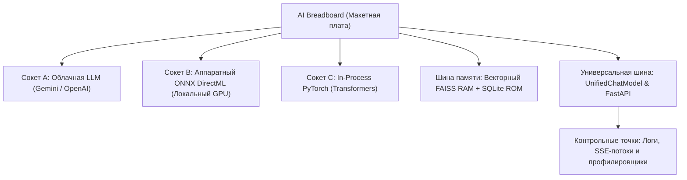

# Глава 1. Архитектура макетной платы и устройство стенда

> **Цель главы:** Понять архитектурную концепцию AI Breadboard как открытого исследовательского стенда, структуру модулей, конфигурирование разъемов (сокетов) и управление питанием и сервисами.

---

## 1.1. Концепция макетной платы: Прозрачный стенд для исследований ИИ

В классической радиоэлектронике инженер собирает прототипы на **макетной плате**:
- Плата содержит ряды контактных гнезд (сокетов).
- Интегральные микросхемы (чипы) вставляются прямо в гнезда платы.
- Шины питания и сигналов связывают компоненты в единую цепь.
- Осциллографы и логические анализаторы подключаются к выводам чипов для замеров параметров.
- Если чип работает некорректно или выходит из строя, его извлекают и заменяют на аналог за считанные секунды.



В проекте **`aibreadboard`** воплощена именно эта физическая метафора:
1. **Базовая плата (Host Board):** Легковесный нативный Python/FastAPI рантайм с открытым доступом ко всем узлам.
2. **Модели как сменные чипы:** Каждая языковая модель выступает в роли сменной микросхемы со стандартизированным интерфейсом контактов.
3. **Универсальная сигнальная шина:** Маршрутизатор `UnifiedChatModel` направляет запросы к тому чипу, который установлен в активный сокет.
4. **Контрольные точки:** Каждый сгенерированный токен, задержка ответа и векторная дистанция доступны для наблюдения в реальном времени.

---

## 1.2. Анатомия репозитория: Расположение компонентов на плате

Структура каталогов проекта отражает компоновку функциональных блоков на плате:

```
aibreadboard/
├── core/                       # Архитектура и ядро базовой платы
│   ├── ai/                     # Сокеты для чипов и адаптеры моделей
│   │   ├── gemini/             # Чип Google GenAI и движок эмбеддингов
│   │   ├── converter/          # Конвертер GGUF -> ONNX и оптимизатор Olive
│   │   ├── model_manager.py    # Контроллер сокетов и Circuit Breaker
│   │   ├── unified_chat.py     # Главная сигнальная шина
│   │   ├── hf_chat.py          # In-Process чип Transformers
│   │   ├── onnx_chat.py        # Аппаратный чип DirectML / ONNX Runtime
│   │   ├── foundry_chat.py     # Адаптер Microsoft AI Foundry
│   │   ├── ollama_chat.py      # Клиент сокета Ollama
│   │   └── langchain_agent.py  # Автономный контроллер ReAct
│   ├── fastapi/                # Панель управления (REST API, SSE, Auth)
│   ├── logger/                 # Диагностика сигналов и логирование
│   ├── secrets/                # Регулирование питания и пул API-ключей
│   └── utils/                  # Утилиты и сериализация данных
├── colab/                      # Стенды облачной векторизации и калибровки
├── docs/                       # Техническая документация (EN, RU, HE, ES, AR)
│   └── ru/book/                # Русскоязычная учебная книга
├── prompts/                    # Прошивки, системные промпты и роли
├── webinterface/               # Осциллограф и интерфейс взаимодействия (UI)
├── config.json                 # Настройки платы и конфигурация сокетов
├── .env.example                # Шаблон шин питания и секретных ключей
└── run.ps1                     # Главный выключатель питания стенда
```

---

## 1.3. Конфигурация сокетов и разделение секретов

Как и в электрической схеме, параметры распиновки и чувствительные ключи питания строго разделены:

### 1. `config.json` — Публичные параметры и распиновка
Параметры работы сервера, порты сокетов, таймауты и черные списки отключенных чипов:

```json
{
  "server": {
    "host": "0.0.0.0",
    "port": 3000,
    "ssl": false
  },
  "ai": {
    "default_provider": "gemini",
    "unsupported_models": {
      "gemini": ["gemini-1.0-pro"],
      "foundry": []
    }
  },
  "rag": {
    "mode": "rag+model",
    "similarity_threshold": 0.60
  }
}
```

### 2. `.env` — Шина питания и секретные ключи
API-ключи и токены авторизации передаются изолированно:

```ini
# Ключи Google Gemini API (через запятую для круговой ротации)
GEMINI_API_KEY=AIzaSyD...1,AIzaSyD...2
# Токен Hugging Face
HUGGINGFACE_TOKEN=hf_...
# Секретный ключ JWT
JWT_SECRET_KEY=supersecretjwtkey...
```

---

## 1.4. Лаунчеры стенда (`Run-*.ps1`)

Для раздельного включения различных блоков стенда предусмотрены лаунчеры PowerShell:

| Скрипт | Назначение |
|---|---|
| [`run.ps1`](file:///c:/Users/onela/AppData/Local/aibreadboard/run.ps1) | Главный запуск стенда: проверка портов, старт локальных демонов и запуск FastAPI с живой перезагрузкой. |
| [`Run-Unicorn.ps1`](file:///c:/Users/onela/AppData/Local/aibreadboard/Run-Unicorn.ps1) | Включение ASGI-сервера Uvicorn с автоперезагрузкой при изменении кода. |
| [`Run-Foundry.ps1`](file:///c:/Users/onela/AppData/Local/aibreadboard/Run-Foundry.ps1) | Запуск локального сервиса Microsoft AI Foundry на порту 54837. |
| [`Run-Agy.ps1`](file:///c:/Users/onela/AppData/Local/aibreadboard/Run-Agy.ps1) | Запуск агента Google Antigravity AGY. |
| [`Run-GeminiCli.ps1`](file:///c:/Users/onela/AppData/Local/aibreadboard/Run-GeminiCli.ps1) | Запуск консольного агента Gemini CLI. |

---

## 1.5. Резюме

1. `aibreadboard` — это открытый стенд для исследований ИИ: модели являются сменными чипами, шины передают данные, а контрольные точки позволяют снимать показания.
2. Четкое разделение настроек в `config.json` и секретов в `.env` обеспечивает безопасность и удобство конфигурирования.
3. Модульные лаунчеры дают возможность включать только те блоки стенда, которые необходимы для конкретного эксперимента.
