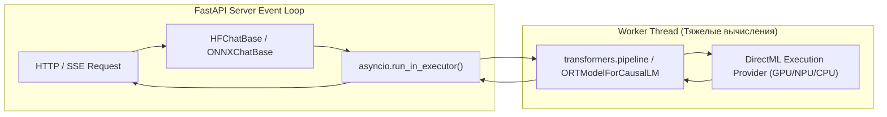

# Глава 3. Локальный инференс: Hugging Face и ONNX DirectML

> **Цель главы:** Освоить запуск открытых моделей непосредственно внутри Python-процесса, работу с кэшем весов, применение шаблонов диалогов (`chat_template`) и аппаратное ускорение через DirectML на любых видеокартах.

---

## 3.1. Архитектура локального In-Process инференса

Большинство существующих решений (Ollama, LM Studio, vLLM) запускают отдельные серверные процессы и демоны, общаясь с ними через локальную сеть.

В `aibreadboard` реализован также **In-Process инференс** ([`core/ai/hf_chat.py`](file:///c:/Users/onela/AppData/Local/aibreadboard/core/ai/hf_chat.py) и [`core/ai/onnx_chat.py`](file:///c:/Users/onela/AppData/Local/aibreadboard/core/ai/onnx_chat.py)):
- Веса модели загружаются непосредственно в адресное пространство процесса (RAM / VRAM).
- Исключаются накладные расходы на сериализацию HTTP-запросов и межпроцессное взаимодействие.
- Асинхронные вызовы изолируются в `asyncio executor`, предотвращая блокировку Event Loop сервера FastAPI.



---

## 3.2. Hugging Face In-Process: загрузка, кэш и Chat Templates

Модуль [`core/ai/hf_chat.py`](file:///c:/Users/onela/AppData/Local/aibreadboard/core/ai/hf_chat.py) решает три ключевые задачи:

### 1. Управление кэшем моделей
Функция `_get_models_dir()` автоматически считывает локальный кэш `~/.cache/huggingface/hub` или путь, указанный в переменной `HF_MODELS_DIR`. С помощью `huggingface_hub.scan_cache_dir()` система определяет уже скачанные модели без обращения к сети.

### 2. Шаблонизация диалогов (`apply_chat_template`)
Различные модели (Llama 3, Qwen 2.5, Mistral, Gemma) используют разные служебные токены для разметки диалога (`<|im_start|>user`, `<|start_header_id|>`, `[INST]`).
Вместо ручной сборки строк используется токенизатор модели:

```python
def _format_messages_for_hf(tokenizer, messages: List[Dict[str, str]]) -> str:
    """Автоматическая адаптация диалога через встроенный chat_template токенизатора."""
    if hasattr(tokenizer, "apply_chat_template") and tokenizer.chat_template:
        return tokenizer.apply_chat_template(
            messages,
            tokenize=False,
            add_generation_prompt=True
        )
    # Fallback для базовых моделей без шаблона
    return "\n".join([f"{m['role']}: {m['content']}" for m in messages]) + "\nassistant:"
```

---

## 3.3. Microsoft ONNX Runtime и ускорение через DirectML

Одной из главных проблем локального ИИ является жесткая привязка к экосистеме Nvidia CUDA. Если у исследователя установлена видеокарта AMD Radeon, Intel Arc или встроенный NPU, запуск стандартных PyTorch-пайплайнов может быть затруднен.

В [`core/ai/onnx_chat.py`](file:///c:/Users/onela/AppData/Local/aibreadboard/core/ai/onnx_chat.py) используется **Microsoft ONNX Runtime** с провайдером **DirectML**:

### Преимущества DirectML:
1. **Кросс-вендорность:** Работает с любыми DirectX 12-совместимыми графическими процессорами (Nvidia, AMD, Intel, Qualcomm).
2. **Низкое потребление памяти:** Квантованные ONNX-модели (INT4 / INT8) оптимизированы под параллельное выполнение на тензорных ядрах и NPU.
3. **Плавная деградация:** Если дискретный GPU перегружен, Execution Provider плавно переключается на CPU без краха приложения.

```python
from optimum.onnxruntime import ORTModelForCausalLM
from transformers import AutoTokenizer

# Загрузка ONNX модели с DirectML ускорением
model = ORTModelForCausalLM.from_pretrained(
    model_path,
    provider="DirectMLExecutionProvider",
    session_options=session_options
)
tokenizer = AutoTokenizer.from_pretrained(model_path)
```

---

## 3.4. Резюме

1. In-process инференс позволяет запускать модели прямо в памяти приложения без сторонних демонов.
2. Использование `apply_chat_template` гарантирует корректную разметку диалоговых токенов для любых архитектур (Llama, Qwen, Mistral).
3. Провайдер `DirectMLExecutionProvider` в ONNX Runtime открывает аппаратное ускорение ИИ на видеокартах любого производителя.
