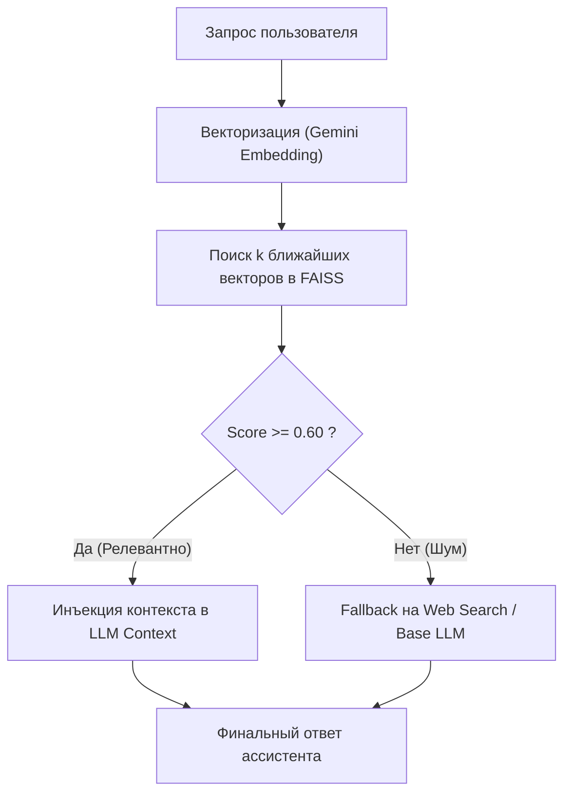

# Глава 4. Архитектура RAG и векторный поиск

> **Цель главы:** Понять математику семантических эмбеддингов, устройство легковесных векторных индексов FAISS без внешних СУБД, алгоритмы гибридного поиска и разделение задач между локальным сервером и Google Colab.

---

## 4.1. Математика эмбеддингов и векторные пространства

Технология **RAG (Retrieval-Augmented Generation)** позволяет расширить контекст языковой модели актуальными или приватными данными без дорогостоящего переобучения.

Основой RAG является преобразование текста в многомерный вектор (эмбеддинг):

$$\mathbf{v} = \text{Embed}(T) \in \mathbb{R}^D$$

В `aibreadboard` по умолчанию используется модель **Google Gemini Embedding** (`models/gemini-embedding-2` / `text-embedding-004`), формирующая векторы размерности $D = 3072$.

### Косинусное сходство (Cosine Similarity)
Степень семантической близости между запросом пользователя $\mathbf{q}$ и документом базы $\mathbf{d}$ вычисляется как косинус угла между нормализованными векторами:

$$\text{Similarity}(\mathbf{q}, \mathbf{d}) = \frac{\mathbf{q} \cdot \mathbf{d}}{\|\mathbf{q}\| \|\mathbf{d}\|} = \sum_{i=1}^D q_i \cdot d_i \quad (\text{при } \|\mathbf{q}\| = \|\mathbf{d}\| = 1)$$

---

## 4.2. Пороги релевантности и фильтрация шума

В модуле [`core/ai/gemini/rag.py`](file:///c:/Users/onela/AppData/Local/aibreadboard/core/ai/gemini/rag.py) и логике диспетчеризации принята строгая градация порогов сходства:

| Диапазон Score | Категория | Реакция системы |
|---|---|---|
| $\ge 0.80$ | **Точное совпадение** | Прямая выдача карточки или точный ответ из базы. |
| $0.60 \dots 0.79$ | **Высокая тематическая близость** | Передача документа в системный промпт LLM для синтеза ответа. |
| $0.35 \dots 0.59$ | **Слабый фоновый контекст** | Документ отсекается при точечном поиске, но может использоваться в тематических подборках. |
| $< 0.35$ | **Семантический шум** | Полное игнорирование результата. Срабатывает fallback на веб-поиск. |



---

## 4.3. Локальный RAG на FAISS без тяжелых СУБД: `GeminiRAG`

Многие RAG-библиотеки навязывают установку тяжелых контейнеров (Qdrant, Milvus, Weaviate).

В [`core/ai/gemini/rag.py`](file:///c:/Users/onela/AppData/Local/aibreadboard/core/ai/gemini/rag.py) применен минималистичный и надежный подход:
- **Векторное хранилище:** Локальный бинарный индекс FAISS (`index.faiss`) с L2-нормализацией (превращает евклидово расстояние в скалярное произведение для быстрого вычисления косинусной близости).
- **Хранилище метаданных:** Простой JSON-файл (`index.json`), синхронизированный по индексам строк с вектором FAISS.

```python
import faiss
import numpy as np

class GeminiRAG:
    def __init__(self, api_key: str, db_path: Path):
        self.dimension = 3072
        self.index = faiss.IndexFlatIP(self.dimension)  # Inner Product для нормализованных векторов
        self.metadatas = []

    def add_documents(self, docs: list[dict]):
        texts = [d['text'] for d in docs]
        vectors = self._get_embeddings(texts)  # Массив numpy shape (N, 3072)
        faiss.normalize_L2(vectors)            # Нормализация до единичной длины
        self.index.add(vectors)
        self.metadatas.extend(docs)
        self._save()
```

---

## 4.4. Индексатор кодовой базы: `dev_rag.py`

В модуле [`core/ai/dev_rag.py`](file:///c:/Users/onela/AppData/Local/aibreadboard/core/ai/dev_rag.py) реализован механизм семантического поиска по самой кодовой базе `aibreadboard`.

Функция `build_dev_rag()` сканирует директории `core/`, `docs/`, `prompts/`, извлекает структуру файлов `.py` и `.md` и строит локальный векторный индекс. Это позволяет ИИ-агентам мгновенно находить релевантные функции и документацию по естественному описанию.

---

## 4.5. Облачные вычисления: блокнот `RAG_Media_Colab.ipynb`

Если база документов насчитывает десятки тысяч записей, векторизация на локальном компьютере может занять длительное время.

В каталоге [`colab/RAG_Media_Colab.ipynb`](file:///c:/Users/onela/AppData/Local/aibreadboard/colab/RAG_Media_Colab.ipynb) представлен готовый Colab-пайплайн:
1. Загрузка SQLite базы или текстового корпуса на Google Drive.
2. Параллельный батчинг запросов к Gemini Embedding API на мощностях Google Cloud.
3. Генерация готового компактного индекса `media_rag.db` / `dev_rag.faiss`.
4. Экспорт индекса обратно на локальную макетную плату для мгновенного поиска без задержек.

---

## 4.6. Резюме

1. Семантический поиск базируется на нормализованных 3072-мерных эмбеддингах Gemini и косинусной мере близости.
2. Связка FAISS + JSON обеспечивает экстремально быстрый поиск (менее 1 мс на 100k векторов) без накладных расходов на серверные СУБД.
3. Модель макетной платы позволяет распределять нагрузку: тяжелая индексация выполняется в Colab, а локальный инференс — на рабочей станции.
