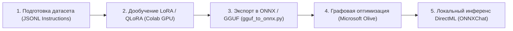

# Глава 5. Оптимизация моделей, конвертация и Fine-Tuning

> **Цель главы:** Изучить методы оптимизации и сжатия моделей (квантование, слияние операторов), освоить пайплайн экспорта весов в ONNX, а также структуру подготовки датасетов и дообучения малых языковых моделей (SLM) через LoRA / QLoRA.

---

## 5.1. Жизненный цикл адаптации моделей

При разработке специализированных ИИ-ассистентов инженеры сталкиваются с компромиссом между точностью модели и требованиями к вычислительным ресурсам.

Пайплайн работы на макетной плате `aibreadboard` включает 4 этапа:



---

## 5.2. Конвертация весов: модуль `gguf_to_onnx.py`

В [`core/ai/converter/gguf_to_onnx.py`](file:///c:/Users/onela/AppData/Local/aibreadboard/core/ai/converter/gguf_to_onnx.py) реализован инструмент конвертации весов Hugging Face и GGUF в формат ONNX через библиотеку `optimum.onnxruntime`.

### Ключевые возможности конвертера:
1. **Асинхронный экспорт:** Выполняется в фоновом пуле потоков без блокировки FastAPI.
2. **Экспорт графа и весов:** Разделение больших моделей на чанки весов (`model.onnx_data`) для преодоления 2 ГБ лимита формата Protobuf.
3. **Графовая оптимизация:** Автоматический запуск проходов слияния узлов (Fusion Passes) и квантования весов.

```python
from optimum.onnxruntime import ORTModelForCausalLM
from transformers import AutoTokenizer

def export_model_to_onnx(model_id: str, output_dir: str, opset: int = 17):
    """Экспорт модели Transformers в ONNX формат."""
    model = ORTModelForCausalLM.from_pretrained(
        model_id,
        export=True,
        opset=opset
    )
    tokenizer = AutoTokenizer.from_pretrained(model_id)
    model.save_pretrained(output_dir)
    tokenizer.save_pretrained(output_dir)
```

---

## 5.3. Графовая оптимизация Microsoft Olive

**Microsoft Olive** — это инструмент оптимизации графов вычислений нейросетей, позволяющий получить 2-4-кратный прирост скорости на оборудовании Windows и DirectML:

- **Constant Folding (Свертка констант):** Предварительный расчет статических операций весов до начала инференса.
- **Attention Fusion (Слияние внимания):** Объединение матричных умножений Query, Key, Value в один высокоэффективный тензорный оператор.
- **Dynamic / Static INT4/INT8 Quantization:** Снижение разрядности весов с FP16/FP32 до 4 или 8 бит с минимальной деградацией точности ($< 1\%$ Perplexity).

---

## 5.4. Лаборатория Fine-Tuning: методология LoRA / QLoRA

Когда системного промпта и RAG недостаточно для точного следования формату (например, генерация строгого JSON, специализированный медицинский/юридический язык или стиль кода), применяется **Fine-Tuning**.

### Формат обучающего датасета
Данные для дообучения формируются в формате `JSON Lines` (`train.jsonl`):

```json
{"messages": [{"role": "system", "content": "Ты эксперт по медиатеке."}, {"role": "user", "content": "Порекомендуй научно-фантастический фильм."}, {"role": "assistant", "content": "<film>Интерстеллар</film> — шедевр Кристофера Нолана о путешествии сквозь червоточину."}]}
{"messages": [{"role": "system", "content": "Ты эксперт по медиатеке."}, {"role": "user", "content": "Включи фильм 1972 года."}, {"role": "assistant", "content": "<film>Солярис</film> — философская драма Андрея Тарковского."}]}
```

### Принцип Low-Rank Adaptation (LoRA)
Вместо изменения всех миллиардов параметров базовой матрицы весов $W_0 \in \mathbb{R}^{d \times k}$, LoRA замораживает базовую модель и обучает две низкоранговые матрицы $A$ и $B$:

$$W = W_0 + \Delta W = W_0 + B \cdot A, \quad \text{где } B \in \mathbb{R}^{d \times r}, \; A \in \mathbb{R}^{r \times k}, \; r \ll \min(d, k)$$

При ранге $r = 16$ количество обучаемых параметров снижается более чем на **99%**, что позволяет проводить дообучение даже на бесплатных GPU в Google Colab (T4 / V100).

---

## 5.5. Резюме

1. Пайплайн `aibreadboard` связывает облачное обучение (LoRA в Colab) с локальным инференсом (ONNX DirectML).
2. Модуль `gguf_to_onnx.py` автоматизирует переход от PyTorch к кроссплатформенным рантаймам.
3. Оптимизация Microsoft Olive и квантование делают возможным запуск современных языковых моделей на потребительских ноутбуках и рабочих станциях.
