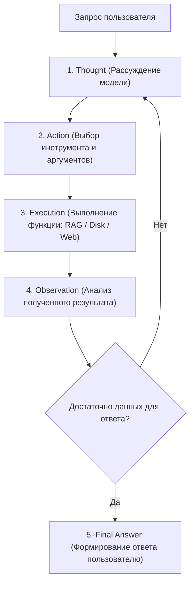

# Глава 6. ReAct-агенты, протокол MCP и мультимодальность

> **Цель главы:** Изучить принципы построения рассуждающих агентов (ReAct-паттерн), интеграцию открытого протокола Model Context Protocol (MCP) и построение асинхронного голосового конвейера (TTS/STT).

---

## 6.1. Паттерн ReAct (Reasoning + Acting)

Автономный агент отличается от обычной языковой модели способностью использовать внешние инструменты (Tools) для решения комплексных задач.

В модулях [`core/ai/langchain_agent.py`](file:///c:/Users/onela/AppData/Local/aibreadboard/core/ai/langchain_agent.py) и [`core/ai/langchain_tools.py`](file:///c:/Users/onela/AppData/Local/aibreadboard/core/ai/langchain_tools.py) реализован агентный цикл ReAct:



### Набор инструментов агента на макетной плате:
- `rag_search_tool` — семантический поиск по внутренней базе знаний.
- `disk_scanner_tool` — опрос состояния подключенных дисков и файловой системы.
- `web_grounding_tool` — поиск свежей информации в интернете при отсутствии локальных данных.
- `player_control_tool` — управление воспроизведением медиаконтента через WebSocket.

---

## 6.2. Интеграция Model Context Protocol (MCP)

**Model Context Protocol (MCP)** — это открытый стандартизированный протокол взаимодействия между ИИ-моделями и внешними источниками данных.

Вместо написания уникальных адаптеров для каждого сервиса, `aibreadboard` подключается к MCP-серверам через JSON-RPC по протоколам `stdio` или `SSE`:

```json
{
  "mcpServers": {
    "filesystem": {
      "command": "npx",
      "args": ["-y", "@modelcontextprotocol/server-filesystem", "C:\\data"]
    },
    "sqlite": {
      "command": "uvx",
      "args": ["mcp-server-sqlite", "--db-path", "media.db"]
    }
  }
}
```

Модели получают доступ к строго типизированным схемам вызова функций (Function Calling), а результаты выполнения автоматически оборачиваются в контекст диалога.

---

## 6.3. Голосовой и мультимодальный конвейер

В [`core/ai/voice_pipeline.py`](file:///c:/Users/onela/AppData/Local/aibreadboard/core/ai/voice_pipeline.py) и маршрутизаторе TTS реализован **двухэтапный конвейер генерации**:

1. **Экранная генерация (Chat Model):** Формирует подробный структурированный текст с разметкой Markdown, ссылками, таблицами и тегами плеера.
2. **Синтез лаконичной речи (Narrator Model):** Сжатие ответа до 1-2 емких предложений для озвучивания голосовым движком (Edge-TTS / gTTS) без задержки восприятия.
3. **Потоковая передача (SSE):** Текст ответа передается клиенту чанками по мере генерации токенов, параллельно запуская буферизацию аудиопотока.

---

## 6.4. Резюме

1. Паттерн ReAct превращает языковую модель в активного агента, способного самостоятельно проверять гипотезы через вызовы инструментов.
2. Протокол MCP стандартизирует подключение к базам данных, веб-сервисам и файловым системам.
3. Разделение экранного ответа и голосового резюме обеспечивает оптимальный пользовательский опыт в мультимодальных интерфейсах.
