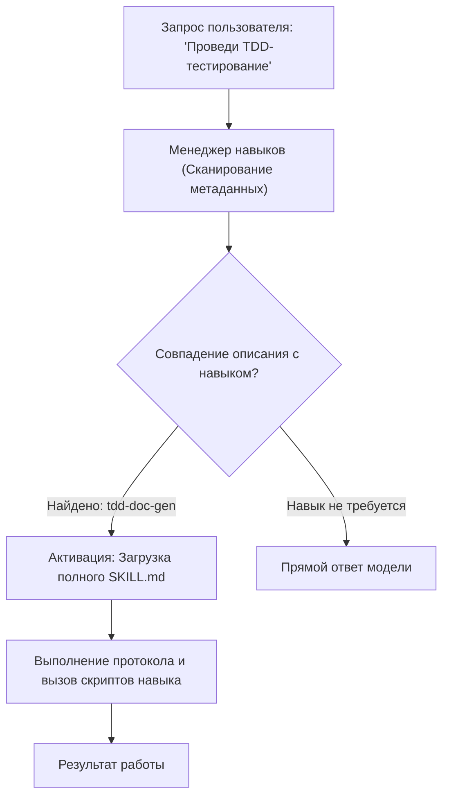
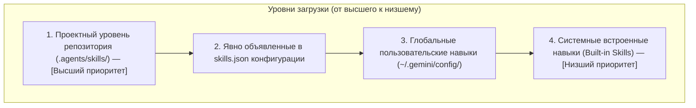

# Глава 7. Создание и управление навыками (Skills) для моделей и агентов

> **Цель главы:** Освоить архитектуру навыков (Skills) в экосистеме ИИ-ассистентов, структуру манифестов `SKILL.md`, механизмы обнаружения (Discovery) и приоритетов, а также автоматизацию создания навыков через фабрику `skill-factory`.

---

## 7.1. Концепция навыков (Skills) в ИИ-системах

В традиционной разработке расширение возможностей языковой модели часто сводилось к перегрузке системного промпта (System Prompt Bloat). Добавление десятков инструкций и сценариев в каждый запрос приводит к двум фундаментальным проблемам:
1. **Перерасход контекстного окна (Token Waste):** Огромный статический промпт оплачивается в каждом сетевом запросе.
2. **Деградация внимания (Attention Degradation):** Модель «забывает» или путает инструкции, когда их становится слишком много («Lost in the Middle»).

**Система навыков (Skills System)** решает эту проблему через **прогрессивное раскрытие (Progressive Disclosure)**:
- Модель загружает в постоянный контекст только **краткие метаданные (name + description)** всех доступных навыков.
- Полный текст инструкций, скрипты, чек-листы и примеры из `SKILL.md` подгружаются в контекст **только тогда, когда пользователь ставит релевантную задачу**.



---

## 7.2. Анатомия и структура навыка

Каждый навык в репозитории представляет собой изолированную директорию (в `.agents/skills/<skill-name>/`):

```
.agents/skills/my-awesome-skill/
├── SKILL.md            # Главный манифест (YAML Frontmatter + Markdown инструкции)
├── scripts/            # Вспомогательные Python/PowerShell/Bash скрипты и утилиты
├── references/         # Дополнительная техническая документация и спецификации
├── examples/           # Примеры входных данных и эталонных результатов
└── resources/          # Шаблоны файлов, конфигурации и статические ресурсы
```

### Формат манифеста `SKILL.md`

Манифест начинается с обязательного блока метаданных YAML Frontmatter:

```markdown
---
name: my-awesome-skill
description: Высокоточный инструмент для анализа схемы базы данных и оптимизации индексов. Используйте при запросах на аудит производительности SQLite.
---

# My Awesome Skill

## 📋 Описание
Подробное руководство для агента о том, когда и как применять данный навык.

## 🛠️ Рабочий процесс (Workflow)
1. Просканировать таблицы базы данных через скрипт `scripts/inspect_tables.py`.
2. Сверить индексы с конфигурацией `config.json`.
3. Сформировать Markdown-отчет о выявленных узких местах.

## ⚙️ Доступные скрипты
- `python scripts/inspect_tables.py --path <db_path>` — сканирование таблиц.
```

> [!IMPORTANT]
> Поле `description` является ключевым: именно по его семантике модель определяет, когда необходимо активировать данный навык. Описание должно четко отвечать на вопросы **«Что делает навык?»** и **«В каких ситуациях его вызывать?»**.

---

## 7.3. Механизм обнаружения (Discovery) и приоритеты загрузки

Система сканирует навыки на нескольких уровнях файловой системы. Если обнаружены навыки с одинаковым именем, применяется строгое правило приоритета:



Это позволяет переопределять стандартное поведение системных агентов для конкретного проекта, не затрагивая глобальную среду.

---

## 7.4. Фабрика навыков: `skill-factory`

Для автоматизации создания и упаковки новых инструментов в репозитории предназначен встроенный навык [`skill-factory`](file:///c:/Users/onela/AppData/Local/aibreadboard/.agents/skills/skill-factory/SKILL.md).

### Процесс создания нового навыка:
1. **Генерация структуры:** Создание папки в `.agents/skills/<name>` с шаблоном `SKILL.md` и директориями `scripts/`, `references/`.
2. **Формирование инструкций:** Описание шагов, граничных условий и правил обработки ошибок.
3. **Реализация вспомогательных скриптов:** Разработка утилит на Python с соблюдением стандартов проекта (логирование через `core.logger`, обработка исключений).
4. **Упаковка и дистрибуция:** Сборка навыка в переносимый архив для передачи между рабочими станциями.

---

## 7.5. Обзор встроенных навыков `aibreadboard`

В репозитории уже развернута библиотека специализированных навыков:

| Навык | Назначение |
|---|---|
| [`tdd-doc-gen`](file:///c:/Users/onela/AppData/Local/aibreadboard/.agents/skills/tdd-doc-gen/SKILL.md) | Модульное тестирование и документация изменений кода. |
| [`rag-search-manager`](file:///c:/Users/onela/AppData/Local/aibreadboard/.agents/skills/rag-search-manager/SKILL.md) | Семантический поиск и координация RAG-индекса. |
| [`db-inspector`](file:///c:/Users/onela/AppData/Local/aibreadboard/.agents/skills/db-inspector/SKILL.md) | Аудит и проверка целостности локальных баз SQLite. |
| [`storage-controller`](file:///c:/Users/onela/AppData/Local/aibreadboard/.agents/skills/storage-controller/SKILL.md) | Управление и сканирование подключенных дисковых накопителей. |
| [`media-card-builder`](file:///c:/Users/onela/AppData/Local/aibreadboard/.agents/skills/media-card-builder/SKILL.md) | Генерация структурированных карточек контента. |

---

## 7.6. Резюме

1. Навыки позволяют модульно расширять возможности ИИ-моделей без раздувания системного промпта.
2. Манифест `SKILL.md` объединяет метаданные для семантического матчинга и строгие алгоритмические инструкции.
3. Иерархический поиск обеспечивает изоляцию проектных навыков и возможность их версионирования в Git.
