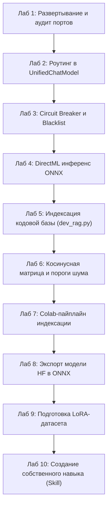

# Глава 8. Практикум: 10 лабораторных работ на AI Breadboard

> **Цель главы:** Закрепить теоретические знания на практике, выполнив серию пошаговых лабораторных работ непосредственно в репозитории `aibreadboard`.

---

## 📋 Перечень лабораторных работ

---

### 🧪 Лабораторная работа 1. Включение стенда и диагностика портов
- **Цель:** Запустить исследовательский стенд AI Breadboard и проверить доступность портов сокетов.
- **Задание:** Запустить `./run.ps1`, открыть Swagger документацию `http://localhost:3000/docs` и отправить тестовый ping-запрос к API.
- **Критерий успеха:** Сервер возвращает статус `200 OK`, в логах `logs/` отсутствуют ошибки инициализации.

---

### 🧪 Лабораторная работа 2. Подключение нового провайдера в `UnifiedChatModel`
- **Цель:** Освоить расширение маршрутизатора моделей.
- **Задание:** В файле [`core/ai/unified_chat.py`](file:///c:/Users/onela/AppData/Local/aibreadboard/core/ai/unified_chat.py) изучить префиксную диспетчеризацию и добавить поддержку нового префикса `custom:<model_name>`.
- **Критерий успеха:** При передаче запроса с моделью `custom:test` управление передается в ваш обработчик.

---

### 🧪 Лабораторная работа 3. Проверка отказоустойчивости (Circuit Breaker)
- **Цель:** Изучить механизм изоляции сбойных моделей.
- **Задание:** Симулировать ошибку 500 для одной из моделей через `ModelManager.add_unsupported_model()`.
- **Критерий успеха:** Модель исчезает из списка доступных в UI и сохраняется в `config.json -> unsupported_models`.

---

### 🧪 Лабораторная работа 4. Локальный инференс с DirectML на GPU
- **Цель:** Запустить модель без CUDA через DirectX 12.
- **Задание:** Загрузить квантованную модель в [`core/ai/onnx_chat.py`](file:///c:/Users/onela/AppData/Local/aibreadboard/core/ai/onnx_chat.py) с провайдером `DirectMLExecutionProvider` и измерить время генерации 50 токенов.
- **Критерий успеха:** Загрузка GPU отображается в диспетчере задач Windows без падения процесса.

---

### 🧪 Лабораторная работа 5. Построение семантического индекса кодовой базы
- **Цель:** Создать RAG-индекс по собственному репозиторию.
- **Задание:** Запустить функцию `build_dev_rag()` из [`core/ai/dev_rag.py`](file:///c:/Users/onela/AppData/Local/aibreadboard/core/ai/dev_rag.py) и выполнить поиск функции роутинга запросом *«Как работает переключение моделей»*.
- **Критерий успеха:** Функция возвращает релевантный фрагмент `unified_chat.py` со score $> 0.70$.

---

### 🧪 Лабораторная работа 6. Исследование матрицы косинусного сходства
- **Цель:** Настроить пороги отсечения шума.
- **Задание:** Провести серию из 10 запросов с разной степенью соответствия базе документов и зафиксировать значения косинусной близости в таблице.
- **Критерий успеха:** Подобрать оптимальный порог `threshold` для отделения релевантных документов от случайного шума.

---

### 🧪 Лабораторная работа 7. Облачный расчет индексов в Google Colab
- **Цель:** Освоить вынос тяжелых вычислений векторизации в облако.
- **Задание:** Открыть блокнот [`colab/RAG_Media_Colab.ipynb`](file:///c:/Users/onela/AppData/Local/aibreadboard/colab/RAG_Media_Colab.ipynb), сгенерировать файл `media_rag.db` и импортировать его на локальную макетную плату.
- **Критерий успеха:** Локальный поиск по новой базе выполняется за время $< 5$ мс.

---

### 🧪 Лабораторная работа 8. Конвертация Hugging Face модели в формат ONNX
- **Цель:** Освоить модуль `gguf_to_onnx.py`.
- **Задание:** Сконвертировать компактную модель (например, `Qwen/Qwen2.5-0.5B-Instruct` или `gpt2`) в формат ONNX и запустить графовую оптимизацию.
- **Критерий успеха:** В выходной директории сформирован валидный файл `model.onnx` и токенизатор.

---

### 🧪 Лабораторная работа 9. Подготовка датасета для Fine-Tuning (Instruction Tuning)
- **Цель:** Сформировать обучающую выборку для адаптации модели.
- **Задание:** С помощью утилиты [`SANDBOX/finetuning_dataset_generator.py`](file:///c:/Users/onela/AppData/Local/aibreadboard/SANDBOX/finetuning_dataset_generator.py) сгенерировать и провалидировать файл `dataset.jsonl` из 50 примеров диалогов.
- **Критерий успеха:** Датасет проходит валидацию синтаксиса JSONL и структуры ролей `system`, `user`, `assistant`.

---

### 🧪 Лабораторная работа 10. Разработка и тестирование пользовательского навыка (Skill)
- **Цель:** Создать и внедрить новый навык для модели с использованием системы `.agents/skills/`.
- **Задание:**
  1. Создать папку `.agents/skills/model-benchmarker/` с манифестом `SKILL.md`.
  2. Заполнить YAML-метаданные с четким описанием в поле `description`.
  3. Написать скрипт `scripts/benchmark.py`, измеряющий скорость генерации (tokens/sec) для активной модели.
  4. Проверить автоматическую активацию навыка агентом при запросе *«Проведи бенчмаркинг скорости моделей»*.
- **Критерий успеха:** Агент активирует навык, выполняет скрипт бенчмаркинга и возвращает структурированную сравнительную таблицу.
