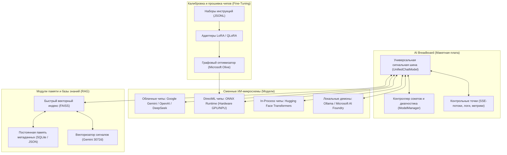

# 📚 AI Breadboard: Учебная книга по архитектуре ИИ, RAG и Fine-Tuning

> **Интерактивная макетная плата для исследования, прототипирования и тестирования моделей искусственного интеллекта**

---

## 💡 Концепция «AI Breadboard» (Макетная плата)

В радиоэлектронике **макетная плата (Breadboard)** — это плата с рядами контактных гнезд (сокетов). Инженер вставляет в гнезда микросхемы (чипы), соединяет шины питания и сигналов перемычками, подключает щупы осциллографа к контрольным точкам и может за секунды заменить один чип на другой, наблюдая за поведением схемы в реальном времени.

**`aibreadboard`** переносит эту концепцию в программную инженерию искусственного интеллекта:

### Ключевые принципы AI Breadboard:
1. **Плата с сокетами:** Прозрачный стенд со стандартизированными разъемами. Модели подключаются и заменяются без изменения прикладного кода.
2. **Модели как чипы:** Каждая модель ИИ (Gemini, Llama, Qwen, DeepSeek, ONNX DirectML) работает как сменный микрочип, подключенный к плате.
3. **Открытые контрольные точки:** Все промежуточные сигналы — эмбеддинги, косинусные оценки сходства, системные промпты и потоки токенов — доступны для живого мониторинга и замеров.
4. **Модули памяти (RAG):** Семантический поиск функционирует как внешний модуль оперативной памяти, подключенный к шине модели.
5. **Калибровка и оптимизация (Fine-Tuning):** Дообучение и прошивка специализированных чипов с помощью LoRA-датасетов и оптимизации графов Microsoft Olive.

---

## 🧭 Навигация по главам книги

| Глава | Тема | Чему вы научитесь |
|---|---|---|
| [**Глава 1**](ch01_philosophy.md) | **Архитектура макетной платы и устройство стенда** | Принцип макетной платы, организация шин, конфигурация сокетов в `config.json`, разделение питания и секретов `.env`, лаунчеры PowerShell. |
| [**Глава 2**](ch02_orchestration.md) | **Сокеты моделей и управление сигнальной шиной** | Шина роутинга `UnifiedChatModel`, реестр `ModelManager`, автоматический Circuit Breaker и ротация ключей. |
| [**Глава 3**](ch03_local_inference.md) | **Прямой локальный инференс (HF и ONNX DirectML)** | Запуск чипов моделей прямо в памяти процесса, шаблоны диалогов `chat_template`, аппаратное ускорение на любых видеокартах через DirectML. |
| [**Глава 4**](ch04_rag_architecture.md) | **Модули памяти: Архитектура RAG и векторный поиск** | Векторные пространства, косинусная близость, легковесный индекс FAISS, семантический поиск по кодовой базе (`dev_rag.py`) и облачные вычисления в Colab. |
| [**Глава 5**](ch05_optimization_finetuning.md) | **Калибровка чипов: Оптимизация и Fine-Tuning** | Графовые проходы Microsoft Olive, экспорт весов в ONNX (`gguf_to_onnx.py`), структура датасетов и дообучение LoRA/QLoRA. |
| [**Глава 6**](ch06_agents_and_mcp.md) | **Автономные ReAct-агенты и протокол MCP** | Циклы управления Thought-Action-Observation, шина внешних инструментов Model Context Protocol и голосовой конвейер. |
| [**Глава 7**](ch07_skills_management.md) | **Модульные навыки (Skills) и динамические возможности** | Прогрессивное раскрытие контекста, манифесты `SKILL.md`, иерархия поиска и фабрика навыков `skill-factory`. |
| [**Глава 8**](ch08_laboratory_practicum.md) | **Практикум: 10 лабораторных работ** | Пошаговые эксперименты: от подключения новых сокетов моделей до создания собственного навыка и калибровки SLM. |

---

## 🎯 Для кого этот стенд

- **Для исследователей и студентов:** Изучать устройство нейросетей, сравнивать модели и анализировать векторные пространства на открытом стенде.
- **Для инженеров ИИ:** Проектировать надежные многомодельные системы с прозрачным управлением потоками данных.
- **Для разработчиков локального ИИ:** Оптимизировать, квантовать и адаптировать малые языковые модели под пользовательское оборудование.
