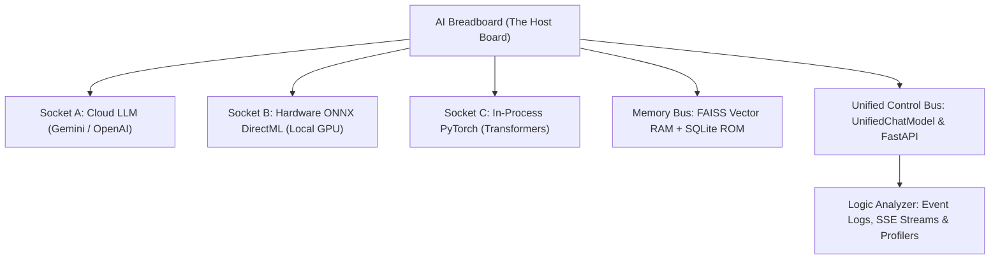

# Chapter 1. The Breadboard Architecture & Workbench Setup

> **Chapter Objective:** Understand the architectural philosophy of the AI Breadboard as a physical testbench metaphor, repository organization, configuration pinouts, and service lifecycle management.

---

## 1.1. The Breadboard Metaphor: A Transparent AI Testbench

In physical electronic prototyping, an engineer works on a **breadboard**:
- The board provides rows of interconnected contact sockets.
- Integrated circuit (IC) chips are inserted directly into the sockets.
- Power buses distribute current across the board.
- Oscilloscopes and logic analyzers probe pins in real time.
- If an IC malfunctions or burns out, it is pulled out and replaced with an alternative in seconds.



`aibreadboard` applies this exact design philosophy:
1. **The Host Board:** A lightweight, transparent Python/FastAPI host runtime with no hidden virtualization barriers.
2. **Models as Interchangeable Chips:** Each AI model acts as a swappable chip with standardized input/output pinouts.
3. **Unified Signal Bus:** The `UnifiedChatModel` dispatcher routes requests to whichever chip is currently plugged into the active socket.
4. **Live Probing:** Every token, latency metric, and vector distance is exposed for real-time inspection.

---

## 1.2. Repository Anatomy: The Board Layout

The codebase layout mirrors a structured electronic board:

```
aibreadboard/
├── core/                       # The Host Board Core Architecture
│   ├── ai/                     # Chip Sockets & Model Adapters
│   │   ├── gemini/             # Google GenAI Chip & Embedding Engine
│   │   ├── converter/          # GGUF -> ONNX Converter & Olive Optimizer
│   │   ├── model_manager.py    # Socket Controller & Circuit Breaker
│   │   ├── unified_chat.py     # Main Signal Routing Bus
│   │   ├── hf_chat.py          # In-Process Transformers Chip
│   │   ├── onnx_chat.py        # DirectML / ONNX Hardware Accelerated Chip
│   │   ├── foundry_chat.py     # Microsoft AI Foundry Adapter
│   │   ├── ollama_chat.py      # Ollama Socket Client
│   │   └── langchain_agent.py  # ReAct Autonomous Controller
│   ├── fastapi/                # Main Control Surface (REST API, SSE, Auth)
│   ├── logger/                 # Signal Diagnostics & Logging
│   ├── secrets/                # Key Pooling & Power Regulation
│   └── utils/                  # Utility Helpers & Serialization
├── colab/                      # Cloud-Scale Indexing & Calibration Benches
├── docs/                       # Multilingual Technical Manuals (EN, RU, HE, ES, AR)
│   └── en/book/                # English Canonical Textbook
├── prompts/                    # Firmware Instructions & Role Definitions
├── webinterface/               # Control Panel & Visual Oscilloscope (UI)
├── config.json                 # Board Configuration & Socket Pinouts
├── .env.example                # Secret Power Rail Credentials Template
└── run.ps1                     # Main Workbench Power-Up Script
```

---

## 1.3. Pinout Configuration vs. Secret Credentials

Like wiring an electronic test circuit, static configuration parameters and sensitive credentials must be clearly segregated:

### 1. `config.json` — Public Board Pinouts
Contains board operational parameters, listening ports, socket timeouts, and blacklisted chip models:

```json
{
  "server": {
    "host": "0.0.0.0",
    "port": 3000,
    "ssl": false
  },
  "ai": {
    "default_provider": "gemini",
    "unsupported_models": {
      "gemini": ["gemini-1.0-pro"],
      "foundry": []
    }
  },
  "rag": {
    "mode": "rag+model",
    "similarity_threshold": 0.60
  }
}
```

### 2. `.env` — Secure Voltage & Key Rails
API keys and authentication secrets are kept isolated from code:

```ini
# Google Gemini API Keys (comma-separated for round-robin rotation)
GEMINI_API_KEY=AIzaSyD...1,AIzaSyD...2
# Hugging Face User Access Token
HUGGINGFACE_TOKEN=hf_...
# JWT Secret Key
JWT_SECRET_KEY=supersecretjwtkey...
```

---

## 1.4. Workbench Launchers (`Run-*.ps1`)

The breadboard provides modular PowerShell launch controls for powering up individual subsystems:

| Script | Purpose |
|---|---|
| [`run.ps1`](file:///c:/Users/onela/AppData/Local/aibreadboard/run.ps1) | Main workbench power-on: verifies ports, checks local daemons, and boots FastAPI with live reload. |
| [`Run-Unicorn.ps1`](file:///c:/Users/onela/AppData/Local/aibreadboard/Run-Unicorn.ps1) | Powers up the Uvicorn ASGI server with hot code reloading. |
| [`Run-Foundry.ps1`](file:///c:/Users/onela/AppData/Local/aibreadboard/Run-Foundry.ps1) | Powers the local Microsoft AI Foundry daemon on port 54837. |
| [`Run-Agy.ps1`](file:///c:/Users/onela/AppData/Local/aibreadboard/Run-Agy.ps1) | Powers the Google Antigravity AGY agent. |
| [`Run-GeminiCli.ps1`](file:///c:/Users/onela/AppData/Local/aibreadboard/Run-GeminiCli.ps1) | Launches the interactive Gemini CLI agent. |

---

## 1.5. Summary

1. The `aibreadboard` is a transparent workbench for AI research: models are swappable chips, buses route signals, and test points monitor results.
2. Clear separation between `config.json` pinouts and `.env` credentials ensures safe and flexible operation.
3. Modular launchers allow spinning up precisely the components needed for any given experiment.
