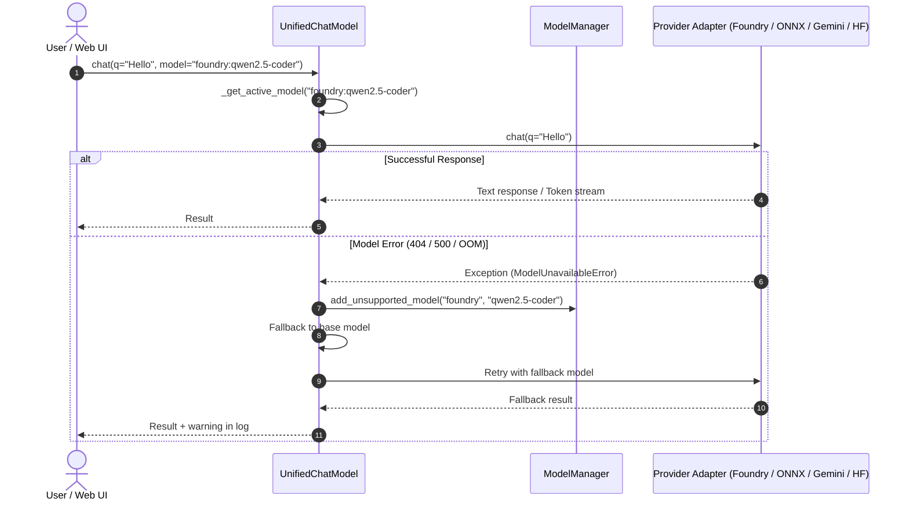

# Chapter 2. Model Orchestration and Fault Tolerance

> **Chapter Objective:** Learn the Facade architectural pattern in AI backends, dynamic model dispatching, the Circuit Breaker algorithm, and round-robin API key pooling.

---

## 2.1. The Facade Pattern: `UnifiedChatModel`

Integrating numerous heterogeneous AI providers presents significant architectural complexity:
- Google GenAI SDK utilizes `client.models.generate_content(...)`.
- Microsoft AI Foundry and OpenAI follow the `/v1/chat/completions` specification.
- Local Transformers rely on in-memory PyTorch generation pipelines.
- ONNX Runtime invokes tensor inference sessions.

To keep core application logic decoupled from provider-specific protocols, [`core/ai/unified_chat.py`](file:///c:/Users/onela/AppData/Local/aibreadboard/core/ai/unified_chat.py) implements the **Unified Facade Pattern**:



### Prefix-Based Routing Table

Routing is dynamically determined by model ID prefixes:

| Model Prefix | Handler Class | Protocol / Transport |
|---|---|---|
| `foundry:<id>` | `FoundryChatBase` | HTTP POST to localhost:54837 (OpenAI API spec) |
| `onnx:<id>` | `ONNXChatBase` | Direct `optimum.onnxruntime` DirectML session |
| `hf:<id>` | `HFChatBase` | In-process `transformers.pipeline` execution |
| `openai:<id>`, `deepseek:<id>` | `OpenAICompatChat` | Remote OpenAI-compatible API endpoints |
| `ollama:<id>` | `OllamaChatBase` | HTTP POST to `http://localhost:11434/api/chat` |
| `gemini_cli:<id>` | `GeminiCliChatBase` | Asynchronous `subprocess` CLI invocation |
| `agy-<id>` | `AgyChatBase` | Google Antigravity SDK |
| `gemini-*` (no prefix) | `GoogleGenerativeAI` | Native Google GenAI SDK with key pooling |

---

## 2.2. Central Registry and Cache: `ModelManager`

The [`core/ai/model_manager.py`](file:///c:/Users/onela/AppData/Local/aibreadboard/core/ai/model_manager.py) module ensures zero runtime latency during model queries through in-memory caching and health monitoring:

### 1. Parallel Cache Warming (`actualize_all_models`)
On server startup, `ModelManager` queries all configured providers concurrently via `asyncio.gather`:

```python
async def actualize_all_models() -> Dict[str, List[str]]:
    """Concurrent cache warming across all AI providers."""
    results = await asyncio.gather(
        get_available_models("gemini", force_refresh=True),
        get_available_models("foundry", force_refresh=True),
        get_available_models("ollama", force_refresh=True),
        get_available_models("hf", force_refresh=True),
        get_available_models("onnx", force_refresh=True),
        return_exceptions=True
    )
    return _CACHED_MODELS
```

### 2. Circuit Breaker Mechanism
If a model fails repeatedly due to out-of-memory errors, incompatible weights, or provider deprecation, `add_unsupported_model(provider, model_name)` is triggered:
1. The broken model is removed from the in-memory cache `_CACHED_MODELS`.
2. It is appended to `unsupported_models` in [`config.json`](file:///c:/Users/onela/AppData/Local/aibreadboard/config.json).
3. The UI and API automatically exclude the failing model from subsequent suggestions.

---

## 2.3. API Key Pooling and Quota Management

When working with cloud providers, free-tier quotas and rate limits (`429 ResourceExhausted`) can interrupt development.

The key pool manager in [`core/secrets/api_key_state.py`](file:///c:/Users/onela/AppData/Local/aibreadboard/core/secrets/api_key_state.py):
- Loads a list of keys from `.env` (`GEMINI_API_KEY=key1,key2,key3`).
- On rate limit exceptions, smoothly advances to the next key via round-robin rotation.
- Tracks cooldown timestamps to prevent retrying exhausted keys before quota reset.

---

## 2.4. Summary

1. `UnifiedChatModel` standardizes heterogeneous models behind a polymorphic API (`chat`, `stream_chat`, `ask`).
2. `ModelManager` warms model caches concurrently and isolates faulty endpoints using Circuit Breakers.
3. API key pooling ensures uninterrupted service during cloud rate-limit events.
