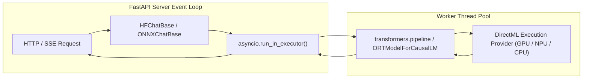

# Chapter 3. Local In-Process Inference: Hugging Face & ONNX DirectML

> **Chapter Objective:** Master in-process model execution within Python, model cache management, dynamic dialogue formatting via `chat_template`, and GPU hardware acceleration with Microsoft ONNX DirectML.

---

## 3.1. In-Process Local Execution Architecture

Most conventional local AI setups (Ollama, LM Studio, vLLM) spawn separate server processes and communicate via local HTTP sockets.

`aibreadboard` offers **In-Process Inference** ([`core/ai/hf_chat.py`](file:///c:/Users/onela/AppData/Local/aibreadboard/core/ai/hf_chat.py) and [`core/ai/onnx_chat.py`](file:///c:/Users/onela/AppData/Local/aibreadboard/core/ai/onnx_chat.py)):
- Model weights are loaded directly into the host process's address space (RAM / VRAM).
- Inter-process serialization and local networking overhead are eliminated.
- Heavy blocking computations are offloaded to dedicated thread pools via `asyncio.run_in_executor`, preserving FastAPI's event loop responsiveness.



---

## 3.2. Hugging Face In-Process: Caching and Chat Templates

The [`core/ai/hf_chat.py`](file:///c:/Users/onela/AppData/Local/aibreadboard/core/ai/hf_chat.py) module handles three core duties:

### 1. Model Cache Discovery
`_get_models_dir()` detects local cached models in `~/.cache/huggingface/hub` or `HF_MODELS_DIR`. `huggingface_hub.scan_cache_dir()` enumerates downloaded snapshots without initiating network calls.

### 2. Dialogue Formatting (`apply_chat_template`)
Different models (Llama 3, Qwen 2.5, Mistral, Gemma) mandate specific delimiters (`<|im_start|>user`, `<|start_header_id|>`, `[INST]`).
Instead of brittle manual string concatenation, `apply_chat_template` leverages the tokenizer's embedded Jinja template:

```python
def _format_messages_for_hf(tokenizer, messages: List[Dict[str, str]]) -> str:
    """Format dialogue using the tokenizer's built-in chat template."""
    if hasattr(tokenizer, "apply_chat_template") and tokenizer.chat_template:
        return tokenizer.apply_chat_template(
            messages,
            tokenize=False,
            add_generation_prompt=True
        )
    return "\n".join([f"{m['role']}: {m['content']}" for m in messages]) + "\nassistant:"
```

---

## 3.3. Microsoft ONNX Runtime & DirectML Acceleration

A pervasive challenge with local AI is deep CUDA vendor lock-in. Developers with AMD Radeon, Intel Arc, or integrated NPUs frequently encounter setup barriers.

[`core/ai/onnx_chat.py`](file:///c:/Users/onela/AppData/Local/aibreadboard/core/ai/onnx_chat.py) integrates **Microsoft ONNX Runtime** paired with the **DirectML** execution provider:

### Key Advantages of DirectML:
1. **Cross-Vendor Hardware Acceleration:** Executes on any DirectX 12-capable GPU (Nvidia, AMD, Intel, Qualcomm).
2. **Reduced Memory Footprint:** Quantized ONNX models (INT4 / INT8) achieve high throughput on consumer VRAM.
3. **Graceful Degradation:** If discrete VRAM is saturated, DirectML smoothly offloads operations to CPU execution providers.

```python
from optimum.onnxruntime import ORTModelForCausalLM
from transformers import AutoTokenizer

model = ORTModelForCausalLM.from_pretrained(
    model_path,
    provider="DirectMLExecutionProvider",
    session_options=session_options
)
tokenizer = AutoTokenizer.from_pretrained(model_path)
```

---

## 3.4. Summary

1. In-process execution loads weights directly in memory, minimizing transport latency.
2. `apply_chat_template` guarantees architectural alignment across all modern conversational SLMs.
3. ONNX DirectML democratizes GPU acceleration across diverse hardware architectures without CUDA restrictions.
