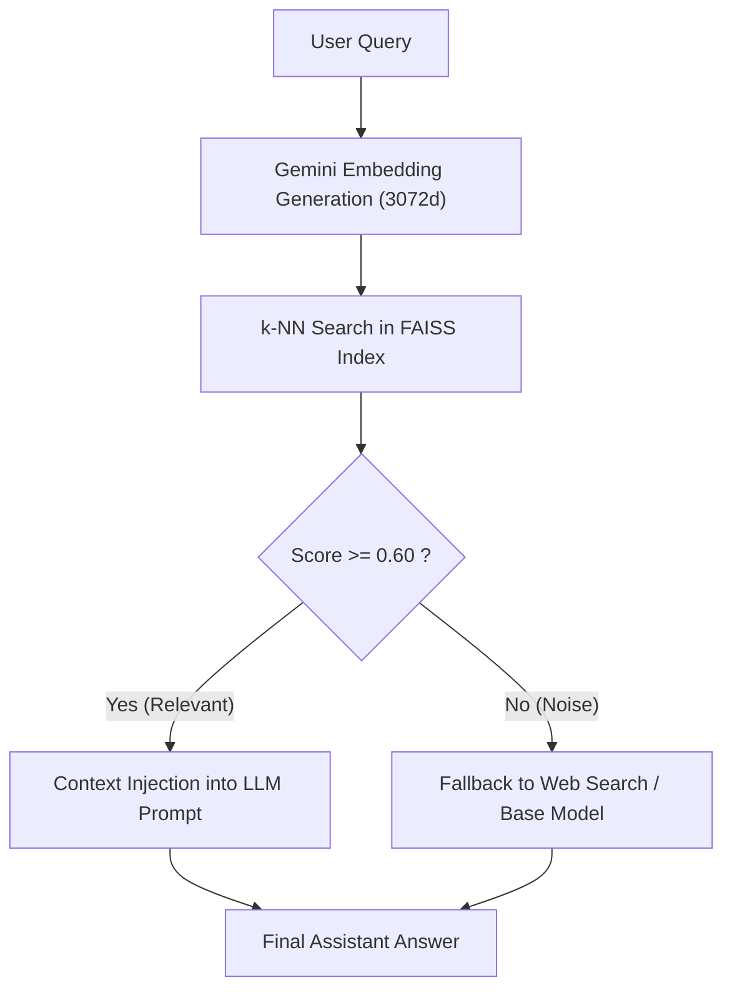

# Chapter 4. RAG Architecture and Vector Search

> **Chapter Objective:** Understand the mathematical foundations of semantic embeddings, lightweight FAISS indices without database bloat, hybrid search heuristics, and cloud-to-local indexing pipelines.

---

## 4.1. Embedding Mathematics and Vector Spaces

**Retrieval-Augmented Generation (RAG)** injects private or real-time context into language models without costly re-training.

At its core, RAG maps text sequences into high-dimensional vector representations:

$$\mathbf{v} = \text{Embed}(T) \in \mathbb{R}^D$$

In `aibreadboard`, the default embedding backbone is **Google Gemini Embedding** (`models/gemini-embedding-2` / `text-embedding-004`), yielding vectors of dimension $D = 3072$.

### Cosine Similarity Metric
Semantic proximity between user query $\mathbf{q}$ and indexed document $\mathbf{d}$ is computed as the cosine of the angle between their normalized vectors:

$$\text{Similarity}(\mathbf{q}, \mathbf{d}) = \frac{\mathbf{q} \cdot \mathbf{d}}{\|\mathbf{q}\| \|\mathbf{d}\|} = \sum_{i=1}^D q_i \cdot d_i \quad (\text{where } \|\mathbf{q}\| = \|\mathbf{d}\| = 1)$$

---

## 4.2. Relevance Thresholds and Noise Filtering

In [`core/ai/gemini/rag.py`](file:///c:/Users/onela/AppData/Local/aibreadboard/core/ai/gemini/rag.py), strict score thresholds govern dispatch decisions:

| Cosine Score | Category | System Action |
|---|---|---|
| $\ge 0.80$ | **Exact / High Match** | Direct card presentation or deterministic factual response. |
| $0.60 \dots 0.79$ | **High Topical Relevance** | Injected into LLM context window for synthesis. |
| $0.35 \dots 0.59$ | **Weak Background Context** | Excluded from point queries, retained for thematic rollups. |
| $< 0.35$ | **Semantic Noise** | Fully discarded. Fallback to Web Search / Base LLM triggers. |



---

## 4.3. Lightweight FAISS Indexing: `GeminiRAG`

Rather than requiring heavy database servers, [`core/ai/gemini/rag.py`](file:///c:/Users/onela/AppData/Local/aibreadboard/core/ai/gemini/rag.py) uses a clean two-file structure:
- **Vector Store:** Binary FAISS index (`.faiss`) using `IndexFlatIP` (Inner Product on L2-normalized vectors).
- **Metadata Store:** Paired JSON document (`.json`) aligned by vector row index.

```python
import faiss
import numpy as np

class GeminiRAG:
    def __init__(self, api_key: str, db_path: Path):
        self.dimension = 3072
        self.index = faiss.IndexFlatIP(self.dimension)
        self.metadatas = []

    def add_documents(self, docs: list[dict]):
        texts = [d['text'] for d in docs]
        vectors = self._get_embeddings(texts)  # numpy array shape (N, 3072)
        faiss.normalize_L2(vectors)            # Normalize in-place to unit length
        self.index.add(vectors)
        self.metadatas.extend(docs)
        self._save()
```

---

## 4.4. Codebase Self-Indexing: `dev_rag.py`

[`core/ai/dev_rag.py`](file:///c:/Users/onela/AppData/Local/aibreadboard/core/ai/dev_rag.py) implements semantic search over `aibreadboard`'s own repository.

The `build_dev_rag()` routine scans `.py` and `.md` files in `core/`, `docs/`, and `prompts/`, building a searchable index. AI coding agents query this index to locate functions and architectural patterns using natural language.

---

## 4.5. Cloud-Scale Indexing via Google Colab

When processing large document collections, local vectorization can be slow on CPU-bound machines.

[`colab/RAG_Media_Colab.ipynb`](file:///c:/Users/onela/AppData/Local/aibreadboard/colab/RAG_Media_Colab.ipynb) provides an interactive cloud workflow:
1. Batch requests to Gemini Embedding API using Google Cloud compute.
2. Compile and save the optimized `media_rag.db` / `.faiss` indices.
3. Download the generated index directly to the local breadboard for millisecond retrieval.

---

## 4.6. Summary

1. Embeddings project semantic meaning into high-dimensional vector space ($D = 3072$).
2. Normalized Inner Product in FAISS delivers sub-millisecond similarity retrieval.
3. The breadboard model enables hybrid architectures: heavy vector calculation in Colab, fast local inference on the host.
