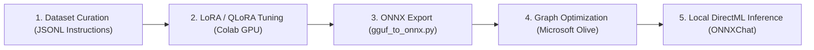

# Chapter 5. Model Optimization, Export, and Fine-Tuning

> **Chapter Objective:** Master neural network graph optimization techniques, the ONNX export pipeline with Microsoft Olive, and dataset preparation for LoRA / QLoRA instruction tuning.

---

## 5.1. Model Adaptation Lifecycle

When optimizing models for edge execution and specialized domain accuracy, engineers balance memory footprint, latency, and predictive performance.

The adaptation lifecycle on the `aibreadboard` follows five stages:



---

## 5.2. Weight Conversion: `gguf_to_onnx.py`

[`core/ai/converter/gguf_to_onnx.py`](file:///c:/Users/onela/AppData/Local/aibreadboard/core/ai/converter/gguf_to_onnx.py) automates the conversion of Hugging Face PyTorch weights and GGUF files into ONNX graphs using `optimum.onnxruntime`.

### Key Pipeline Features:
1. **Asynchronous Non-Blocking Export:** Runs inside background thread pools without freezing HTTP traffic.
2. **External Data Chunking:** Automatically segments large model weights (`model.onnx_data`) to surpass the 2 GB Protobuf serialization limit.
3. **Graph Pass Integration:** Applies automated node fusion passes during export.

```python
from optimum.onnxruntime import ORTModelForCausalLM
from transformers import AutoTokenizer

def export_model_to_onnx(model_id: str, output_dir: str, opset: int = 17):
    """Export Hugging Face model to ONNX format."""
    model = ORTModelForCausalLM.from_pretrained(
        model_id,
        export=True,
        opset=opset
    )
    tokenizer = AutoTokenizer.from_pretrained(model_id)
    model.save_pretrained(output_dir)
    tokenizer.save_pretrained(output_dir)
```

---

## 5.3. Microsoft Olive Graph Optimization Passes

**Microsoft Olive** optimizes model computation graphs for hardware-specific targets:

- **Constant Folding:** Statically computes invariant graph operations at compile time, eliminating runtime overhead.
- **Attention Fusion:** Fuses separate Query, Key, and Value matrix multiplications into single optimized tensor kernels.
- **Dynamic INT4 / INT8 Quantization:** Compresses FP16 weight representations to 4 or 8 bits with minimal ($< 1\%$) perplexity degradation.

---

## 5.4. Fine-Tuning Lab: LoRA and QLoRA

When prompting and RAG are insufficient to enforce rigid domain logic or specialized syntaxes, **Instruction Tuning** is applied.

### Dataset Format (`train.jsonl`)
Training examples are formatted as multi-turn JSON Lines:

```json
{"messages": [{"role": "system", "content": "You are an AI Breadboard assistant."}, {"role": "user", "content": "Route to DirectML ONNX model."}, {"role": "assistant", "content": "Prefix target: onnx:qwen2.5-coder with DirectMLExecutionProvider."}]}
{"messages": [{"role": "system", "content": "You are an AI Breadboard assistant."}, {"role": "user", "content": "What is the similarity threshold for high relevance in Gemini embeddings?"}, {"role": "assistant", "content": "Cosine similarity score >= 0.60 indicates high topical relevance."}]}
```

### Low-Rank Adaptation (LoRA) Theory
Instead of updating the full weight matrix $W_0 \in \mathbb{R}^{d \times k}$, LoRA freezes $W_0$ and trains low-rank decomposition matrices $A$ and $B$:

$$W = W_0 + \Delta W = W_0 + B \cdot A, \quad \text{where } B \in \mathbb{R}^{d \times r}, \; A \in \mathbb{R}^{r \times k}, \; r \ll \min(d, k)$$

At rank $r = 16$, trainable parameters decrease by **over 99%**, allowing fine-tuning of 7B–14B models on free Google Colab GPUs (T4 / V100).

---

## 5.5. Summary

1. `aibreadboard` unifies cloud fine-tuning (LoRA in Colab) with local accelerated runtime (ONNX DirectML).
2. `gguf_to_onnx.py` automates graph conversion and weight chunking.
3. Microsoft Olive optimization and INT4 quantization enable local execution on consumer hardware.
