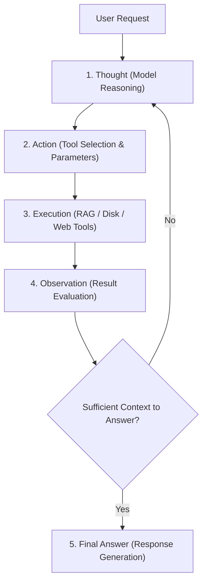

# Chapter 6. ReAct Agents, MCP Protocol, and Multimodality

> **Chapter Objective:** Learn agentic reasoning loops (ReAct pattern), Model Context Protocol (MCP) server integration, and asynchronous multimodal voice pipelines (TTS/STT).

---

## 6.1. ReAct Pattern (Reasoning + Acting)

An autonomous agent transcends static chat completions by orchestrating external tools to fulfill multi-step goals.

[`core/ai/langchain_agent.py`](file:///c:/Users/onela/AppData/Local/aibreadboard/core/ai/langchain_agent.py) and [`core/ai/langchain_tools.py`](file:///c:/Users/onela/AppData/Local/aibreadboard/core/ai/langchain_tools.py) implement the classic ReAct cycle:



### Standard Breadboard Toolset:
- `rag_search_tool` — Semantic search over indexed technical knowledge.
- `disk_scanner_tool` — Inspects connected physical storage drives.
- `web_grounding_tool` — Queries online search engines for real-time information.
- `player_control_tool` — Dispatches media playback commands via WebSockets.

---

## 6.2. Model Context Protocol (MCP)

**Model Context Protocol (MCP)** is an open industry standard that connects AI models to contextual data sources and tool servers via JSON-RPC.

`aibreadboard` bridges external MCP servers over `stdio` or `SSE`:

```json
{
  "mcpServers": {
    "filesystem": {
      "command": "npx",
      "args": ["-y", "@modelcontextprotocol/server-filesystem", "C:\\data"]
    },
    "sqlite": {
      "command": "uvx",
      "args": ["mcp-server-sqlite", "--db-path", "media.db"]
    }
  }
}
```

Models receive strongly-typed Function Calling schemas, and tool execution outputs are streamed back into the conversation context.

---

## 6.3. Asynchronous Voice Pipeline

In [`core/ai/voice_pipeline.py`](file:///c:/Users/onela/AppData/Local/aibreadboard/core/ai/voice_pipeline.py), a **two-tier generation pipeline** balances visual richness with voice brevity:

1. **Screen Generation (Chat Model):** Produces complete, structured Markdown with tables and actionable UI links.
2. **Speech Synthesis (Narrator Model):** Distills the screen answer into 1–2 punchy sentences for low-latency Edge-TTS synthesis.
3. **SSE Streaming:** Streams tokens to the UI while concurrently buffering the audio stream in parallel.

---

## 6.4. Summary

1. ReAct cycles enable agents to dynamically query tools and verify hypotheses before responding.
2. MCP standardizes integration across file systems, databases, and APIs.
3. Decoupling screen text from voice summaries delivers optimal user experience in multimodal interfaces.
