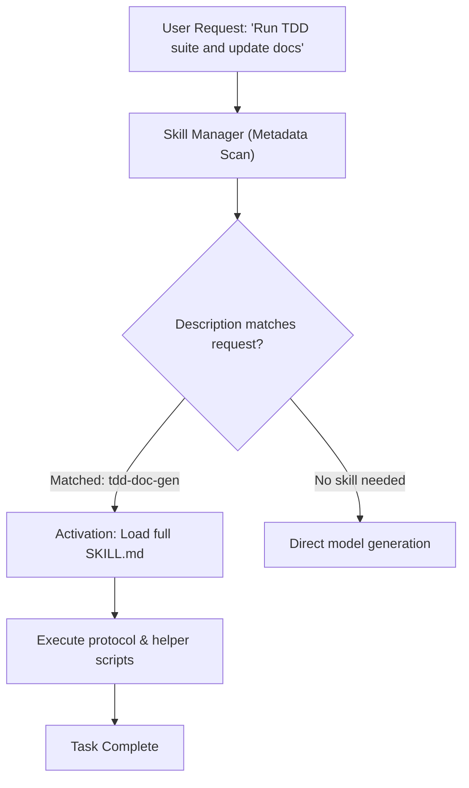
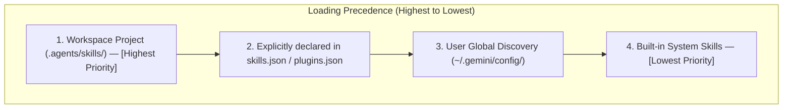

# Chapter 7. Skills Creation and Lifecycle Management

> **Chapter Objective:** Master the skills architecture for AI agents, `SKILL.md` manifest design, discovery hierarchies, progressive disclosure mechanics, and automated authoring via `skill-factory`.

---

## 7.1. Progressive Disclosure: Solving System Prompt Bloat

In classical AI applications, developers frequently pack dozens of instructions into the global system prompt. This creates two acute failure modes:
1. **Context Window Inefficiency (Token Waste):** Massive static prompts consume billable context on every single API request.
2. **Attention Degradation (Lost in the Middle):** As prompt length grows, models struggle to adhere to complex constraints consistently.

The **Skills System** resolves this through **Progressive Disclosure**:
- The model loads only **concise metadata (`name` + `description`)** of all available skills at boot.
- Detailed step-by-step instructions, runbooks, checklists, and execution scripts in `SKILL.md` are loaded **strictly on-demand** when the user's intent matches the skill's domain.



---

## 7.2. Anatomy of a Skill

Each skill is encapsulated within its own directory under `.agents/skills/<skill-name>/`:

```
.agents/skills/my-awesome-skill/
├── SKILL.md            # Manifest (YAML Frontmatter + Markdown instructions)
├── scripts/            # Python / PowerShell helper utilities
├── references/         # Technical reference documentation
├── examples/           # Sample inputs and expected golden outputs
└── resources/          # Templates and static assets
```

### Manifest Format (`SKILL.md`)

The file must begin with YAML frontmatter:

```markdown
---
name: my-awesome-skill
description: High-precision database schema inspection and index auditor. Use when performing SQLite query analysis.
---

# My Awesome Skill

## 📋 Overview
Instructions guiding the agent on when and how to execute this skill.

## 🛠️ Execution Protocol
1. Run `python scripts/inspect.py --db media.db`.
2. Compare index performance against baseline metrics.
3. Generate a Markdown diagnostic report.
```

> [!IMPORTANT]
> The `description` field is critical: the model performs semantic matching against this string to decide when to activate the skill. It should clearly articulate **what the skill does** and **when it should be invoked**.

---

## 7.3. Discovery Hierarchy and Precedence

Customizations are discovered across multiple directories with strict priority rules:



This ensures team-specific project skills in Git override machine-global configurations cleanly.

---

## 7.4. Skill Factory: Automated Authoring

The built-in [`skill-factory`](file:///c:/Users/onela/AppData/Local/aibreadboard/.agents/skills/skill-factory/SKILL.md) skill automates skill creation:
1. **Scaffold Generation:** Creates the directory structure and boilerplate `SKILL.md`.
2. **Instruction Formulation:** Drafts operational procedures and error-handling steps.
3. **Script Implementation:** Generates companion Python scripts matching project code standards.
4. **Packaging:** Bundles the skill for redistribution across development workstations.

---

## 7.5. Built-in Skills Catalog

The `aibreadboard` repository comes equipped with specialized skills:

| Skill | Description |
|---|---|
| [`tdd-doc-gen`](file:///c:/Users/onela/AppData/Local/aibreadboard/.agents/skills/tdd-doc-gen/SKILL.md) | Generates unit tests (`pytest`), analyzes impact, and updates code documentation. |
| [`rag-search-manager`](file:///c:/Users/onela/AppData/Local/aibreadboard/.agents/skills/rag-search-manager/SKILL.md) | Orchestrates semantic RAG retrieval with web fallback. |
| [`db-inspector`](file:///c:/Users/onela/AppData/Local/aibreadboard/.agents/skills/db-inspector/SKILL.md) | SQLite database inspection, schema analysis, and vector debugging. |
| [`storage-controller`](file:///c:/Users/onela/AppData/Local/aibreadboard/.agents/skills/storage-controller/SKILL.md) | Discovers and manages connected physical storage volumes. |
| [`media-card-builder`](file:///c:/Users/onela/AppData/Local/aibreadboard/.agents/skills/media-card-builder/SKILL.md) | Generates structured Markdown media cards. |

---

## 7.6. Summary

1. Skills modularize agent intelligence without polluting the global prompt context.
2. `SKILL.md` combines semantic matching metadata with deterministic procedures.
3. The hierarchical discovery engine supports clean team workflows and version control.
