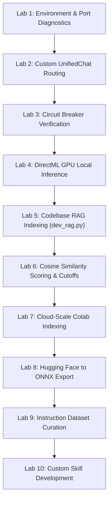

# Chapter 8. Laboratory Practicum: 10 Hands-on Exercises

> **Chapter Objective:** Consolidate theoretical knowledge by completing step-by-step hands-on experiments directly on the `aibreadboard` repository.

---

## 📋 Laboratory Curriculum

---

### 🧪 Laboratory 1. Workbench Power-Up and Port Diagnostics
- **Objective:** Power up the AI Breadboard testbench and audit active socket connections.
- **Task:** Run `./run.ps1`, open Swagger API documentation at `http://localhost:3000/docs`, and execute a health check query.
- **Success Criteria:** HTTP status `200 OK` is returned and log files in `logs/` confirm clean startup.

---

### 🧪 Laboratory 2. Adding a Custom Prefix to `UnifiedChatModel`
- **Objective:** Extend the dynamic model router.
- **Task:** In [`core/ai/unified_chat.py`](file:///c:/Users/onela/AppData/Local/aibreadboard/core/ai/unified_chat.py), implement prefix routing for a new provider `custom:<model_name>`.
- **Success Criteria:** Sending a request with model `custom:test` successfully executes your custom handler.

---

### 🧪 Laboratory 3. Circuit Breaker and Auto-Blacklisting
- **Objective:** Test model fault isolation.
- **Task:** Simulate a 500 error for a model using `ModelManager.add_unsupported_model()`.
- **Success Criteria:** The model is immediately removed from the active cache and persists in `config.json -> unsupported_models`.

---

### 🧪 Laboratory 4. DirectML GPU Inference
- **Objective:** Run local models without CUDA dependencies via DirectX 12.
- **Task:** Load a quantized model in [`core/ai/onnx_chat.py`](file:///c:/Users/onela/AppData/Local/aibreadboard/core/ai/onnx_chat.py) with `DirectMLExecutionProvider` and benchmark token latency.
- **Success Criteria:** Windows Task Manager reflects GPU Compute activity without process termination.

---

### 🧪 Laboratory 5. Semantic Indexing of the Codebase
- **Objective:** Build a self-referential RAG index over project source code.
- **Task:** Execute `build_dev_rag()` in [`core/ai/dev_rag.py`](file:///c:/Users/onela/AppData/Local/aibreadboard/core/ai/dev_rag.py) and search for *"How does model routing work"*.
- **Success Criteria:** Returns `unified_chat.py` with a cosine similarity score $> 0.70$.

---

### 🧪 Laboratory 6. Cosine Similarity & Threshold Calibration
- **Objective:** Calibrate noise filtering cutoffs.
- **Task:** Execute 10 test queries spanning exact matches to irrelevant queries, recording similarity scores.
- **Success Criteria:** Calibrate the optimal `similarity_threshold` separating signal from background noise.

---

### 🧪 Laboratory 7. Cloud-Scale Vector Indexing in Colab
- **Objective:** Offload heavy embedding computations to cloud GPU instances.
- **Task:** Run [`colab/RAG_Media_Colab.ipynb`](file:///c:/Users/onela/AppData/Local/aibreadboard/colab/RAG_Media_Colab.ipynb), generate `media_rag.db`, and import it locally.
- **Success Criteria:** Local vector retrieval executes in $< 5$ ms.

---

### 🧪 Laboratory 8. Hugging Face to ONNX Conversion
- **Objective:** Master model serialization with `gguf_to_onnx.py`.
- **Task:** Export a small model (such as `Qwen/Qwen2.5-0.5B-Instruct` or `gpt2`) to ONNX and run graph optimization.
- **Success Criteria:** Valid `model.onnx` and tokenizer artifacts are produced.

---

### 🧪 Laboratory 9. Instruction Dataset Curation for Fine-Tuning
- **Objective:** Prepare structured instruction datasets for LoRA adaptation.
- **Task:** Use [`SANDBOX/finetuning_dataset_generator.py`](file:///c:/Users/onela/AppData/Local/aibreadboard/SANDBOX/finetuning_dataset_generator.py) to generate and validate a 50-sample `dataset.jsonl`.
- **Success Criteria:** Dataset validates successfully against multi-turn role schemas.

---

### 🧪 Laboratory 10. Custom Skill Authoring and Verification
- **Objective:** Build and register a project-specific skill under `.agents/skills/`.
- **Task:**
  1. Create `.agents/skills/model-benchmarker/` with `SKILL.md`.
  2. Implement `scripts/benchmark.py` measuring generation tokens/sec.
  3. Verify automatic agent activation on the query *"Benchmark model generation speed"*.
- **Success Criteria:** Agent automatically triggers the skill and outputs a structured performance comparison.
