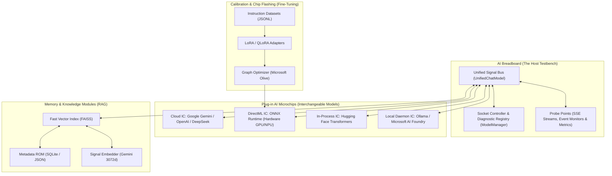

# 📚 AI Breadboard: Textbook on AI Architecture, RAG, and Fine-Tuning

> **An interactive breadboard testbench for exploring, prototyping, and benchmarking modern artificial intelligence models**

---

## 💡 The "AI Breadboard" Concept

In electronics, a **breadboard** is a solderless board perforated with spring-clip sockets. It allows engineers to plug in integrated circuits (ICs), connect signal buses with jumper wires, probe voltages at any test point, swap components instantly, and observe circuit behavior in real time.

**`aibreadboard`** translates this hardware workbench philosophy into the software architecture of modern AI:

### Core Tenets of the AI Breadboard:
1. **The Board with Sockets:** A clean host runtime with standardized pinouts and sockets. You plug any model in and out without rewriting business logic.
2. **Models as Microchips:** Each AI model (Gemini, Llama, Qwen, DeepSeek, ONNX DirectML) functions as an interchangeable IC chip plugged into the breadboard.
3. **Open Probe Points:** Every intermediate signal—embedding vectors, cosine similarity scores, prompt wrappers, and token streams—is exposed for live probing and profiling.
4. **Memory Modules & Knowledge Buses:** RAG acts as an external RAM/ROM module connected to the chip's bus for instant knowledge retrieval.
5. **Chip Calibration (Fine-Tuning):** Adapt and flash custom microchips using LoRA datasets and Microsoft Olive graph compilation.

---

## 🧭 Chapter Navigation

| Chapter | Topic | Key Competencies |
|---|---|---|
| [**Chapter 1**](ch01_philosophy.md) | **The Breadboard Architecture & Workbench Setup** | Breadboard design principles, host runtime, `config.json` pinouts, `.env` security, PowerShell testbench launchers. |
| [**Chapter 2**](ch02_orchestration.md) | **Model Sockets & Fault-Tolerant Bus Control** | `UnifiedChatModel` routing bus, `ModelManager` socket health, Circuit Breakers, and round-robin key pooling. |
| [**Chapter 3**](ch03_local_inference.md) | **Direct-Die Local Inference (HF & ONNX DirectML)** | Running model chips directly in process memory, `chat_template` formatting, and DirectML GPU acceleration. |
| [**Chapter 4**](ch04_rag_architecture.md) | **Memory Modules: RAG Architecture & Vector Search** | Vector spaces, cosine similarity scoring, lightweight FAISS indices, codebase self-indexing, and Colab pipelines. |
| [**Chapter 5**](ch05_optimization_finetuning.md) | **Chip Calibration: Optimization & Fine-Tuning** | Graph passes (Microsoft Olive), ONNX export (`gguf_to_onnx.py`), dataset curation, and LoRA/QLoRA tuning. |
| [**Chapter 6**](ch06_agents_and_mcp.md) | **ReAct Autonomous Agents & MCP Protocol** | Thought-Action-Observation control loops, external tool buses via Model Context Protocol, and multimodal voice pipelines. |
| [**Chapter 7**](ch07_skills_management.md) | **Modular Skills & Dynamic Capabilities** | Progressive disclosure, `SKILL.md` manifests, skill discovery hierarchy, and automated authoring via `skill-factory`. |
| [**Chapter 8**](ch08_laboratory_practicum.md) | **Laboratory Practicum: 10 Hands-on Experiments** | Practical breadboard experiments: from wiring custom model sockets to flashing calibrated SLMs. |

---

## 🎯 Who Is This Testbench For?

- **AI Researchers & Students:** Experiment with neural network behaviors, prompt boundaries, and vector mathematics on an open testbench.
- **Software Engineers:** Build resilient multi-provider AI architectures using proven hardware-inspired design patterns.
- **Edge Computing Innovators:** Quantize, benchmark, and deploy domain-calibrated SLMs on consumer hardware.
