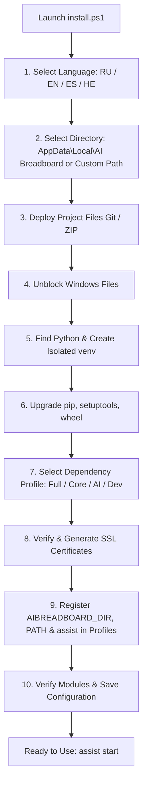

# 📦 AI Breadboard Installation Guide (English)

**Language / Language:** [🇷🇺 Русский](installation.ru.md) | [🇬🇧 English](installation.en.md) | [🇪🇸 Español](installation.es.md) | [🇮🇱 עברית](installation.he.md)

This document describes the complete process of installing, configuring, and initializing the **AI Breadboard** project on a local machine or server.

---

## 📋 Table of Contents
1. [System Requirements](#1-system-requirements)
2. [Automated Installation (Recommended)](#2-automated-installation-recommended)
3. [Manual Installation](#3-manual-installation)
4. [Environment Variables and Configuration](#4-environment-variables-and-configuration)
5. [Global Management Commands (assist CLI)](#5-global-management-commands-assist-cli)
6. [Service Launchers](#6-service-launchers)
7. [Troubleshooting](#7-troubleshooting)

---

## 1. System Requirements

* **Operating System:** Windows 10/11 (x64), Linux (Ubuntu 22.04+ / Debian), macOS.
* **Python Interpreter:** Python 3.10 – 3.14 (Python 3.12 or 3.13 from [python.org](https://www.python.org/downloads/) is recommended).
  > [!IMPORTANT]
  > When installing Python on Windows, make sure to check **"Add python.exe to PATH"**.
* **Version Control System:** Git ([git-scm.com](https://git-scm.com/)).
* **Network Ports:** By default, the server uses port `3000` (FastAPI) and `54837` (local AI Foundry).

---

## 2. Automated Installation (Recommended)

For a quick and automated installation, use the interactive [`install.ps1`](file:///c:/Users/onela/AppData/Local/AI%20Breadboard/install.ps1) script.

### Running the Installer:

1. Open a PowerShell terminal.
2. Run the installer:
   ```powershell
   # Run from the project directory
   .\install.ps1

   # Or remote one-liner installation:
   irm https://raw.githubusercontent.com/hypo69/AI-Breadboard/master/install.ps1 | iex
   ```

### What the Installation Wizard Does:



* **[1] Wizard Language:** Supports **Russian (RU)**, **English (EN)**, **Spanish (ES)**, and **Hebrew (HE)** with automatic system locale detection.
* **[2] Installation Directory:** Preferred default is `%USERPROFILE%\AppData\Local\AI Breadboard` (`$env:LOCALAPPDATA\aibreadboard`). Provides a stability note explaining why default path is best during active development, while allowing custom folder selection.
* **[3] Autonomous Deployment:** When run remotely (`irm | iex`), the installer clones the repository via `git clone` or downloads and extracts `master.zip`.
* **[4] Unblock Files (Unblock-File):** Unblocks PowerShell scripts from Windows Mark-of-the-Web restrictions.
* **[5] Virtual Environment:** Discovers system Python 3.12–3.14 and creates an isolated `venv`.
* **[6] Upgrade pip:** Upgrades package building utilities (`pip`, `setuptools`, `wheel`).
* **[7] Dependency Profiles:** Allows choosing installation scope:
  1. *Full Installation (Core + AI + Utils)* — recommended
  2. *Core server only*
  3. *Core + AI modules*
  4. *Full Installation + Dev (Tests & Documentation)*
  5. *Skip dependency installation*
* **[8] SSL Certificates:** Validates HTTPS certificates (`localhost+2.pem`) or invokes `install_ssl_cert.ps1`.
* **[9] Global Environment & assist Integration:**
  * Sets permanent user environment variable `AIBREADBOARD_DIR` (and `ASSIST_DIR`).
  * Generates `assist.ps1`, `assist.cmd`, and bash script `assist` bound to the installation directory.
  * Deploys them into `%USERPROFILE%\.local\bin\`.
  * Adds bin and project paths to user `PATH`.
  * Registers `assist` function in PowerShell 7 and Windows PowerShell profiles.
* **[10] Final Verification:** Verifies essential modules (`fastapi`, `uvicorn`, `dotenv`, `pydantic`, `cryptography`) and saves language choice to `config.json`.

---

## 3. Manual Installation

### 3.1. Clone Repository
```bash
git clone https://github.com/hypo69/AI-Breadboard.git C:\Users\%USERNAME%\AppData\Local\AI-Breadboard
cd C:\Users\%USERNAME%\AppData\Local\AI-Breadboard
```

### 3.2. Create & Activate Virtual Environment
```powershell
python -m venv venv
.\venv\Scripts\Activate.ps1
```

### 3.3. Install Dependencies
```powershell
python -m pip install --upgrade pip setuptools wheel
pip install -r requirements.txt
```

### 3.4. Generate SSL Certificates (for HTTPS)
```powershell
.\install_ssl_cert.ps1
```

### 3.5. Register Global CLI Command
```powershell
.\assist.ps1 install-profile
```

---

## 4. Environment Variables and Configuration

Architectural principle: **Configuration over Hardcode**.

### 4.1. Secret Data (`.env`)
The `.env` file resides at the root of the project and is used **EXCLUSIVELY** for secrets, API tokens, and credentials:

```env
# Comma-separated Gemini API key environment variable names
GEMINI_API_KEY_NAMES=GEMINI_API_KEY_1,GEMINI_API_KEY_2

# Keys themselves
GEMINI_API_KEY_1=AIzaSy...
GEMINI_API_KEY_2=AIzaSy...

# Antigravity AGY API Key (optional)
AGY_API_KEY=...

# Secret key for JWT auth token signing
JWT_SECRET=your_super_secret_jwt_key

# Optional third-party integration tokens
TELEGRAM_BOT_TOKEN=...
TMDB_API_KEY=...
```

### 4.2. Non-Secret Settings (`config.json`)
All server parameters, AI models, plugins, and modes are stored in `config.json`:

```json
{
  "server": {
    "host": "0.0.0.0",
    "port": 3000,
    "workers": 1,
    "reload": true,
    "use_ssl": true,
    "mode": "DEV",
    "debug": true
  },
  "ai": {
    "use_foundry": true,
    "foundry_base_url": "http://localhost:54837",
    "foundry_model_id": "qwen2.5-1.5b-instruct-generic-cpu:4",
    "use_gemini_cli": true,
    "gemini_cli_model_id": "gemini-3.1-flash-lite",
    "use_agy": false,
    "agy_model_id": "agy-gemini-3.5-flash-lite"
  }
}
```

---

## 5. Global Management Commands (assist CLI)

After installation, the **`assist`** global command is available across any terminal:

| Command | Purpose |
|---|---|
| `assist start` | Launch the main server and dependent services (`run.ps1`) |
| `assist start unicorn` | Run FastAPI server with Uvicorn (`Run-Unicorn.ps1`) |
| `assist start light` | Run lightweight standalone server (`Run-LightServer.ps1`) |
| `assist start foundry` | Start Microsoft AI Foundry background service |
| `assist stop` | Stop the server and liberate port `3000` |
| `assist restart` | Fast server restart |
| `assist status` | Inspect process status, listening ports, and health |
| `assist providers` | Inspect all connected AI providers and model catalogs |
| `assist logs [N]` | View last $N$ lines of application logs (default 40) |
| `assist config show` | View current `config.json` |
| `assist config get <key>` | Get setting value (e.g. `assist config get server.port`) |
| `assist config set <key> <val>` | Update setting value (e.g. `assist config set server.port 8000`) |
| `assist test` | Execute full automated test suite with `pytest` |

---

## 6. Service Launchers

All launchers reside in the project root:

* **[`run.ps1`](file:///c:/Users/onela/AppData/Local/AI%20Breadboard/run.ps1)** — Main orchestrator: venv verification, dependency checks, port liberation, Foundry startup, and Unicorn execution.
* **[`Run-Unicorn.ps1`](file:///c:/Users/onela/AppData/Local/AI%20Breadboard/Run-Unicorn.ps1)** — FastAPI server with automatic browser launch on TCP readiness and logging into `logs/`.
* **[`Run-LightServer.ps1`](file:///c:/Users/onela/AppData/Local/AI%20Breadboard/Run-LightServer.ps1)** — Light server runner (`-mode 0.0.0.0|localhost` and `-port`).
* **[`Run-Foundry.ps1`](file:///c:/Users/onela/AppData/Local/AI%20Breadboard/Run-Foundry.ps1)** — Microsoft AI Foundry controller (`-Action start|stop|status`).

---

## 7. Troubleshooting

### 7.1. PowerShell ExecutionPolicy Error
If PowerShell complains that `running scripts is disabled on this system`:
```powershell
Set-ExecutionPolicy -Scope CurrentUser -ExecutionPolicy RemoteSigned -Force
```

### 7.2. Port 3000 Occupied
`run.ps1` and `Run-Unicorn.ps1` automatically terminate orphaned processes on port 3000. You can also run:
```powershell
assist stop
```

### 7.3. Browser SSL Warning
Local certificates are generated for `localhost`, `127.0.0.1`, and local LAN IP. Click **"Advanced" -> "Proceed to localhost (unsafe)"** or install `localhost+2.pem` into Windows Trusted Root Authorities.

### 7.4. Checking Logs
All logs are stored in `logs/`:
* `logs/fastapi.log` — FastAPI routes and requests
* `logs/info.log` — General system events
* `logs/errors.log` — Application errors
* `logs/uvicorn_*.log` — Uvicorn console output
