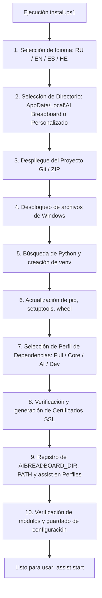

# 📦 Guía de Instalación de AI Breadboard (Español)

**Idioma / Language:** [🇷🇺 Русский](installation.ru.md) | [🇬🇧 English](installation.en.md) | [🇪🇸 Español](installation.es.md) | [🇮🇱 עברית](installation.he.md)

Este documento describe el proceso completo de instalación, configuración e inicialización del proyecto **AI Breadboard** en un equipo local o servidor.

---

## 📋 Tabla de Contenidos
1. [Requisitos del Sistema](#1-requisitos-del-sistema)
2. [Instalación Automática (Recomendada)](#2-instalación-automática-recomendada)
3. [Instalación Manual](#3-instalación-manual)
4. [Variables de Entorno y Configuración](#4-variables-de-entorno-y-configuración)
5. [Comandos Globales de Gestión (CLI assist)](#5-comandos-globales-de-gestión-cli-assist)
6. [Lanzadores de Servicios](#6-lanzadores-de-servicios)
7. [Solución de Problemas (Troubleshooting)](#7-solución-de-problemas-troubleshooting)

---

## 1. Requisitos del Sistema

* **Sistema Operativo:** Windows 10/11 (x64), Linux (Ubuntu 22.04+ / Debian), macOS.
* **Intérprete Python:** Python 3.10 – 3.14 (se recomienda Python 3.12 o 3.13 desde [python.org](https://www.python.org/downloads/)).
  > [!IMPORTANT]
  > Al instalar Python en Windows, asegúrese de marcar la casilla **"Add python.exe to PATH"**.
* **Control de Versiones:** Git ([git-scm.com](https://git-scm.com/)).
* **Puertos de Red:** Por defecto, el servidor utiliza el puerto `3000` (FastAPI) y `54837` (AI Foundry local).

---

## 2. Instalación Automática (Recomendada)

Para una instalación rápida y desatendida, utilice el instalador interactivo [`install.ps1`](file:///c:/Users/onela/AppData/Local/AI%20Breadboard/install.ps1).

### Ejecución del instalador:

1. Abra una terminal PowerShell.
2. Ejecute el instalador:
   ```powershell
   # Desde el directorio del proyecto
   .\install.ps1

   # O ejecución remota en una sola línea:
   irm https://raw.githubusercontent.com/hypo69/AI-Breadboard/master/install.ps1 | iex
   ```

### Qué realiza el asistente de instalación:



* **[1] Idioma del Asistente:** Compatible con **Ruso (RU)**, **Inglés (EN)**, **Español (ES)** y **Hebreo (HE)** con detección automática del sistema.
* **[2] Directorio de Instalación:** Ubicación preferida por defecto: `%USERPROFILE%\AppData\Local\AI Breadboard` (`$env:LOCALAPPDATA\aibreadboard`). Incluye una nota explicando la estabilidad de la ruta estándar durante el desarrollo activo, permitiendo también elegir una ruta personalizada.
* **[3] Despliegue Autónomo:** En ejecuciones remotas (`irm | iex`), clona el repositorio con `git clone` o descarga y descomprime `master.zip`.
* **[4] Desbloqueo de archivos (Unblock-File):** Desbloquea los scripts de PowerShell contra restricciones de Windows Mark-of-the-Web.
* **[5] Entorno Virtual:** Localiza Python 3.12–3.14 en el sistema y crea un `venv` limpio y aislado.
* **[6] Actualización de pip:** Actualiza las herramientas base de compilación (`pip`, `setuptools`, `wheel`).
* **[7] Perfiles de Dependencias:** Permite elegir el alcance de la instalación:
  1. *Instalación completa (Core + AI + Utils)* — recomendado
  2. *Solo servidor básico (Core)*
  3. *Servidor + Módulos AI (Core + AI)*
  4. *Instalación completa + Dev (Pruebas y Documentación)*
  5. *Omitir instalación de dependencias*
* **[8] Certificados SSL:** Verifica certificados HTTPS (`localhost+2.pem`) o ejecuta `install_ssl_cert.ps1`.
* **[9] Integración Global y Variables de Entorno:**
  * Establece la variable de entorno permanente `AIBREADBOARD_DIR` (y `ASSIST_DIR`).
  * Genera `assist.ps1`, `assist.cmd` y el script bash `assist` vinculados al directorio instalado.
  * Los despliega en `%USERPROFILE%\.local\bin\`.
  * Añade las rutas al `PATH` del usuario.
  * Registra la función `assist` en los perfiles de PowerShell 7 y Windows PowerShell.
* **[10] Verificación Final:** Prueba la importación de módulos clave (`fastapi`, `uvicorn`, `dotenv`, `pydantic`, `cryptography`) y guarda el idioma en `config.json`.

---

## 3. Instalación Manual

### 3.1. Clonar el Repositorio
```bash
git clone https://github.com/hypo69/AI-Breadboard.git C:\Users\%USERNAME%\AppData\Local\AI-Breadboard
cd C:\Users\%USERNAME%\AppData\Local\AI-Breadboard
```

### 3.2. Crear y Activar el Entorno Virtual
```powershell
python -m venv venv
.\venv\Scripts\Activate.ps1
```

### 3.3. Instalar Dependencias
```powershell
python -m pip install --upgrade pip setuptools wheel
pip install -r requirements.txt
```

### 3.4. Generar Certificados SSL (para HTTPS)
```powershell
.\install_ssl_cert.ps1
```

### 3.5. Registrar el Comando Global assist
```powershell
.\assist.ps1 install-profile
```

---

## 4. Variables de Entorno y Configuración

Principio arquitectónico: **Configuration over Hardcode**.

### 4.1. Datos Secretos (`.env`)
El archivo `.env` se encuentra en la raíz del proyecto y se utiliza **EXCLUSIVAMENTE** para claves secretas, tokens de API y credenciales:

```env
# Nombres de variables de entorno de claves API de Gemini separados por comas
GEMINI_API_KEY_NAMES=GEMINI_API_KEY_1,GEMINI_API_KEY_2

# Las claves
GEMINI_API_KEY_1=AIzaSy...
GEMINI_API_KEY_2=AIzaSy...

# Clave de API de Antigravity AGY (opcional)
AGY_API_KEY=...

# Secreto para la firma de tokens JWT
JWT_SECRET=your_super_secret_jwt_key

# Tokens de integraciones de terceros opcionales
TELEGRAM_BOT_TOKEN=...
TMDB_API_KEY=...
```

### 4.2. Parámetros de Configuración (`config.json`)
Todas las opciones de configuración, modelos de IA, complementos y puertos se almacenan en `config.json`:

```json
{
  "server": {
    "host": "0.0.0.0",
    "port": 3000,
    "workers": 1,
    "reload": true,
    "use_ssl": true,
    "mode": "DEV",
    "debug": true
  },
  "ai": {
    "use_foundry": true,
    "foundry_base_url": "http://localhost:54837",
    "foundry_model_id": "qwen2.5-1.5b-instruct-generic-cpu:4",
    "use_gemini_cli": true,
    "gemini_cli_model_id": "gemini-3.1-flash-lite",
    "use_agy": false,
    "agy_model_id": "agy-gemini-3.5-flash-lite"
  }
}
```

---

## 5. Comandos Globales de Gestión (CLI assist)

Tras la instalación, la utilidad CLI **`assist`** estará disponible globalmente:

| Comando | Propósito |
|---|---|
| `assist start` | Iniciar el servidor principal y servicios dependientes (`run.ps1`) |
| `assist start unicorn` | Iniciar servidor FastAPI con Uvicorn (`Run-Unicorn.ps1`) |
| `assist start light` | Iniciar servidor ligero independiente (`Run-LightServer.ps1`) |
| `assist start foundry` | Iniciar servicio local Microsoft AI Foundry |
| `assist stop` | Detener el servidor y liberar el puerto `3000` |
| `assist restart` | Reinicio rápido del servidor |
| `assist status` | Comprobar estado de procesos, puertos y salud |
| `assist providers` | Inspeccionar proveedores de IA y modelos configurados |
| `assist logs [N]` | Ver las últimas $N$ líneas de registros (por defecto 40) |
| `assist config show` | Ver configuración actual de `config.json` |
| `assist config get <key>` | Obtener valor de configuración (ej.: `assist config get server.port`) |
| `assist config set <key> <val>` | Establecer valor de configuración (ej.: `assist config set server.port 8000`) |
| `assist test` | Ejecutar suite de pruebas con `pytest` |

---

## 6. Lanzadores de Servicios

Todos los lanzadores están ubicados en la raíz del proyecto:

* **[`run.ps1`](file:///c:/Users/onela/AppData/Local/AI%20Breadboard/run.ps1)** — Orquestador principal: validación de venv, dependencias, liberación de puerto, inicio de Foundry y ejecución de Unicorn.
* **[`Run-Unicorn.ps1`](file:///c:/Users/onela/AppData/Local/AI%20Breadboard/Run-Unicorn.ps1)** — Servidor FastAPI con apertura automática del navegador tras verificación TCP y registro en `logs/`.
* **[`Run-LightServer.ps1`](file:///c:/Users/onela/AppData/Local/AI%20Breadboard/Run-LightServer.ps1)** — Modo ligero (`-mode 0.0.0.0|localhost` y `-port`).
* **[`Run-Foundry.ps1`](file:///c:/Users/onela/AppData/Local/AI%20Breadboard/Run-Foundry.ps1)** — Administrador de Microsoft AI Foundry (`-Action start|stop|status`).

---

## 7. Solución de Problemas (Troubleshooting)

### 7.1. Error de ExecutionPolicy en PowerShell
Si PowerShell bloquea la ejecución de scripts:
```powershell
Set-ExecutionPolicy -Scope CurrentUser -ExecutionPolicy RemoteSigned -Force
```

### 7.2. Puerto 3000 Ocupado
`run.ps1` y `Run-Unicorn.ps1` liberan automáticamente el puerto. También puede ejecutar:
```powershell
assist stop
```

### 7.3. Advertencia de Certificado SSL en el Navegador
Los certificados son autofirmados para `localhost` y la red local. Haga clic en **"Configuración avanzada" -> "Continuar a localhost (no seguro)"** o instale el certificado en Entidades de Certificación Raíz de Windows.

### 7.4. Verificación de Registros
Todos los logs se almacenan en `logs/`:
* `logs/fastapi.log` — Rutas y peticiones FastAPI
* `logs/info.log` — Eventos generales del sistema
* `logs/errors.log` — Errores de la aplicación
* `logs/uvicorn_*.log` — Salida de consola de Uvicorn
