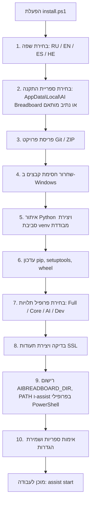

# 📦 מדריך התקנה עבור AI Breadboard (עברית)

**שפה / Language:** [🇷🇺 Русский](installation.ru.md) | [🇬🇧 English](installation.en.md) | [🇪🇸 Español](installation.es.md) | [🇮🇱 עברית](installation.he.md)

מסמך זה מתאר את תהליך ההתקנה, ההגדרה וההפעלה המלא של פרויקט **AI Breadboard** במחשב מקומי או בשרת.

---

## 📋 תוכן עניינים
1. [דרישות מערכת](#1-דרישות-מערכת)
2. [התקנה אוטומטית (מומלץ)](#2-התקנה-אוטומטית-מומלץ)
3. [התקנה ידנית](#3-התקנה-ידנית)
4. [משתני סביבה והגדרות](#4-משתני-סביבה-והגדרות)
5. [פקודות ניהול גלובליות (assist CLI)](#5-פקודות-ניהול-גלובליות-assist-cli)
6. [סקריפטים להפעלת שירותים (Launchers)](#6-סקריפטים-להפעלת-שירותים-launchers)
7. [פתרון תקלות (Troubleshooting)](#7-פתרון-תקלות-troubleshooting)

---

## 1. דרישות מערכת

* **מערכת הפעלה:** Windows 10/11 (x64), Linux (Ubuntu 22.04+ / Debian), macOS.
* **גרסת Python:** Python 3.10 – 3.14 (מומלץ Python 3.12 או 3.13 מאתר [python.org](https://www.python.org/downloads/)).
  > [!IMPORTANT]
  > בעת התקנת Python ב-Windows, חובה לסמן את האפשרות **"Add python.exe to PATH"**.
* **בקרת גרסאות:** Git ([git-scm.com](https://git-scm.com/)).
* **פורטים:** כברירת מחדל, השרת פועל בפורט `3000` (FastAPI) ו-`54837` (AI Foundry מקומי).

---

## 2. התקנה אוטומטית (מומלץ)

עבור התקנה מהירה ופשוטה, השתמש בסקריפט ההתקנה האינטראקטיבי [`install.ps1`](file:///c:/Users/onela/AppData/Local/AI%20Breadboard/install.ps1).

### הפעלת תוכנית ההתקנה:

1. פתח מסוף PowerShell.
2. הרץ את פקודת ההתקנה:
   ```powershell
   # מתוך תיקיית הפרויקט
   .\install.ps1

   # או הפעלה מרחוק בשורה אחת:
   irm https://raw.githubusercontent.com/hypo69/AI-Breadboard/master/install.ps1 | iex
   ```

### שלבי אשף ההתקנה:



* **[1] שפת ההתקנה:** תמיכה מלאה ב-**רוסית (RU)**, **אנגלית (EN)**, **ספרדית (ES)** ו-**עברית (HE)** עם זיהוי שפה אוטומטי.
* **[2] ספריית התקנה:** מיקום ברירת המחדל המומלץ: `%USERPROFILE%\AppData\Local\AI Breadboard`. כולל הסבר על יציבות הנתיב התקני במהלך פיתוח פעיל, לצד אפשרות בחירת ספרייה מותאמת.
* **[3] פריסה אוטונומית:** בהפעלה מרחוק (`irm | iex`), האשף משכפל את המאגר באמצעות `git clone` או מוריד ומחלץ את ארכיון `master.zip`.
* **[4] שחרור חסימת קבצים (Unblock-File):** הסרת חסימות אבטחה של Windows מסקריפטי PowerShell שהורדו.
* **[5] סביבה וירטואלית:** איתור מפרש Python 3.12–3.14 במערכת ויצירת סביבת `venv` נקייה ומבודדת.
* **[6] עדכון כלי בנייה:** עדכון `pip`, `setuptools`, `wheel`.
* **[7] פרופילי תלויות:** אפשרות בחירה בין:
  1. *התקנה מלאה (Core + AI + Utils)* — מומלץ
  2. *שרת בסיסי בלבד (Core)*
  3. *שרת + מודולי AI (Core + AI)*
  4. *התקנה מלאה + Dev (בדיקות ותיעוד)*
  5. *דלג על התקנת תלויות*
* **[8] תעודות SSL:** אימות תעודות HTTPS מקומיות (`localhost+2.pem`) או הפעלת מחולל `install_ssl_cert.ps1`.
* **[9] אינטגרציה גלובלית ומשתני סביבה:**
  * הגדרת משתנה סביבה קבוע למשתמש: `AIBREADBOARD_DIR`.
  * יצירת `assist.ps1`, `assist.cmd` וסקריפט bash בשם `assist` מקושרים לנתיב ההתקנה.
  * פריסה בתיקיית `%USERPROFILE%\.local\bin\`.
  * הוספת הנתיבים למשתנה הסביבה `PATH` של המשתמש.
  * רישום הפונקציה `assist` בפרופילי PowerShell 7 ו-Windows PowerShell.
* **[10] אימות סופי:** בדיקת טעינת ספריות ליבה (`fastapi`, `uvicorn`, `dotenv`, `pydantic`, `cryptography`) ושמירת השפה הנבחרת ב-`config.json`.

---

## 3. התקנה ידנית

אם ברצונך לבצע התקנה ידנית שלב אחר שלב:

### 3.1. שכפול המאגר (Clone)
```bash
git clone https://github.com/hypo69/AI-Breadboard.git C:\Users\%USERNAME%\AppData\Local\AI-Breadboard
cd C:\Users\%USERNAME%\AppData\Local\AI-Breadboard
```

### 3.2. יצירה והפעלת סביבה וירטואלית
```powershell
python -m venv venv
.\venv\Scripts\Activate.ps1
```

### 3.3. התקנת תלויות
```powershell
python -m pip install --upgrade pip setuptools wheel
pip install -r requirements.txt
```

### 3.4. יצירת תעודות SSL (עבור HTTPS)
```powershell
.\install_ssl_cert.ps1
```

### 3.5. רישום פקודת assist גלובלית
```powershell
.\assist.ps1 install-profile
```

---

## 4. משתני סביבה והגדרות

עיקרון ארכיטקטוני: **Configuration over Hardcode**.

### 4.1. סודות ומפתחות (`.env`)
קובץ `.env` בשורש הפרויקט מיועד **בלעדית** עבור מפתחות API, טוקנים וסיסמאות:

```env
# שמות משתני המפתחות של Gemini מופרדים בפסיקים
GEMINI_API_KEY_NAMES=GEMINI_API_KEY_1,GEMINI_API_KEY_2

# ערכי המפתחות
GEMINI_API_KEY_1=AIzaSy...
GEMINI_API_KEY_2=AIzaSy...

# מפתח Antigravity AGY (אופציונלי)
AGY_API_KEY=...

# מפתח חתימה לטוקני JWT
JWT_SECRET=your_super_secret_jwt_key

# טוקנים אופציונליים
TELEGRAM_BOT_TOKEN=...
TMDB_API_KEY=...
```

### 4.2. הגדרות מערכת (`config.json`)
הגדרות שרת, מודלי AI, פלאגינים ופורטים מוגדרים בקובץ `config.json`:

```json
{
  "server": {
    "host": "0.0.0.0",
    "port": 3000,
    "workers": 1,
    "reload": true,
    "use_ssl": true,
    "mode": "DEV",
    "debug": true
  },
  "ai": {
    "use_foundry": true,
    "foundry_base_url": "http://localhost:54837",
    "foundry_model_id": "qwen2.5-1.5b-instruct-generic-cpu:4",
    "use_gemini_cli": true,
    "gemini_cli_model_id": "gemini-3.1-flash-lite",
    "use_agy": false,
    "agy_model_id": "agy-gemini-3.5-flash-lite"
  }
}
```

---

## 5. פקודות ניהול גלובליות (assist CLI)

לאחר ההתקנה, פקודת **`assist`** זמינה מכל מסוף ומכל תיקייה:

| פקודה | תיאור |
|---|---|
| `assist start` | הפעלת השרת הראשי והשירותים הנלווים (`run.ps1`) |
| `assist start unicorn` | הפעלת שרת FastAPI ישירות דרך Uvicorn (`Run-Unicorn.ps1`) |
| `assist start light` | הפעלת שרת במצב קל (`Run-LightServer.ps1`) |
| `assist start foundry` | הפעלת שירות מקומי של Microsoft AI Foundry |
| `assist stop` | עצירת השרת ושחרור פורט `3000` |
| `assist restart` | הפעלה מחדש מהירה של השרת |
| `assist status` | בדיקת מצב תהליכים, פורטים פתוחים ושירותים |
| `assist providers` | הצגת רשימת ספקי ומודלי ה-AI המוגדרים |
| `assist logs [N]` | הצגת $N$ שורות אחרונות מקבצי הלוג (ברירת מחדל 40) |
| `assist config show` | הצגת קובץ ההגדרות `config.json` |
| `assist config get <key>` | קריאת פרמטר הגדרה (למשל: `assist config get server.port`) |
| `assist config set <key> <val>` | עדכון פרמטר הגדרה (למשל: `assist config set server.port 8000`) |
| `assist test` | הרצת בדיקות אוטומטיות עם `pytest` |

---

## 6. סקריפטים להפעלת שירותים (Launchers)

* **[`run.ps1`](file:///c:/Users/onela/AppData/Local/AI%20Breadboard/run.ps1)** — מנהל ראשי: אימות venv, בדיקת תלויות, שחרור פורט, הפעלת Foundry וטעינת Unicorn.
* **[`Run-Unicorn.ps1`](file:///c:/Users/onela/AppData/Local/AI%20Breadboard/Run-Unicorn.ps1)** — שרת FastAPI עם פתיחה אוטומטית של הדפדפן ושמירת לוגים ב-`logs/`.
* **[`Run-LightServer.ps1`](file:///c:/Users/onela/AppData/Local/AI%20Breadboard/Run-LightServer.ps1)** — שרת קל (פרמטרים `-mode 0.0.0.0|localhost` ו-`-port`).
* **[`Run-Foundry.ps1`](file:///c:/Users/onela/AppData/Local/AI%20Breadboard/Run-Foundry.ps1)** — ניהול שירות מקומי של Microsoft AI Foundry (`-Action start|stop|status`).

---

## 7. פתרון תקלות (Troubleshooting)

### 7.1. שגיאת ExecutionPolicy ב-PowerShell
אם PowerShell חוסם הרצת סקריפטים:
```powershell
Set-ExecutionPolicy -Scope CurrentUser -ExecutionPolicy RemoteSigned -Force
```

### 7.2. פורט 3000 תפוס
הסקריפטים משחררים את הפורט אוטומטית. ניתן גם להריץ ישירות:
```powershell
assist stop
```

### 7.3. אזהרת אבטחה בדפדפן עקב תעודת SSL
התעודות נוצרות מקומית. לחץ בדפדפן על **"Advanced" -> "Proceed to localhost (unsafe)"** או התקן את התעודה במאגר התעודות המהימנות של Windows.

### 7.4. בדיקת קבצי לוג
כל קבצי הלוג נשמרים בתיקיית `logs/`:
* `logs/fastapi.log` — בקשות וניתובים ב-FastAPI
* `logs/info.log` — אירועי מערכת כלליים
* `logs/errors.log` — שגיאות יישום
* `logs/uvicorn_*.log` — פלט מסוף של שרת Uvicorn
