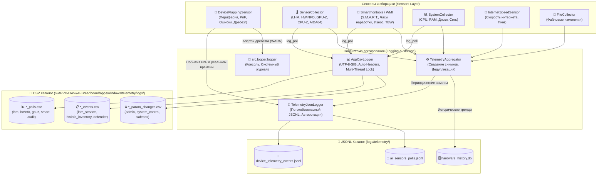

# Подсистема AI-сенсоров и телеметрии (AI Sensors & Telemetry)

## 📋 Обзор

Подсистема **AI Sensors & Telemetry** в AI-Breadboard обеспечивает комплексный сбор, агрегацию, структурированное хранение и анализ телеметрических данных операционной системы Windows и физического аппаратного обеспечения компьютера.

---

## 🎯 Каталог сенсоров: Как они работают и что меряют

| Сенсор / Модуль | Как работает (Технология) | Что измеряет / Детектирует |
| :--- | :--- | :--- |
| 🔌 [**DeviceFlappingSensor**](device_flapping_sensor.md) | Нативный Ctypes-опрос Windows **SetupAPI** и **CfgMgr32** (PnP шина) | • Подключение/отключение всей периферии (USB, накопители/флешки, Wacom pen, мыши, клавиатуры, HDMI/DP мониторы, Bluetooth, принтеры)<br>• Аптайм непрерывной работы каждого девайса<br>• Аппаратные сбои драйверов (**Code 43, Code 10, Code 28**)<br>• **Циклический дребезг (Flapping Alert)** при частых сбросах портов |
| 🌡️ [**SensorCollector & LHM**](hardware_telemetry.md) | HTTP API **LibreHardwareMonitor**, WMI `root\LibreHardwareMonitor`, `nvidia-smi` CLI, ACPI Thermal Zones | • Температуры CPU Package, ядер, GPU Core, термальных зон материнской платы (°C)<br>• Напряжения питания (VCore, линии +3.3V, +5V, +12V)<br>• Тактовые частоты CPU/GPU (MHz)<br>• Потребляемая мощность CPU/GPU (W)<br>• Скорость вентиляторов (RPM, %) и управление помпами СЖО |
| 💾 [**SMART & StorageSensor**](hardware_telemetry.md) | Утилита `smartctl.exe` и нативный `WindowsStorageSensor` (`MSFT_PhysicalDisk` + `StorageReliabilityCounter`) | • Наработка дисков в часах (**Power-On Hours**)<br>• Число циклов включения (**Power Cycles**)<br>• Процент износа ячеек (**Wear % / TBW**)<br>• Ошибки чтения/записи и Reallocated Sectors<br>• Задержки операций чтения/записи (Latency ms) |
| 💻 [**SystemCollector**](hardware_telemetry.md) | Библиотека `psutil`, Win32 API `kernel32`/`advapi32` | • Процент общей загрузки CPU и по ядрам<br>• Физическая память (RAM Used/Available) и файл подкачки (Swap)<br>• Дисковый ввод-вывод (I/O Read/Write Bytes/sec и IOPS)<br>• Сетевой трафик сетевых адаптеров (Rx/Tx Mbps)<br>• Состояние батареи (UPS / Ноутбук), список активных процессов |
| 🚀 [**InternetSpeedSensor**](hardware_telemetry.md) | Потоковый сетевой пробер (HTTP/TCP ping probe) | • Задержка сети (Ping latency, ms)<br>• Дрожание задержки (Jitter, ms)<br>• Входящая и исходящая пропускная способность канала (Mbps) |
| 📁 [**FileCollector**](logging.md) | Служба `DirectoryWatcher` (Win32 `ReadDirectoryChangesW`) | • Файловая активность в отслеживаемых каталогах<br>• Создание, удаление, модификация файлов конфигурации и баз данных |

---

## 🏗️ Архитектура подсистемы и потоков телеметрии



---

## 📑 Разделы документации

1. 📊 [**Централизованное CSV-логгирование (CSV Telemetry & App Logs)**](csv_telemetry.md)
   * Полный реестр CSV-файлов, форматы колонок (`*_polls.csv`, `*_events.csv`, `*_param_changes.csv`), пути `%APPDATA%/AI-Breadboard/apps/logs/`.
2. 🔌 [**Сенсор мониторинга периферии и дребезга (Device Flapping Sensor)**](device_flapping_sensor.md)
   * Контроль USB, накопителей (флешек), клавиатур, мышей, Wacom pen/планшетов, HDMI/DP мониторов, Bluetooth, принтеров.
   * Детекция отключений, аптайма, сбоев драйвера (Code 43/10/28) и алертов дребезга.
3. 🌡️ [**Аппаратная телеметрия и датчики (Hardware & System Telemetry)**](hardware_telemetry.md)
   * Метрики CPU, GPU, RAM, температурные зоны ACPI, S.M.A.R.T. накопителей (наработка часов, циклы, износ, TBW), напряжения (3.3V/5V/12V), обороты кулеров и управление питанием.
4. 📝 [**Логгирование сенсоров и управление потоками телеметрии**](logging.md)
   * Потокобезопасная запись JSON-Lines и CSV, схемы сообщений, авторотация файлов по достижению предельного размера, фильтрация дельт и связка с агрегатором.

---

## 🧪 Запуск и тестирование

```powershell
# Полный запуск тестов сенсоров и подсистемы телеметрии
pytest tests/apps/windows/test_telemetry_aggregator.py apps/windows/tests/test_storage_sensor.py apps/windows/tests/test_hardware.py -v

# Быстрая проверка сенсора периферии через Python CLI
python -c "from apps.windows.telemetry import DeviceFlappingSensor; s = DeviceFlappingSensor(); s.poll_once(); print(s.get_status())"
```
