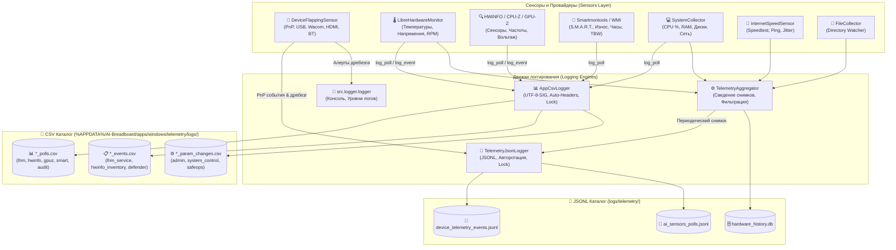

# Логгирование сенсоров и управление потоками телеметрии

## 📋 Обзор системы логирования

Логгирование сенсоров в AI-Breadboard спроектировано по стандартам высоконагруженных телеметрических систем и разделено на **два взаимодополняющих формата**:

1. 📊 **Табличные CSV-логи ([`AppCsvLogger`](../../apps/common/csv_logger.py)):**
   * Располагаются в системной директории `%APPDATA%/AI-Breadboard/apps/windows/telemetry/logs/`.
   * Обеспечивают мгновенную интеграцию с аналитическими инструментами (Excel, Pandas, Grafana, PowerBI).
   * Стандартизированы по 3 потокам: **Опросы (`*_polls.csv`)**, **События (`*_events.csv`)**, **Изменения параметров (`*_param_changes.csv`)**.
2. 📄 **Потоковые JSON-Lines логи ([`TelemetryJsonLogger`](../../apps/windows/telemetry/json_logger.py)):**
   * Располагаются в `logs/telemetry/` (`ai_sensors_polls.jsonl` и `device_telemetry_events.jsonl`).
   * Append-only формат с защитой от повреждения при сбоях и автоматической ротацией файлов по достижению 50–100 МБ.
3. 📝 **Системный журнал ([`src.logger.logger`](../../logger/logger.py)):**
   * Консольный вывод и файлы журнала (`info.log`, `debug.log`, `errors.log`).

---

## 🔗 Архитектура потоков логирования



---

## 📊 CSV-логгирование: Схемы и форматы

Все CSV-логи формируются модулем [`apps/common/csv_logger.py`](../../apps/common/csv_logger.py) в кодировке `utf-8-sig` с автоматическим созданием заголовков колонок:

### 1. Опросы сенсоров (`*_polls.csv`)
Записываются вызовом `AppCsvLogger.log_poll(...)`:
```csv
timestamp,app,poll_type,metric_name,value,unit,status,details
2026-09-24T11:40:00.123+00:00,librehardwaremonitor,sensor_read,cpu_package_temp,58.4,°C,OK,"{""sensor_id"": ""/amdcpu/0/temperature/0""}"
2026-09-24T11:40:00.124+00:00,smartmontools,sensor_read,power_on_hours,25038,h,OK,"{""device"": ""Disk0"", ""model"": ""YongzhenWeiye""}"
```

### 2. События сенсоров и служб (`*_events.csv`)
Записываются вызовом `AppCsvLogger.log_event(...)`:
```csv
timestamp,app,event_type,status,details
2026-09-24T11:40:05.500+00:00,lhm_service,service_start,SUCCESS,"{""port"": 8085, ""pid"": 14220}"
2026-09-24T11:40:10.100+00:00,windows_defender,scan_completed,OK,"{""threats_detected"": 0}"
```

### 3. Изменения параметров (`*_param_changes.csv`)
Записываются вызовом `AppCsvLogger.log_param_change(...)`:
```csv
timestamp,app,param_name,old_value,new_value,status,user,details
2026-09-24T11:40:15.000+00:00,windows_telemetry,sensors.disk.interval_seconds,60.0,30.0,SUCCESS,admin,"{""reason"": ""Disk audit""}"
```

---

## 📄 JSONL-логгирование: Схемы и форматы

### 1. Поток событий оборудования (`device_telemetry_events.jsonl`)
Формируется сенсором [`DeviceFlappingSensor`](device_flapping_sensor.md) при любом изменении состояния шины:

```json
{
  "timestamp": "2026-09-24T11:40:30.104218+00:00",
  "event_type": "FLAPPING_ALERT",
  "device_instance_id": "USB\\VID_056A&PID_0357\\6&17A9B3E2&0&2",
  "friendly_name": "Wacom Intuos Pro M",
  "device_class": "HIDClass",
  "category": "Wacom / Графический планшет",
  "has_problem": true,
  "problem_code": 43,
  "status_code": 1024,
  "manufacturer": "Wacom Technology Corp.",
  "flapping_count_in_window": 3,
  "uptime_seconds": 2.4
}
```

### 2. Поток периодических аппаратных метрик (`ai_sensors_polls.jsonl`)
Формируется [`SensorCollector`](hardware_telemetry.md) и [`TelemetryAggregator`](../../apps/windows/telemetry/aggregator.py):

```json
{
  "timestamp": "2026-09-24T11:40:30.000000+00:00",
  "hardware_sensors": {
    "cpu": {
      "package_temperature_c": 54.2,
      "core_voltage_v": 1.21,
      "package_power_w": 65.4,
      "fan_speed_rpm": 1250
    },
    "gpu": {
      "temperature_c": 48.0,
      "core_clock_mhz": 1830,
      "memory_used_mb": 2450,
      "power_draw_w": 115.2,
      "fan_percent": 42
    },
    "motherboard": {
      "rail_12v": 12.08,
      "rail_5v": 5.02,
      "rail_3v3": 3.34
    }
  },
  "system_load": {
    "cpu_percent": 14.8,
    "ram_used_gb": 18.4,
    "ram_total_gb": 64.0,
    "disk_read_mbs": 4.2,
    "disk_write_mbs": 1.8,
    "network_sent_mbps": 0.8,
    "network_recv_mbps": 5.4
  }
}
```

---

## ⚙️ Программные примеры использования

### Использование CSV-логгера:
```python
from apps.common.csv_logger import AppCsvLogger

logger = AppCsvLogger("smartmontools")
logger.log_poll(
    poll_type="smart_read",
    metric_name="power_on_hours",
    value=25038,
    unit="hours",
    status="OK",
    details={"device": "\\\\.\\PhysicalDrive0", "model": "Samsung SSD 990 EVO Plus"},
    filename="smartmontools_drives_polls.csv"
)
```

### Использование JSONL-логгера:
```python
from apps.windows.telemetry.json_logger import TelemetryJsonLogger

json_logger = TelemetryJsonLogger(
    log_dir="logs/telemetry",
    filename="ai_sensors_polls.jsonl",
    max_file_size_mb=50.0
)
json_logger.log({"metric": "cpu_load", "value": 15.4})
```

---

## 📑 См. также:
* [Подробный реестр CSV-телеметрии и файлов](csv_telemetry.md)
* [Аппаратная телеметрия и датчики](hardware_telemetry.md)
* [Сенсор периферии и дребезга портов](device_flapping_sensor.md)
