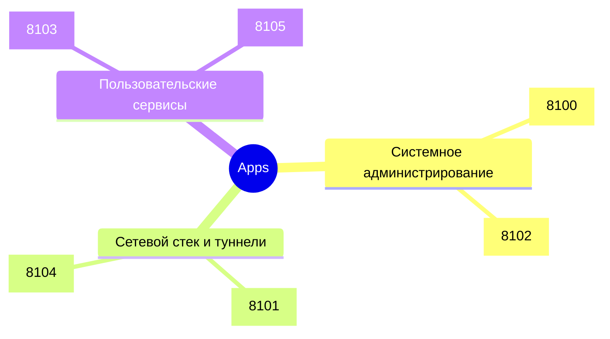

# 📚 Каталог микро-приложений (Apps)

Полный реестр автономных приложений подсистемы `apps/` платформы AI Breadboard.

---

## 🗂️ Список приложений

---

### 1. `windows_sysadmin`
* **Порт:** `8100`
* **Каталог:** `apps/windows_sysadmin/`
* **Назначение:** Веб-панель и TUI для автоматизации задач системного администрирования Windows.
* **Функционал:**
  - Управление службами Windows (Services), процессами и автозагрузкой.
  - Анализ системных логов Event Log.
  - Выполнение диагностических PowerShell команд в изолированном контексте.
  - Мониторинг прав и политик безопасности.

---

### 2. `network_terminal`
* **Порт:** `8101`
* **Каталог:** `apps/network_terminal/`
* **Назначение:** Терминальный и веб-инструмент для диагностики сетевой инфраструктуры.
* **Функционал:**
  - Сканирование открытых портов, проверка доступности хостов (Ping/Traceroute/DNS).
  - Инспекция сетевых интерфейсов, маршрутов и адаптеров.
  - Анализ HTTP/HTTPS ответов и SSL сертификатов.
  - Интеграция с локальными веб-сокетами для потокового отображения трафика.

---

### 3. `system_inspector`
* **Порт:** `8102`
* **Каталог:** `apps/system_inspector/`
* **Назначение:** Аппаратный анализатор конфигурации оборудования и аппаратных ускорителей AI.
* **Функционал:**
  - Проверка доступности GPU (NVIDIA CUDA, DirectML, Intel Arc).
  - Диагностика NPU (Neural Processing Unit, Qualcomm QNN / Intel OpenVINO / DirectML).
  - Мониторинг загрузки процессора, оперативной памяти и температурных датчиков.
  - Экспорт телеметрии в формате JSON для систем маршрутизации AI-Breadboard.

---

### 4. `trading_terminal`
* **Порт:** `8103`
* **Каталог:** `apps/trading_terminal/`
* **Назначение:** Аналитический терминал для финансового мониторинга и отслеживания рыночных данных.
* **Функционал:**
  - Интеграция с криптовалютными и биржевыми API.
  - Построение интерактивных графиков котировок в реальном времени.
  - Сигналы на основе индикаторов технического анализа.
  - Экспорт аналитических отчетов для RAG и LLM-аналитиков.

---

### 5. `cloudflared_monitor`
* **Порт:** `8104`
* **Каталог:** `apps/cloudflared_monitor/`
* **Назначение:** Мониторинг состояния и управление туннелями Cloudflare (Cloudflare Tunnel / Argo).
* **Функционал:**
  - Проверка активного статуса туннеля `cloudflared`.
  - Мониторинг задержек, соединений и ошибок маршрутизации.
  - Быстрый перезапуск и проверка валидности ingress-правил.
  - Оповещение об обрывах соединения через системные уведомления.

---

### 6. `user_assistant`
* **Порт:** `8105`
* **Каталог:** `apps/user_assistant/`
* **Назначение:** Персональный пользовательский ассистент и командный центр управления задачами.
* **Функционал:**
  - Интерактивный диалоговый интерфейс к локальным и облачным LLM.
  - Быстрый доступ к зарегистрированным навыкам (Skills) и плагинам (Plugins).
  - Управление персональными заметками, задачами и контекстом RAG.
  - Голосовое и текстовое взаимодействие.

---

### 7. `gcloud_monitor`
* **Порт:** `8106`
* **Каталог:** `apps/gcloud_monitor/`
* **Назначение:** Телеметрический центр и консоль наблюдаемости (Observability) для Google Cloud Platform (GCP).
* **Функционал:**
  - Запросы и фильтрация логов Cloud Logging (severity, 5xx, Cloud Run, Audit).
  - Мониторинг тайм-серий Cloud Monitoring (CPU, RAM, API Throughput, P95 Latency).
  - Аудит безопасности Cloud Audit Logs (мутации IAM-ролей, доступ к ключам и секретам).
  - Кластеризация traceback'ов и группировка ошибок (Error Reporting).
  - AI-диагностика первопричин сбоев (RCA), оценка индекса здоровья и рекомендации по устранению.

---

### 8. `enterprise_knowledge`
* **Интерфейс:** общий FastAPI-сервер
* **API:** `/api/v1/enterprise-knowledge/*`
* **Каталог:** `apps/enterprise_knowledge/`
* **Назначение:** Накопительная база корпоративных знаний с реестром сотрудников, источниками, фактами и полнотекстовым поиском.
* **Функционал:**
  - Регистрация сотрудников, email и алиасов.
  - Разрешение идентичности при обработке событий.
  - Идемпотентный ingestion унифицированных событий.
  - Раздельное хранение исходных источников и производных фактов.
  - История фактов со статусами `proposed`, `confirmed`, `rejected`, `superseded`.
  - Hybrid query по структурированным фактам и SQLite FTS5.
* **Руководство:** [Платформа корпоративных знаний](../guides/apps/enterprise_knowledge.md)

---

### 8. `system_log_viewer` (System Log Center)
* **Порт:** `8108`
* **Каталог:** `apps/system_log_viewer/`
* **Назначение:** Универсальный системный центр мониторинга и анализа всех журналов Windows и файловых логов.
* **Функционал:**
  - Динамическое сканирование («Scan System») всех зарегистрированных каналов Windows Event Log (1000+).
  - Автоматическое обнаружение и нормализация файловых логов (`C:\Windows\Logs`, `System32\LogFiles`, `ProgramData`, `AppData`).
  - Многофакторная корреляция временных окон и выявление каскадных инцидентов (`IncidentCluster`).
  - Контекстная AI-диагностика первопричин сбоев и перезагрузок (±5 минут вокруг целевого события).
  - Режимы отображения: Live Stream, Errors Only, Incidents, Timeline Histogram, Raw XML/JSON.
  - Экспорт в форматы JSON и CSV.

---

### 9. `scenarios` (Сценарии & AI Skills Assistant)
* **Интерфейс:** Вкладка `/tc#tab-scenarios` (первая вкладка в Test Computer)
* **Роутер:** `src/api/router_scenarios.py` (`/api/v1/scenarios`)
* **Руководство:** [Документация по сценариям](../guides/apps/scenarios.md)
* **Назначение:** Автоматизированные процедуры экспресс-диагностики (Smoke Test), аудита логов, проверки оборудования и автогенерации навыков через встроенный диалоговый мини-чат.
* **Функционал:**
  - Запуск быстрой проверки системы в 1 клик с подробными шагами и рекомендациями.
  - Аудит логов ядра и журналов Windows EventLog с подсчетом ошибок.
  - Аппаратная диагностика (CPU, RAM, диски, фоновые процессы).
  - Интеллектуальный мини-чат с аппаратным опросом (например, история подключенных мышей, USB-устройств).
  - Автоматическая генерация и сохранение новых навыков (`.skills/<skill-name>/SKILL.md`).

---

## 📚 Связанные разделы

- [Обзор микро-приложений](index.md) — общая архитектура подсистемы.
- [Каталог навыков](../skills/catalog.md) — библиотека навыков платформы.
- [Каталог плагинов](../plugins/catalog.md) — интеграционные модули.