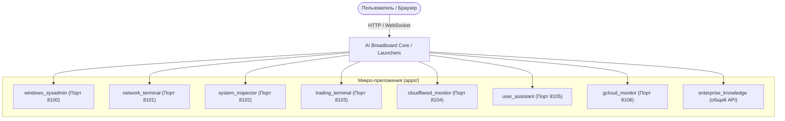

# 📱 Микро-приложения AI Breadboard (Apps)

## 📋 Обзор

Подсистема **Apps** (`apps/`) содержит специализированные автономные терминальные и веб-приложения (микро-сервисы), расширяющие возможности платформы AI Breadboard. Каждое микро-приложение изолировано, имеет собственный выделенный TCP-порт, веб-интерфейс или TUI (Text User Interface) и может взаимодействовать с ядром платформы через REST API.

---

## 🏗️ Архитектура микро-приложений

Все приложения построены по модульному принципу и запускаются независимо либо через общий диспетчер задач.



### Стандарт распределения портов

| Приложение | Порт | Протокол | Назначение |
|------------|------|----------|------------|
| `windows_sysadmin` | `8100` | HTTP / WS | Администрирование Windows хоста |
| `network_terminal` | `8101` | HTTP / SSH | Диагностика сети и терминальный доступ |
| `system_inspector` | `8102` | HTTP / JSON | Аппаратный мониторинг и инспекция железа |
| `trading_terminal` | `8103` | HTTP / WS | Финансовая аналитика и трейдинг-интерфейс |
| `cloudflared_monitor` | `8104` | HTTP / SSE | Мониторинг туннелей Cloudflare |
| `user_assistant` | `8105` | HTTP / Chat | Интерактивный ассистент пользователя |
| `gcloud_monitor` | `8106` | HTTP / TUI | Google Cloud Observability, логи, метрики и аудит |
| `enterprise_knowledge` | общий сервер | HTTP / JSON | Накопление корпоративных знаний, identity resolution и hybrid retrieval |

---

## 🚀 Быстрый старт

### Запуск конкретного приложения

Каждое приложение содержит файл точки входа (обычно `main.py`, `app.py` или `server.py`).

```powershell
# Запуск системного инспектора
py apps/system_inspector/main.py

# Запуск ассистента пользователя
py apps/user_assistant/main.py
```

### Запуск через PowerShell лаунчеры

Для микро-приложений в каталоге `launchers/` предусмотрены специализированные скрипты автоматического развертывания и контроля портов.

---

## 📚 Связанные разделы

- [Каталог микро-приложений](catalog.md) — подробное описание каждого из 6 приложений.
- [Архитектура системы](../architecture/index.md) — общая организация платформы.
- [MCP Серверы](../mcp/index.md) — интеграция протокола Model Context Protocol.