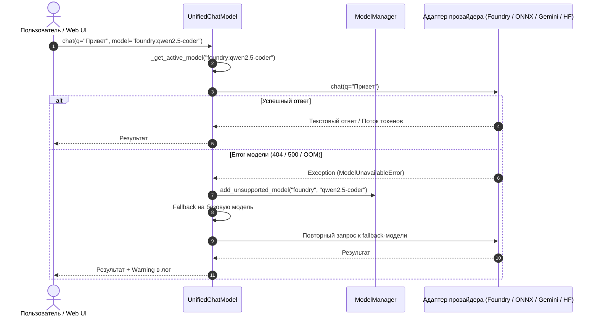

# Глава 2. Оркестратор моделей и отказоустойчивость

> **Цель главы:** Изучить паттерн «Фасад» в ИИ-системах, диспетчеризацию запросов к разнородным провайдерам, алгоритм Circuit Breaker и механизмы пула API-ключей.

---

## 2.1. Паттерн «Фасад» и class `UnifiedChatModel`

При разработке приложений, работающих с десятками различных моделей (облачными и локальными), возникает проблема несовместимости интерфейсов:
- Google GenAI SDK требует вызова `client.models.generate_content(...)`.
- Microsoft AI Foundry и OpenAI работают по протоколу Chat Completions `/v1/chat/completions`.
- Локальный Transformers использует пайплайны генерации PyTorch.
- ONNX Runtime performs прямой тензорный инференс через сессии.

Чтобы избавить бизнес-логику приложения от бесконечных проверок `if provider == '...'`, в модуле [`src/ai/unified_chat.py`](../../../src/ai/unified_chat.py) реализован паттерн **Unified Facade**:



### Префиксная маршрутизация

Маршрутизация осуществляется по префиксу идентификатора модели:

| Префикс модели | Class-обработчик | Транспорт / Протокол |
|---|---|---|
| `foundry:<id>` | `FoundryChatBase` | HTTP POST на локальный порт 54837 (OpenAI API spec) |
| `onnx:<id>` | `ONNXChatBase` | Прямой вызов `optimum.onnxruntime` через DirectML/CPU |
| `hf:<id>` | `HFChatBase` | In-process пайплайн `transformers.pipeline` |
| `openai:<id>`, `deepseek:<id>` | `OpenAICompatChat` | Облачные OpenAI-совместимые эндпоинты |
| `ollama:<id>` | `OllamaChatBase` | HTTP POST на `http://localhost:11434/api/chat` |
| `gemini_cli:<id>` | `GeminiCliChatBase` | Запуск CLI-процесса через асинхронный `subprocess` |
| `agy-<id>` | `AgyChatBase` | Google Antigravity SDK |
| `windows_ai:<id>` | `WindowsAIChatBase` | Windows Copilot Runtime / DirectML Native |
| `gemini-*` (без префикса) | `GoogleGenerativeAI` | Нативный вызов Google GenAI SDK с пулом ключей |

---

## 2.2. Централизованный реестр и кэш: `ModelManager`

Module [`src/ai/model_manager.py`](../../../src/ai/model_manager.py) отвечает за то, чтобы система всегда знала реальный status всех моделей без постоянных задержек на сетевые запросы:

### 1. Параллельный прогрев кэша (`actualize_all_models`)
При старте сервера асинхронный менеджер запускает параллельный опрос всех подключенных провайдеров через `asyncio.gather`:

```python
async def actualize_all_models() -> Dict[str, List[str]]:
    """Параллельный опрос доступных моделей всех провайдеров."""
    results = await asyncio.gather(
        get_available_models("gemini", force_refresh=True),
        get_available_models("foundry", force_refresh=True),
        get_available_models("ollama", force_refresh=True),
        get_available_models("hf", force_refresh=True),
        get_available_models("onnx", force_refresh=True),
        return_exceptions=True
    )
    # Caching в оперативной памяти на весь жизненный цикл
    return _CACHED_MODELS
```

### 2. Circuit Breaker (Автоматическое exception неработающих моделей)
Если в процессе работы модель Returns ошибку несовместимости, таймаута или исчерпания ресурсов (OOM), срабатывает method `add_unsupported_model(provider, model_name)`:
1. Модель немедленно удаляется из оперативного кэша `_CACHED_MODELS`.
2. Модель добавляется в черный list в [`config.json`](../../../config.json).
3. При следующих запросах клиентам возвращаются только заведомо рабочие альтернативы.

---

## 2.3. Пул API-ключей и отказоустойчивость Gemini

При активном использовании облачных LLM бесплатные тарифные планы быстро сталкиваются с лимитами скорости (Rate Limits / Quotas).

В [`src/ai/gemini/gemini_api_key_state.py`](../../../src/ai/gemini/gemini_api_key_state.py) реализован менеджер пула ключей:
- Ключи загружаются списком из `.env` (`GEMINI_API_KEY=key1,key2,key3`).
- При возникновении ошибки `429 ResourceExhausted` Module автоматически переключает активный ключ на следующий по круговому алгоритму (Round-Robin).
- Временная метка блокировки ключа сохраняется в памяти, предотвращая повторные запросы до истечения окна охлаждения.

---

## 2.4. Резюме

1. `UnifiedChatModel` скрывает различия протоколов за единым интерфейсом (`chat`, `stream_chat`, `ask`).
2. `ModelManager` прогревает кэш параллельно и автоматически изолирует сбоящие модели через Circuit Breaker.
3. Пул ключей обеспечивает непрерывную работу без остановки сервиса при исчерпании квот.
