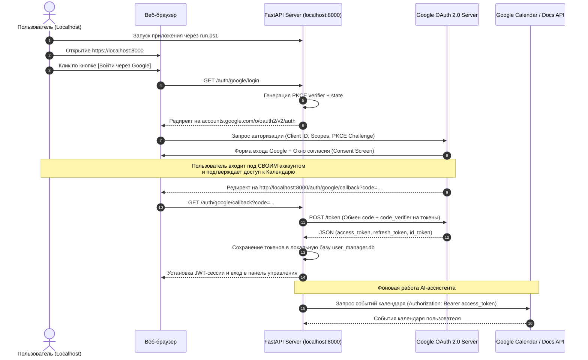

# Архитектура и безопасность Google OAuth 2.0 на Localhost

Настоящий документ описывает архитектуру, модель безопасности и пошаговую настройку интеграции **Google OAuth 2.0** для приложений, запускаемых локально на машинах пользователей (`localhost`).

---

## 1. Концепция и ключевой принцип

Когда приложение запускается на локальном компьютере пользователя (`http://localhost:8000`), ассистенту требуется доступ к **персональным данным самого пользователя** (Google Календарь, Google Контакты, Google Документы).

> [!IMPORTANT]
> **Главный вопрос безопасности:**  
> *«Если пользователь запускает приложение локально, не скомпрометирует ли это аккаунт разработчика и не утекут ли секретные ключи?»*  
> **Ответ:** Нет. В архитектуре OAuth 2.0 для настольных / локальных приложений учетные данные приложения (`Client ID`) лишь идентифицируют программу, но **не дают никакого доступа к данным разработчика**. Доступ выдается исключительно к аккаунту того пользователя, который прошел авторизацию в браузере.

---

## 2. Модель безопасности

### А. Почему `Client ID` безопасен
* `Client ID` — это публичный идентификатор приложения в экосистеме Google (аналог имени программы).
* Знание `Client ID` третьими лицами не позволяет им прочитать ваши письма, календарь или файлы на Google Диске.

### Б. Механизм защиты PKCE (Proof Key for Code Exchange)
Для приложений, исполняемых на стороне клиента (Desktop / Localhost / Mobile), Google рекомендует и поддерживает протокол **PKCE**:
1. Приложение локально генерирует динамический секрет (`code_verifier`) и его криптографический хэш (`code_challenge`).
2. При открытии браузера Google получает только хэш.
3. При возврате кода авторизации на `localhost` приложение отправляет исходный `code_verifier`.
4. Google сверяет хэш и выдает токены. Перехват кода в сети или локально без `code_verifier` бесполезен.

### В. Изоляция пользовательских данных
* Авторизация происходит в браузере конечного пользователя.
* Пользователь логинится под **своим** логином и паролем Google.
* Выданный `refresh_token` и `access_token` привязаны **только к его аккаунту**.
* Токены сохраняются локально на его компьютере (в изолированной базе SQLite `user_manager.db`) и не передаются разработчику.

---

## 3. Диаграмма процесса авторизации (Sequence Diagram)



---

## 4. Пошаговая настройка в Google Cloud Console

### Шаг 1. Создание проекта
1. Перейдите в [Google Cloud Console](https://console.cloud.google.com/).
2. Создайте новый проект (например, `AI-Assistant-Local`).

### Шаг 2. Настройка OAuth Consent Screen (Экрана согласия)
1. Откройте **APIs & Services** → **OAuth consent screen**.
2. Выберите тип пользователя: **External** (Внешний).
3. Заполните обязательные поля:
   - **App name**: `AI Assistant`
   - **User support email**: ваш контактный email
   - **Developer contact information**: ваш контактный email
4. В разделе **Scopes (Области видимости)** добавьте необходимые разрешения:
   - `openid`, `.../auth/userinfo.email`, `.../auth/userinfo.profile`
   - `https://www.googleapis.com/auth/calendar.readonly` (или `.../auth/calendar`)
   - `https://www.googleapis.com/auth/contacts.readonly`
   - `https://www.googleapis.com/auth/documents.readonly`
   - `https://www.googleapis.com/auth/drive.readonly`
5. В разделе **Test users (Тестовые пользователи)**:
   - Пока приложение находится в режиме тестирования (Status: *Testing*), добавьте email-адреса тех, кто будет запускать программу.

### Шаг 3. Создание учетных данных (Credentials)
1. Перейдите в **APIs & Services** → **Credentials** → **Create Credentials** → **OAuth client ID**.
2. Выберите тип приложения:
   - **Desktop app** (Десктопное приложение) — *рекомендуется для распространяемых локальных программ*, либо
   - **Web application** (Веб-приложение) с указанием Authorized Redirect URIs:
     ```
     http://localhost:8000/auth/google/callback
     https://localhost:8000/auth/google/callback
     http://127.0.0.1:8000/auth/google/callback
     https://127.0.0.1:8000/auth/google/callback
     ```
3. Скопируйте полученный **Client ID**.

---

## 5. Хранение и использование токенов в проекте

### Конфигурация (`.env`)
```ini
# Google OAuth Configuration
GOOGLE_CLIENT_ID=xxxxxxxxxxxx-xxxxxxxxxxxxxxxxxxxxxxxxxxxxxxxx.apps.googleusercontent.com
GOOGLE_CLIENT_SECRET=GOCSPX-xxxxxxxxxxxxxxxxxxxxxxxxxxxx
GOOGLE_REDIRECT_URI=https://localhost:8000/auth/google/callback
```

### Структура хранения в SQLite (`user_manager.db`)
Таблица `google_oauth_tokens`:
```sql
CREATE TABLE IF NOT EXISTS google_oauth_tokens (
    user_id INTEGER PRIMARY KEY,
    google_user_id TEXT,
    email TEXT,
    access_token TEXT,
    refresh_token TEXT,
    token_uri TEXT DEFAULT 'https://oauth2.googleapis.com/token',
    client_id TEXT,
    client_secret TEXT,
    scopes TEXT,
    expiry TEXT,
    updated_at TIMESTAMP DEFAULT CURRENT_TIMESTAMP,
    FOREIGN KEY(user_id) REFERENCES users(id) ON DELETE CASCADE
);
```

### Автоматическое обновление просроченного `access_token`
Модуль `core/google_services.py` автоматически проверяет валидность токена перед каждым вызовом Google API:
* Если `access_token` истек (срок жизни обычно 1 час), сервис выполняет запрос к `https://oauth2.googleapis.com/token` с использованием сохраненного `refresh_token`.
* Обновленный токен автоматически записывается в базу данных.
* Пользователю **не требуется** повторно проходить авторизацию в браузере.

---

## 6. Сводная таблица безопасности

| Компонент | Где хранится | Кто имеет доступ | Уровень риска |
|---|---|---|---|
| **Google Client ID** | `config.json` / `.env` | Публичный (в коде) | 🟢 **Безопасно** (не дает доступа к данным) |
| **Google Client Secret** | `.env` / PKCE Flow | Локальный ПК | 🟢 **Безопасно** при использовании Desktop App / PKCE |
| **Пользовательский Refresh Token** | Локальная БД `user_manager.db` | Только локальный сервер пользователя | 🟢 **Изолировано** (доступ только к данным этого пользователя) |
| **Данные календаря / файлов** | Google Cloud пользователя | Пользователь и его локальный AI | 🟢 **Конфиденциально** (не уходит разработчику) |
