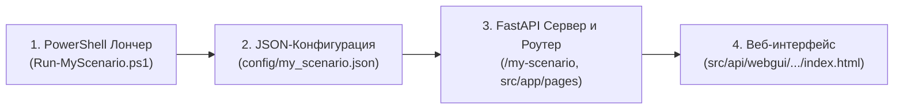

# Руководство: Создание нового сценария запуска и веб-интерфейса

**Статус:** ✅ Актуально  
**Языковой стандарт:** Русский  
**Область применения:** AI Breadboard (FastAPI, WebGUI, PowerShell Launchers, Config Profiles)

---

## 🧭 1. Концепция сценариев в AI Breadboard

Каждый сценарий запуска в проекте представляет собой **связанную цепочку из четырёх уровней**:



1. **PowerShell Лончер (`Run-*.ps1` / `*.ps1`)**: точка входа для пользователя, подготавливает переменные окружения, освобождает порт, запускает зависимые сервисы и открывает браузер.
2. **Профиль конфигурации (`config/*.json`)**: определяет список активных приложений (`apps.enabled`), параметры AI-провайдеров, хост/порт и флаги (SSL, OAuth, Tray).
3. **HTTP-маршрут (FastAPI)**: регистрирует эндпоинты страниц в `src/app/pages/__init__.py`.
4. **HTML/JS Оболочка (WebGUI)**: интерфейс страницы в `src/api/webgui/<раздел>/index.html`.

---

## 🛠️ 2. Пошаговый алгоритм создания нового сценария

### Шаг 1. Создание профиля конфигурации (`config/<name>.json`)

Создайте JSON-файл в директории `config/` (например, `config/kiosk.json`):

```json
{
  "_meta": {
    "version": "1.0",
    "description": "Профиль запуска информационного терминала (Run-Kiosk.ps1)"
  },
  "server": {
    "host": "127.0.0.1",
    "port": 8090,
    "protocol": "http",
    "use_ssl": false,
    "enable_tray": true,
    "enable_oauth": false
  },
  "ai": {
    "provider": "gemini",
    "gemini": {
      "model": "gemini-2.5-flash"
    }
  },
  "apps": {
    "enabled": [
      "system_inspector",
      "dashboard"
    ],
    "disabled": []
  }
}
```

> [!WARNING]
> Никогда не храните в файлах `config/*.json` секреты, пароли и токены. Все секретные ключи загружаются только из `.env`.

---

### Шаг 2. Создание веб-интерфейса (`src/api/webgui/<name>/`)

Создайте директорию интерфейса (или переиспользуйте существующий хаб `src/api/webgui/apps/`):

1. **`src/api/webgui/<name>/index.html`**:
   ```html
   <!DOCTYPE html>
   <html lang="ru" data-bs-theme="dark">
   <head>
       <meta charset="UTF-8">
       <meta name="viewport" content="width=device-width, initial-scale=1.0">
       <title>AI Breadboard — Информационный терминал</title>
       <link rel="stylesheet" href="/html/vendor/bootstrap/bootstrap.min.css">
       <link rel="stylesheet" href="/html/css/common.css">
   </head>
   <body>
       <div class="container py-4">
           <h1 class="h3 mb-3">Терминал мониторинга</h1>
           <div id="content">Загрузка данных...</div>
       </div>
       <script type="module" src="./main.js"></script>
   </body>
   </html>
   ```

2. **`src/api/webgui/<name>/main.js`**:
   ```javascript
   document.addEventListener('DOMContentLoaded', async () => {
       console.log('Терминал инициализирован');
   });
   ```

---

### Шаг 3. Регистрация маршрута в FastAPI (`src/app/pages/__init__.py`)

Добавьте обработчики для отдачи HTML и статических файлов сценария:

```python
# === Kiosk Terminal Pages ===

@app.get('/kiosk', response_class=HTMLResponse)
async def kiosk_interface(request: Request) -> HTMLResponse:
    """Отображение страницы терминала Kiosk."""
    content = read_text_file(webinterface_dir / 'kiosk' / 'index.html')
    if not content:
        raise HTTPException(status_code=500, detail='Failed to read Kiosk page')
    response = HTMLResponse(content=content)
    response.headers['Cache-Control'] = 'no-cache, no-store, must-revalidate'
    return response

@app.get('/kiosk/{full_path:path}', response_class=Response)
async def kiosk_static(full_path: str) -> Response:
    """Раздача статических файлов Kiosk."""
    file_path = webinterface_dir / 'kiosk' / full_path
    if not file_path.exists() or not file_path.is_file():
        raise HTTPException(status_code=404, detail='File not found')
    
    media_type = 'text/plain'
    if full_path.endswith('.css'):
        media_type = 'text/css'
    elif full_path.endswith('.js'):
        media_type = 'application/javascript'
    elif full_path.endswith('.html'):
        media_type = 'text/html'
    elif full_path.endswith('.json'):
        media_type = 'application/json'
        
    return FileResponse(file_path, media_type=media_type)
```

---

### Шаг 4. Создание PowerShell лончера (`Run-<Name>.ps1`)

Создайте скрипт в корне проекта (например, `Run-Kiosk.ps1`):

```powershell
<#
.SYNOPSIS
    Запускает специализированный терминал Kiosk (AI Breadboard /kiosk).

.DESCRIPTION
    Читает конфигурацию из config/kiosk.json.
    Параметры -Host и -Port переопределяют значения из конфига.

.EXAMPLE
    .\Run-Kiosk.ps1
    .\Run-Kiosk.ps1 -Host 127.0.0.1 -Port 8090
#>

[CmdletBinding()]
param (
    [Alias('Host', 'Address', 'IP')]
    [string]$HostAddress,

    [string]$Port
)

$ErrorActionPreference = 'Continue'
$env:PYTHONUTF8 = '1'
[Console]::OutputEncoding = [System.Text.Encoding]::UTF8
$OutputEncoding = [System.Text.Encoding]::UTF8

$scriptDir = $PSScriptRoot
if ([string]::IsNullOrEmpty($scriptDir)) { $scriptDir = (Get-Location).Path }
$env:AIBREADBOARD_DIR  = $scriptDir
$env:ASSIST_DIR        = $scriptDir
$env:ENABLE_OAUTH      = 'false'
$env:DISABLE_AUTH      = 'true'

# 1. Загрузка конфигурации
$configPath = Join-Path $scriptDir 'config\kiosk.json'
$cfgHost    = '127.0.0.1'
$cfgPort    = '8090'
$useSsl     = $false
$enableTray = $true

if (Test-Path $configPath) {
    try {
        $cfg = Get-Content $configPath -Raw -Encoding UTF8 | ConvertFrom-Json
        if ($cfg.server.host)     { $cfgHost = [string]$cfg.server.host }
        if ($cfg.server.port)     { $cfgPort = [string]$cfg.server.port }
        if ($cfg.server.protocol) { $useSsl  = $cfg.server.protocol.ToLower() -eq 'https' }
        if ($null -ne $cfg.server.enable_tray) { $enableTray = [bool]$cfg.server.enable_tray }
        Write-Host "[OK] config/kiosk.json загружен" -ForegroundColor Green
    } catch {
        Write-Host "[ERROR] Ошибка чтения config/kiosk.json: $_" -ForegroundColor Red
    }
}

$env:CONFIG_FILE         = 'config/kiosk.json'
$env:AIBREADBOARD_CONFIG = 'config/kiosk.json'

$host_ = if ($HostAddress) { $HostAddress } else { $cfgHost }
$port_ = if ($Port)        { $Port }        else { $cfgPort }
$proto = if ($useSsl) { 'https' } else { 'http' }
$browserHost = if ($host_ -eq '0.0.0.0') { 'localhost' } else { $host_ }
$targetUrl = "${proto}://${browserHost}:${port_}/kiosk"

Write-Host "  Хост:  $host_"  -ForegroundColor White
Write-Host "  Порт:  $port_"  -ForegroundColor White
Write-Host "  URL:   $targetUrl"  -ForegroundColor Cyan

# 2. Освобождение порта при необходимости
$occupied = netstat -aon 2>$null |
    Select-String ":${port_}\s" |
    ForEach-Object { ($_ -split '\s+')[-1] } |
    Where-Object { $_ -match '^\d+$' -and $_ -ne '0' } |
    Select-Object -Unique

foreach ($pid_ in $occupied) {
    try {
        Stop-Process -Id $pid_ -Force -ErrorAction Stop
        Write-Host "[OK] Освобождён порт $port_ (PID $pid_)" -ForegroundColor Green
    } catch {
        Write-Host "[WARN] Не удалось завершить PID ${pid_}: $_" -ForegroundColor Yellow
    }
}

# 3. Интеграция с системным треем
if ($enableTray) {
    $trayScript = Join-Path $scriptDir 'launchers\ShowHide-InTray.ps1'
    if (Test-Path $trayScript) {
        try { & $trayScript -Action start -WebUrl $targetUrl -Title "AI Breadboard Kiosk ($port_)" }
        catch { Write-Host "  [WARN] Трей: $_" -ForegroundColor Yellow }
    }
}

# 4. Запуск сервера через Run-Unicorn.ps1
$unicornScript = Join-Path $scriptDir 'launchers\Run-Unicorn.ps1'
if (-not (Test-Path $unicornScript)) { $unicornScript = Join-Path $scriptDir 'Run-Unicorn.ps1' }

if (Test-Path $unicornScript) {
    & $unicornScript -Host_ $host_ -Port $port_ -OpenUrl $targetUrl `
                     -EnableOAuth $false -ConfigFile 'config/kiosk.json'
} else {
    Write-Host "[ERROR] Run-Unicorn.ps1 не найден" -ForegroundColor Red
    exit 1
}
```

---

### Шаг 5. Регистрация в реестре портов и документации

1. Зарегистрируйте порт в [`start_scenarios_config/ports.json`](file:///c:/Users/onela/AppData/Local/AI-Breadboard/start_scenarios_config/ports.json).
2. Добавьте запись в таблицу сценариев в [`start_scenarios_config/README.md`](file:///c:/Users/onela/AppData/Local/AI-Breadboard/start_scenarios_config/README.md).
3. При необходимости добавьте пункт в меню диспетчера [`launcher.ps1`](file:///c:/Users/onela/AppData/Local/AI-Breadboard/launcher.ps1).

---

## 📋 3. Чек-лист проверки нового сценария

- [ ] Файл конфигурации создан в `start_scenarios_config/<name>.json` (без секретов).
- [ ] Порт не конфликтует с существующими сервисами в `start_scenarios_config/ports.json`.
- [ ] Роут зарегистрирован в `src/app/pages/__init__.py`.
- [ ] HTML-страница создана в `src/api/webgui/<name>/index.html` (или подключена к хабу `apps`).
- [ ] PowerShell-скрипт корректно запускает `Run-Unicorn.ps1` с передачей `-ConfigFile` и целевого `-OpenUrl`.
- [ ] Проверено открытие в браузере и сворачивание в трей.
