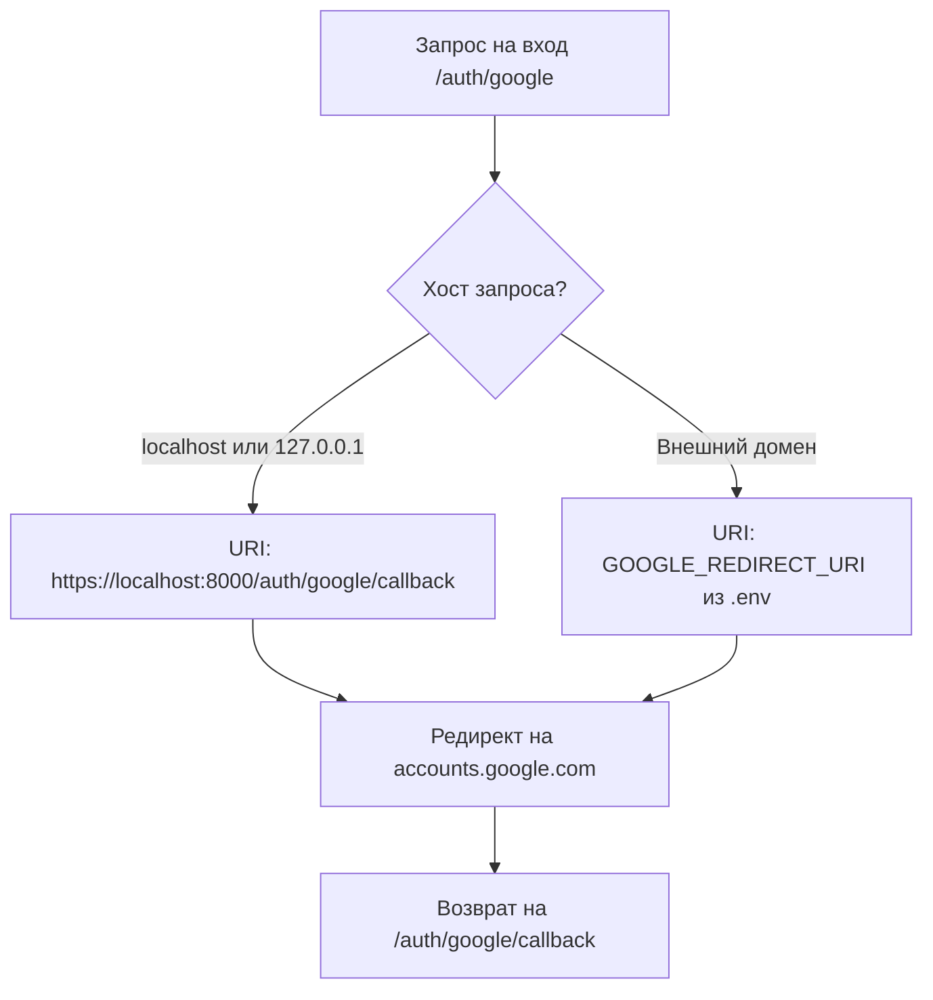

# Руководство по настройке Google OAuth 2.0 (Localhost и Cloud)

> **Цель:** Пошаговая настройка авторизации через Google OAuth для локальной разработки (`localhost:8000`) и внешнего домена (`kino.davidka.net`), решение частых ошибок и управление флагом `enable_oauth`.

---

## 📋 Содержание

1. [Введение и архитектурный принцип](#1-введение-и-архитектурный-принцип)
2. [Управление флагом enable_oauth](#2-управление-флагом-enable_oauth)
3. [Настройка Google Cloud Console](#3-настройка-google-cloud-console)
4. [Динамическая маршрутизация redirect_uri](#4-динамическая-маршрутизация-redirect_uri)
5. [Решение типичных проблем и ошибок](#5-решение-типичных-проблем-и-ошибок)
6. [Проверка работоспособности](#6-проверка-работоспособности)

---

## 1. Введение и архитектурный принцип

В AI Breadboard авторизация через Google OAuth используется для:
- Идентификации пользователя и разграничения сессий (выдача JWT токена).
- Персональной синхронизации с сервисами Google Workspace (Google Drive, Docs, Calendar, Contacts).
- Сохранения персональных токенов (`access_token`, `refresh_token`) в локальной базе данных `user_manager.db`.

> [!IMPORTANT]
> **Принцип изоляции данных:**  
> Учетные данные приложения (`GOOGLE_CLIENT_ID` и `GOOGLE_CLIENT_SECRET`) идентифицируют программу в экосистеме Google, но **не предоставляют** доступ к данным разработчика. Доступ выдается исключительно к аккаунту того пользователя, который проходит авторизацию в окне браузера.

---

## 2. Управление флагом enable_oauth

Авторизация через Google OAuth по умолчанию **выключена** (`false`), чтобы локальный сервер мог запускаться автономно без обязательной настройки внешних сервисов.

### Иерархия настроек:
1. **Флаг CLI при запуске** (наивысший приоритет):
   ```powershell
   # Включить OAuth
   .\run.ps1 -EnableOAuth:$true
   # или с алиасом
   .\run.ps1 -OAuth

   # Принудительно выключить
   .\run.ps1 -EnableOAuth:$false
   ```
2. **Переменная окружения `.env`**:
   ```env
   ENABLE_OAUTH=true
   ```
3. **Глобальный конфигурационный файл `config.json`**:
   ```json
   {
     "server": {
       "enable_oauth": false
     }
   }
   ```
4. **Интерактивный диалог (`.\run.ps1 -Interactive`)**:
   Лончер задаст вопрос: `Включить авторизацию Google OAuth? (y/N) [Enter = n]`.

---

## 3. Настройка Google Cloud Console

Чтобы Google принимал запросы авторизации от вашего экземпляра AI Breadboard:

### Шаг 1. Переход в Google Cloud Console
1. Откройте [Google Cloud Console](https://console.cloud.google.com/).
2. Выберите или создайте проект (например, `AI-Breadboard`).

### Шаг 2. Экран согласия (OAuth consent screen)
1. Откройте **APIs & Services ➔ OAuth consent screen**.
2. Выберите тип пользователя: **External** (Внешний).
3. Заполните обязательные поля:
   - **App name**: Имя вашего приложения (например, `davidka.net` или `AI Breadboard`).
   - **User support email**: ваш контактный email.
   - **Developer contact information**: ваш email.
4. **Test users (Тестовые пользователи)**:
   > [!WARNING]
   > Пока приложение находится в статусе *Testing*, вход разрешен **только** адресам из списка тестировщиков!
   - Нажмите **+ ADD USERS**.
   - Добавьте свой Google-аккаунт (например, `e.cat.co.il@gmail.com`).
   - Нажмите **Save**.

### Шаг 3. Создание и настройка Client ID (Credentials)
1. Откройте **APIs & Services ➔ Credentials**.
2. Нажмите **Create Credentials ➔ OAuth client ID**.
3. Тип приложения: **Web application**.
4. В поле **Authorized JavaScript origins** (Авторизованные источники JavaScript) укажите:
   - `https://localhost:8000`
   - `http://localhost:8000`
   - `https://kino.davidka.net` (если используется Cloudflare Tunnel)
5. В поле **Authorized redirect URIs** (Разрешенные URI перенаправления) обязательно укажите:
   - `https://localhost:8000/auth/google/callback`
   - `http://localhost:8000/auth/google/callback`
   - `https://kino.davidka.net/auth/google/callback`
6. Скопируйте сгенерированные **Client ID** и **Client Secret** в файл `.env`:
   ```env
   GOOGLE_CLIENT_ID=ваш_client_id.apps.googleusercontent.com
   GOOGLE_CLIENT_SECRET=ваш_client_secret
   GOOGLE_REDIRECT_URI=https://kino.davidka.net/auth/google/callback
   ```

---

## 4. Динамическая маршрутизация redirect_uri

В AI Breadboard реализовано автоматическое переключение адреса возврата в зависимости от того, откуда пришел пользователь (`src/fastapi/router_auth.py` -> `get_oauth_redirect_uri`):



- Если вы заходите через браузер по адресу `https://localhost:8000`, Google вернет вас на `https://localhost:8000/auth/google/callback`.
- Если вы заходите через туннель `https://kino.davidka.net`, Google вернет вас на внешний домен.

---

## 5. Решение типичных проблем и ошибок

| Ошибка Google | Причина | Способ решения |
|---|---|---|
| **`401: invalid_client`** | Неверный или удаленный `GOOGLE_CLIENT_ID` | Проверьте значение `GOOGLE_CLIENT_ID` в `.env` и в Google Cloud Console. |
| **`400: redirect_uri_mismatch`** | Текущий URL возврата отсутствует в настройках Google Cloud Console | Добавьте точный URL (схема + хост + порт + `/auth/google/callback`) в **Authorized redirect URIs**. |
| **`403: access_denied` / *Приложение не прошло проверку*** | Приложение в статусе *Testing*, а email не добавлен в список тестировщиков | Добавьте email пользователя в **OAuth consent screen ➔ Test users** в Google Console. |
| **`403: Google OAuth отключен`** | Флаг `enable_oauth` установлен в `false` | Запустите сервер с флагом `.\run.ps1 -EnableOAuth:$true` или укажите `ENABLE_OAUTH=true` в `.env`. |

---

## 6. Проверка работоспособности

1. Запустите сервер с поддержкой OAuth:
   ```powershell
   .\run.ps1 -EnableOAuth:$true
   ```
2. Откройте в браузере `https://localhost:8000`.
3. В навигационной панели появится кнопка **Регистрация через Google** / **Войти через Google**.
4. Нажмите на кнопку — произойдет переход на стандартную форму входа Google Accounts.
5. После подтверждения доступа браузер вернется на `https://localhost:8000/`, а в правом верхнем углу отобразится аватар и имя профиля пользователя.
