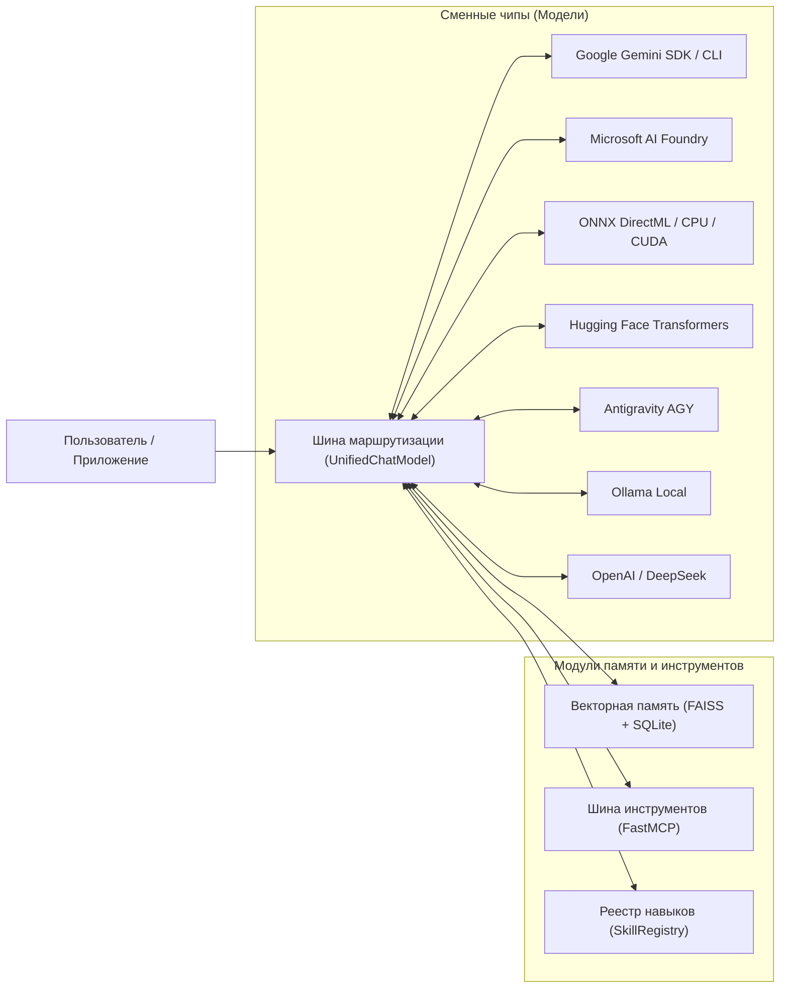

# 🧭 AI Breadboard — Русскоязычная документация проекта прототипирования моделей

> **Интерактивный стенд и «макетная плата» для исследования, тестирования, сравнения и калибровки языковых моделей искусственного интеллекта.**

---

## 💡 О проекте

**AI Breadboard** переносит концепцию радиоэлектронной макетной платы в программную инженерию искусственного интеллекта. Модели ИИ выступают в роли сменных микросхем, сигнальная шина `UnifiedChatModel` обеспечивает мгновенную коммутацию, а контрольные точки (RAG-индекс, логи, SSE-потоки) дают полную наблюдаемость за всеми этапами работы нейросетей.



---

## 📚 Разделы русскоязычной документации

### 1. 📘 [Учебная книга по архитектуре и прототипированию моделей](book/index.md)
Фундаментальное практическое руководство из 8 глав по работе со стендом:
- **[Глава 1. Архитектура макетной платы и среда](book/ch01_philosophy.md)** — Философия стенда, шины сигналов, сокеты в `config.json`, изоляция секретов `.env`.
- **[Глава 2. Оркестратор моделей и отказоустойчивость](book/ch02_orchestration.md)** — `model_manager.py`, `unified_chat.py`, балансировка квот, circuit breaker.
- **[Глава 3. Локальный инференс (HF и DirectML)](book/ch03_local_inference.md)** — Запуск моделей в памяти процесса, квантование, аппаратное ускорение DirectML на любых GPU.
- **[Глава 4. Архитектура RAG и векторный поиск](book/ch04_rag_architecture.md)** — Модули оперативной памяти, косинусная близость, индекс FAISS, гибридный поиск.
- **[Глава 5. Оптимизация, экспорт и Fine-Tuning](book/ch05_optimization_finetuning.md)** — Оптимизатор Microsoft Olive, экспорт GGUF -> ONNX, дообучение LoRA/QLoRA.
- **[Глава 6. ReAct-агенты, MCP и мультимодальность](book/ch06_agents_and_mcp.md)** — Цикл Thought-Action-Observation, FastMCP-серверы, голосовой конвейер.
- **[Глава 7. Создание и управление навыками (Skills)](book/ch07_skills_management.md)** — Манифесты `SKILL.md`, фабрика навыков `skill-factory`.
- **[Глава 8. Практикум: 10 лабораторных работ](book/ch08_laboratory_practicum.md)** — Пошаговые лабораторные работы для закрепления навыков.

---

### 2. ⚙️ [Техническая документация модулей и исходного кода](code/index.md)
Подробное описание архитектуры, API и исходного кода всех подсистем проекта:
- 🤖 **[Ядро системы (`core/`)](code/core/README.md)**:
  - [`core.ai`](code/core/ai/README.md) — Мультимодельный оркестратор, адаптеры провайдеров.
  - [`core.ai.gemini`](code/core/ai/gemini/README.MD) — Google Gemini SDK, ротация ключей, отказоустойчивость.
  - [`core.rag`](code/core/rag/README.md) — Подсистема RAG-First, `RAGEngine`, `RulesRAG`, `UserRAG`.
  - [`core.fastapi`](code/core/fastapi/README.md) — API-роутеры, WebSocket и SSE стриминг.
  - [`core.secrets`](code/core/secrets/README.md) — Менеджер API-ключей и отслеживание квот.
  - [`core.skills`](code/core/skills/README.md) — Универсальный реестр навыков.
  - [`core.tts`](code/core/tts/README.md) — Движки синтеза речи (Edge-TTS, gTTS, Silero).
  - [`core.logger`](code/core/logger/README.MD) — Подсистема структурированного логирования.
  - [`core.clients`](code/core/clients/README.md) — Клиенты внешних сервисов (Foundry, Ollama).
  - [`core.user_manager`](code/core/user_manager/README.md) — Профили пользователей и сессии.
  - [`core.utils`](code/core/utils/README.md) — Утилиты и конверторы данных.
- 🖥️ **[Веб-интерфейс (`webinterface/`)](code/webinterface/README.md)**:
  - [Чат с ИИ](code/webinterface/chat/README.md), [Панель моделей](code/webinterface/models_tab/README.md), [ReAct-агенты](code/webinterface/agents_tab/README.md), [RAG-поиск](code/webinterface/search_tab/README.md), [Плеер](code/webinterface/cosmicplayer/README.md), [Пульт ДУ](code/webinterface/rc/README.md), [Админка](code/webinterface/admin/README.md).
- 🔌 **[Серверы Model Context Protocol (`.mcp/`)](code/.mcp/README.md)**:
  - FastMCP серверы для внешних агентов (Claude Desktop, Cursor, Antigravity, VS Code).
- 🧠 **[Инструкции и промпты ИИ (`.ai/`)](code/.ai/instructions/README.md)**:
  - Единый центр инструкций, правила `CODE_RULES.md`, база знаний `codex/` и системные промпты `prompts/`.
- 🛠️ **[Инструменты разработчика и тесты (`scripts/`, `tests/`)](code/scripts/README.md)**:
  - Скрипты разработки (`scripts/dev/`), сопровождения (`scripts/maintenance/`), автоматические тесты (`tests/`).
- 📦 **[Установка и окружение (`install/`, `req/`)](code/install/README.md)**:
  - Moduleный установщик, генерация SSL-сертификатов, профили зависимостей Python.

---

## 📋 Таблица содержания

Структурированная навигация по разделам документации:

| Раздел | Описание | Ссылка |
|--------|---------|--------|
| 📘 Учебная книга | 8 глав по архитектуре и прототипированию моделей | [Перейти](book/index.md) |
| 📕 Техническая документация | Описание модулей, API и исходного кода | [Перейти](code/index.md) |
| 🚀 Начало работы | Первые шаги, установка и конфигурация | [Перейти](manual/getting-started.md) |
| ⚙️ Установка | Инструкции по установке и настройке окружения | [Перейти](manual/installation.md) |
| 📖 Руководства | Расширенные руководства по разработке | [Перейти](manual/index.md) |
| 🏗️ Архитектура | Описание архитектуры системы и компонентов | [Перейти](architecture/overview.md) |
| 🧰 Гайды | Специализированные гайды и примеры | [Перейти](guides/) |
| 🤝 Контрибуция | Правила участия в развитии проекта | [Перейти](#правила-контрибуции) |

---

## 🔗 Быстрая навигация

Основные разделы документации для разных типов пользователей:

### Для начинающих:
1. [Начало работы](manual/getting-started.md) — введение в AI Breadboard
2. [Установка](manual/installation.md) — пошаговая установка
3. [Первый пример](manual/usage-examples.md) — создание первого проекта

### Для разработчиков:
1. [Ядро системы](code/core/README.md) — архитектура и API
2. [Создание навыков (Skills)](book/ch07_skills_management.md) — разработка собственных навыков
3. [API Документация](api/index.md) — полная API-документация

### Для архитекторов:
1. [Обзор архитектуры](architecture/overview.md) — общая архитектура системы
2. [Компоненты системы](architecture/components.md) — описание компонентов
3. [Модели данных](architecture/data-models.md) — структуры данных

### Для контрибьюторов:
1. [Правила контрибуции](contributing.md) — как участвовать в проекте
2. [Руководство разработчика](manual/configuration.md) — настройка окружения
3. [Тестирование](guides/testing-strategy.md) — стратегия тестирования

---

## 📋 Полный индекс документации

- [DOCUMENTATION.md](DOCUMENTATION.md) — полный индекс всей русскоязычной документации
- [README.md](README.md) — навигация по разделам

---

## 🤝 Правила контрибуции

Мы благодарны за вашу помощь в развитии проекта AI Breadboard! Вот несколько правил для участия:

### Как внести вклад в документацию

1. **Создание нового документа:**
   - Разместите файл в соответствующем разделе (например, `docs/ru/manual/` для руководств)
   - Используйте русский язык и соответствующее форматирование Markdown
   - Добавьте ссылку на новый документ в таблицу содержания

2. **Обновление существующей документации:**
   - Откройте соответствующий файл `.md`
   - Внесите необходимые изменения с ясными комментариями
   - Убедитесь в корректности всех ссылок и примеров кода

3. **Требования к качеству:**
   - Все текты должны быть на русском языке
   - Используйте понятный и простой язык
   - Проверьте синтаксис Markdown перед отправкой
   - Избегайте битых ссылок (внутренние ссылки должны быть проверены)
   - Примеры кода должны быть актуальными и работающими

4. **Обновление API-документации:**
   - При изменении Python docstrings в коде
   - Запустите скрипт генерации: `python scripts/docs/generate_api.py`
   - Закоммитьте обновленные файлы в `docs/ru/api/`

5. **Локальная проверка перед отправкой:**
   ```bash
   # Валидация структуры
   python scripts/docs/validate_structure.py
   
   # Проверка ссылок
   python scripts/docs/check_links.py
   
   # Локальная сборка документации
   make docs-build
   
   # Предпросмотр в браузере
   make docs-serve
   ```

### Процесс pull request

1. Создайте ветку от `develop`: `git checkout -b docs/описание-изменений`
2. Внесите изменения в документацию
3. Запустите локальную валидацию (см. выше)
4. Создайте pull request с описанием изменений
5. Дождитесь проверки через GitHub Actions
6. После одобрения, ветка будет слита в `develop`

### Структура commit-сообщений

```
docs: краткое описание изменения

Более подробное описание, если необходимо:
- Что было добавлено/изменено
- Какие разделы затронуты
- Необходимые проверки
```

Примеры:
- `docs: добавить руководство по созданию навыков`
- `docs: обновить примеры в документации установки`
- `docs: исправить неверные ссылки в архитектуре`

### Коммуникация

- 📧 Для вопросов обращайтесь через Issues на GitHub
- 💬 Для обсуждений используйте Discussions
- 📝 Документируйте все изменения в [CHANGELOG](changelog.md)

---

## 📞 Получение помощи

- 📚 **Документация:** Начните с [Начало работы](manual/getting-started.md)
- 🐛 **报告о проблемах:** [Создать Issue](https://github.com/breadboard-ai/breadboard/issues)
- 💡 **Предложения:** [Создать Discussion](https://github.com/breadboard-ai/breadboard/discussions)
- 📧 **Контактная информация:** см. [README.md](README.md)

---

## 📄 Лицензия

Данная документация распространяется под лицензией Creative Commons Attribution 4.0 International (CC BY 4.0).
Исходный код проекта распространяется под соответствующей лицензией проекта.

---

**Последнее обновление:** 2024

---

## ⚡ Быстрый старт со стендом

### Запуск через PowerShell-лончер (Windows):
```powershell
./run.ps1
```
Лончер автоматически:
1. Checks и освобождает рабочий порт (`3000`).
2. При необходимости запускает демон Microsoft AI Foundry.
3. Стартует FastAPI сервер с поддержкой SSL и автоперезагрузкой.

### Доступ к интерфейсам:
- 🏠 **Основной дашборд:** `http://localhost:8000/`
- 📄 **Интерактивная документация Swagger:** `http://localhost:8000/docs`
- 📱 **Мобильный пользовательский портал:** `http://localhost:8000/user`
- 🛠️ **Панель администратора:** `http://localhost:8000/admin`

Для более подробных инструкций обратитесь к разделу [Начало работы](manual/getting-started.md).
