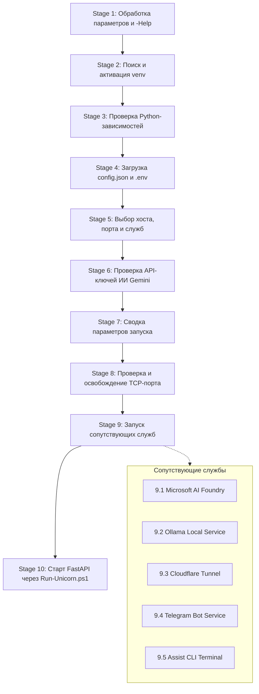

# Руководство по запуску AI Breadboard (`run.ps1`)

Данный документ подробно описывает сценарии, архитектурные этапы, параметры командной строки и сопутствующие сервисы главного лончера проекта — `run.ps1`.

---

## 📋 Обзор

`run.ps1` — единая точка входа для подготовки среды и запуска веб-сервера FastAPI вместе с локальными ИИ-сервисами и сетевыми туннелями.

### Ключевые возможности:
- **Автоматический запуск по умолчанию:** при обычном вызове `.\run.ps1` лончер не задает лишних вопросов, автоматически применяет параметры из `config.json` / `.env` и стартует сервер.
- **Поддержка интерактивного режима (`-Interactive` / `-i`):** позволяет интерактивно выбрать сетевой интерфейс (`0.0.0.0`, `127.0.0.1` или произвольный IP), порт и подтвердить запуск сопутствующих служб.
- **Освобождение порта:** автоматическое обнаружение и корректное завершение зависших процессов, блокирующих рабочий порт (по умолчанию `8000`).
- **Автозапуск CLI ассистента (`assist.ps1`):** по умолчанию запускает отдельное окно терминала (`Windows Terminal` или PowerShell) с интерактивным окружением ассистента управления проектом.
- **Оркестрация сопутствующих служб:**
  - **Microsoft AI Foundry** (через `launchers/Run-Foundry.ps1`)
  - **Ollama** (через `launchers/Run-Ollama.ps1`)
  - **Telegram Bot** (через `launchers/Run-TelegramBot.ps1`)
  - **Cloudflare Tunnel** (через `launchers/Run-Cloudflared.ps1`)
- **Автоматическая активация окружения Python (`venv`):** изоляция интерпретатора и проверка ключевых зависимостей перед стартом.

---

## 🚀 Быстрый старт

### Стандартный запуск (сервер + окно assist.ps1)
```powershell
.\run.ps1
```

### Запуск без открытия терминала ассистента
```powershell
.\run.ps1 -EnableAssist:$false
# или через алиас
.\run.ps1 -Assist:$false
```

### Запуск с включением туннеля Cloudflare
```powershell
.\run.ps1 -Cloudflared
# или короткий алиас
.\run.ps1 -cf
```

### Запуск в интерактивном режиме
```powershell
.\run.ps1 -Interactive
# или короткий алиас
.\run.ps1 -i
```

### Запуск с переопределением хоста и порта
```powershell
.\run.ps1 -Host 0.0.0.0 -Port 8000
.\run.ps1 -Host 127.0.0.1 -Port 8080
```

### Вызов справки
```powershell
.\run.ps1 --help
```

---

## ⚙️ Параметры командной строки

| Параметр | Алиасы | Тип | Назначение |
|---|---|---|---|
| `-HostAddress` | `-Host`, `-Address`, `-IP`, `-Host_` | `string` | IP-адрес или хост для привязки сервера (`0.0.0.0`, `127.0.0.1`, `localhost`). При явном указании интерактивный выбор хоста пропускается. |
| `-Port` | — | `string` / `int` | TCP-порт для веб-сервера (по умолчанию: из `config.json` или `8000`). |
| `-EnableAssist` | `-Assist`, `-enable_assist` | `bool` | Включить запуск терминала с ассистентом `assist.ps1`. По умолчанию включен (`$true`). |
| `-EnableOAuth` | `-OAuth` | `bool` | Включить авторизацию через Google OAuth. По умолчанию выключен (`$false`). |
| `-EnableTelegramBot` | `-Telegram`, `-EnableTelegram`, `-TelegramBot`, `-tg` | `bool` | Включить запуск фоновой службы Telegram-бота. По умолчанию выключен (`$false`). |
| `-Cloudflared` | `-Tunnel`, `-cf` | `switch` | Включить Cloudflare Tunnel (`kino.davidka.net`). По умолчанию выключен (`$false`). |
| `-EnableTray` | `-Tray`, `-SystemTray`, `-tray_mode` | `bool` | Включить иконку и контекстное меню в системном трее Windows (`ShowHide-InTray.ps1`). По умолчанию включен (`$true`). |
| `-DisableCloseButton` | `-ProtectClose`, `-NoClose` | `switch` | Заблокировать кнопку закрытия консольного окна `[X]`, предотвращая аварийное завершение процесса. |
| `-Interactive` | `-i` | `switch` | Принудительное включение диалогового режима с вопросами. |
| `-NonInteractive` | — | `switch` | Явное отключение диалогов (поведение по умолчанию). |
| `-Help` | `-h`, `--help` | `switch` | Вывод справки по параметрам и завершение работы. |

---

## 🔄 Этапы выполнения (`Stages`)

Процесс запуска разбит на 10 логических этапов с цветной индикацией в консоли:



### Подробное описание этапов:

1. **Stage 1 — Справка и параметры:** парсинг аргументов, вывод справки при флаге `-Help`.
2. **Stage 2 — Python-окружение:** проверка `venv\Scripts\python.exe`, активация через `Activate.ps1`. Если venv не найден, используется системный Python.
3. **Stage 3 — Проверка зависимостей:** быстрая проверка импорта `fastapi`, `uvicorn`, `dotenv`, `jwt`.
4. **Stage 4 — Конфигурация:** чтение `config.json` и переопределение переменными из `.env` (`USE_SSL`, `USE_FOUNDRY`, `USE_OLLAMA`, `ENABLE_ASSIST`, `ENABLE_TELEGRAM_BOT`, `ENABLE_OAUTH`, `CLOUDFLARE_TUNNEL_TOKEN`, `AUTO_LAUNCH_ENABLED`).
5. **Stage 5 — Выбор параметров:**
   - **По умолчанию (неинтерактивно):** значения берутся из конфига (`0.0.0.0`, порт `8000`, службы по флагам).
   - **При `-Interactive`:** меню выбора интерфейса (`0.0.0.0`, `127.0.0.1`, произвольный), запрос порта, подтверждение запуска Foundry, Ollama, Cloudflare, Google OAuth, Telegram-бота и терминала Assist.
6. **Stage 6 — Проверка AI-ключей:** проверка наличия Gemini API ключей в переменных среды, `.env` или `src/secrets/gemini_keys.json`.
7. **Stage 7 — Итоговая сводка:** печать параметров: хост, порт, локальный URL, сетевой LAN URL, статус SSL и всех служб (включая Assist Terminal).
8. **Stage 8 — Подготовка TCP-порта:** поиск занятого порта через `netstat` и принудительное завершение конфликтующего процесса.
9. **Stage 9 — Запуск сопутствующих сервисов:**
   - **Microsoft AI Foundry:** запуск локального инференса через `launchers/Run-Foundry.ps1` (`start`).
   - **Ollama:** проверка порта `11434` и запуск `ollama serve` через `launchers/Run-Ollama.ps1`.
   - **Cloudflare Tunnel:** запуск туннеля для `kino.davidka.net` через `launchers/Run-Cloudflared.ps1` при наличии токена в `.env`.
   - **Telegram Bot:** запуск фоновой службы бота через `launchers/Run-TelegramBot.ps1`.
   - **Assist CLI Terminal:** запуск отдельного окна терминала с вызовом `assist.ps1` в директории проекта.
10. **Stage 10 — Запуск сервера:** передача управления `launchers/Run-Unicorn.ps1` с автоперезагрузкой (`--reload`) и SSL (при наличии сертификатов).

---

## 🛠️ Сопутствующие сервисы и их управление

Каждый сервис имеет собственный специализированный скрипт в папке `launchers/` или корне проекта:

### 1. Assist CLI Terminal (`assist.ps1`)
Запускает интерактивный терминал с ассистентом командной строки для управления проектом:
```powershell
.\assist.ps1 --help
.\assist.ps1 status
.\assist.ps1 start
```
*Управляется переключателем `-EnableAssist` (по умолчанию `$true`). Запуск производится в отдельном окне Windows Terminal (`wt.exe`) или PowerShell (`pwsh`/`powershell`).*

### 2. Microsoft AI Foundry (`Run-Foundry.ps1`)
Управляет локальным экземпляром Microsoft AI Foundry Local:
```powershell
.\launchers\Run-Foundry.ps1 -Action start    # Запуск
.\launchers\Run-Foundry.ps1 -Action status   # Проверка статуса
.\launchers\Run-Foundry.ps1 -Action stop     # Остановка
.\launchers\Run-Foundry.ps1 -Action restart  # Перезапуск
```

### 3. Ollama (`Run-Ollama.ps1`)
Управляет локальным демоном Ollama (`localhost:11434`):
```powershell
.\launchers\Run-Ollama.ps1 -Action start    # Запуск ollama serve
.\launchers\Run-Ollama.ps1 -Action status   # Проверка доступности порта 11434
.\launchers\Run-Ollama.ps1 -Action stop     # Остановка процессов ollama
.\launchers\Run-Ollama.ps1 -Action restart  # Перезапуск
```

### 4. Cloudflare Tunnel (`Run-Cloudflared.ps1`)
Поднимает внешний защищенный доступ к сайту:
```powershell
.\launchers\Run-Cloudflared.ps1
```
*Требует наличие переменной `CLOUDFLARE_TUNNEL_TOKEN` в файле `.env`.*

### 5. Системный трей Windows (`ShowHide-InTray.ps1`)
Интегрирует приложение в системный трей (System Tray) Windows:
```powershell
.\launchers\ShowHide-InTray.ps1 -Action start -WebUrl "http://localhost:8000/admin" -DisableCloseButton
```
- Скрывает и восстанавливает окно приложения при кликах по иконке трея.
- Блокирует кнопку `[X]` на консоли (`-DisableCloseButton`), защищая сервер от случайного закрытия.
- Позволяет корректно завершить работу сервера через пункт контекстного меню *Stop Server and Exit*.

### 6. Лончер сценария Test Computer (`tc.ps1`)
Запуск автономного блока микросервисов `/apps` и веб-интерфейса `/tc` (по `config_tc.json`):
```powershell
.\tc.ps1                         # Обычный запуск (с треем и отдельным окном)
.\tc.ps1 -DisableCloseButton     # Запуск с защитой кнопки [X]
.\tc.ps1 -Background             # Фоновый запуск
.\tc.ps1 -Action status          # Проверка состояния сервисов
.\tc.ps1 -Action stop            # Остановка
```

---

## ⚙️ Настройка через `config.json` и `.env`

### Настройки в `config.json`:
```json
{
  "server": {
    "host": "0.0.0.0",
    "port": 8000,
    "use_ssl": true,
    "reload": true,
    "enable_assist": true,
    "use_cloudflared": false
  },
  "ai": {
    "use_foundry": true,
    "use_ollama": true,
    "preload_silero": false
  }
}
```

### Переопределение через `.env`:
```ini
USE_SSL=true
USE_FOUNDRY=true
USE_OLLAMA=true
ENABLE_ASSIST=true
USE_CLOUDFLARED=false
CLOUDFLARE_TUNNEL_TOKEN=eyJhIjoi...
```

---

## ❓ Часто задаваемые вопросы (Troubleshooting)

### 1. Порт 8000 занят предыдущей сессией
`run.ps1` автоматически находит PID процесса, занимающего порт `8000`, и завершает его (`Stop-Process -Force`) перед запуском Uvicorn. Ручное вмешательство не требуется.

### 2. Как запустить только сервер без Foundry и Ollama?
Передайте соответствующие флаги через `.env` (`USE_FOUNDRY=false`, `USE_OLLAMA=false`) или запустите лончер в интерактивном режиме `.\run.ps1 -i` и ответьте `n` на вопрос о запуске сервисов.

### 3. Где смотреть логи фоновых служб?
Все логи сопутствующих служб пишутся в директорию `logs/`:
- `logs/cloudflared.log` — логи туннеля Cloudflare.
- `logs/foundry_stdout.log`, `logs/foundry_stderr.log` — логи Foundry.
- `logs/ollama_stdout.log`, `logs/ollama_stderr.log` — логи Ollama.
