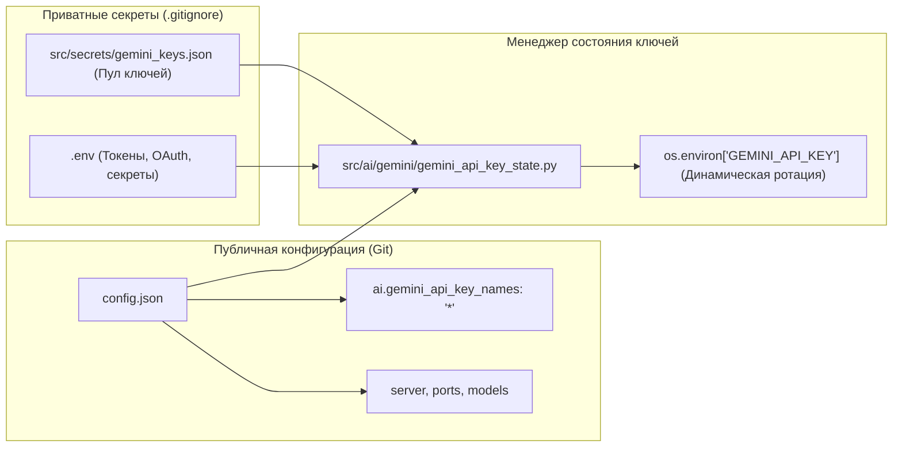

# Конфигурация и управление секретами

В AI-Breadboard действует строгое разделение между **публичной конфигурацией системы** и **приватными секретами / API-ключами**.

---

## 🏗️ Архитектура: Конфигурация vs Секреты



---

## 1. Публичная конфигурация (`config.json`)

Файл `config.json` располагается в корне проекта, версионируется в Git и содержит все параметры работы сервисов, портов, моделей и правил маршрутизации.

### Секция `"ai"` и фильтрация ключей:

Параметр `gemini_api_key_names` определяет, какие ключи из пула разрешено использовать приложению. Это не секрет, а параметр маршрутизации:

```json
{
  "server": {
    "host": "0.0.0.0",
    "port": 8000,
    "workers": 1,
    "mode": "DEV",
    "debug": true
  },
  "ai": {
    "use_foundry": false,
    "use_ollama": false,
    "use_agy": true,
    "agy_model_id": "agy-gemini-3.5-flash-lite",
    "use_gemini_cli": true,
    "gemini_cli_model_id": "gemini-3.1-flash-lite",
    "gemini_api_key_names": "*",
    "realtime_streaming": true
  }
}
```

#### Значения для `gemini_api_key_names`:
- `"*"` — использовать все доступные активные ключи из пула (рекомендуется по умолчанию).
- `"main,backup"` — использовать только указанные псевдонимы ключей через запятую.

---

## 2. Управление ключами Google Gemini (Пул ротации)

> [!IMPORTANT]
> **`GEMINI_API_KEY` не хранится как одиночный статический ключ в `.env`**.  
> Система использует динамический пул ключей с автоматической ротацией и 24-часовым кулдауном квот.

### Основное хранилище пула: `src/secrets/gemini_keys.json`

Ключи хранятся в защищенном локальном файле `src/secrets/gemini_keys.json` (добавлен в `.gitignore`):

```json
{
  "key_alias_1": {
    "value": "AIzaSy...",
    "last_run": "2026-09-08T17:49:15+00:00",
    "status": "active",
    "exhausted_at": ""
  },
  "key_alias_2": {
    "value": "AIzaSy...",
    "last_run": "",
    "status": "active",
    "exhausted_at": ""
  }
}
```

### Принцип работы ротации:
1. `src/ai/gemini/gemini_api_key_state.py` загружает доступные ключи из пула с учетом фильтра `gemini_api_key_names` из `config.json`.
2. При выполнении запросов активный ключ динамически подставляется в `os.environ['GEMINI_API_KEY']`.
3. При исчерпании суточного лимита ключ помечается статусом `exhausted` с фиксацией времени `exhausted_at`, и система автоматически переключается на следующий рабочий ключ в пуле.
4. По истечении 24 часов ключ автоматически возвращается в статус `active`.

---

## 3. Файл секретов (`.env`)

Файл `.env` создается локально на основе шаблона [`.env.example`](../../../.env.example) и **никогда не коммитится в репозиторий**.

В `.env` хранятся только приватные токены внешних сервисов и OAuth-секреты:

```env
# Google OAuth 2.0 (Опционально)
GOOGLE_CLIENT_ID=your_google_client_id.apps.googleusercontent.com
GOOGLE_CLIENT_SECRET=your_google_client_secret
GOOGLE_REDIRECT_URI=https://kino.davidka.net/auth/google/callback

# JWT Секрет для сессий
JWT_SECRET=your_generated_jwt_secret

# Дополнительные внешние провайдеры
OPENAI_API_KEY=your_openai_key
HF_TOKEN=your_hf_token
TELEGRAM_BOT_TOKEN=your_telegram_bot_token

# (Опционально) Дополнительные ключи пула Gemini через окружение:
# GEMINI_API_KEY_1=AIzaSy...
# GEMINI_API_KEY_2=AIzaSy...
```

---

## 4. Диагностика и проверка статуса

Для проверки статуса ключей, провайдеров и конфигурации:

```powershell
# Проверка статуса системы через CLI
assist status

# Проверка API-ключей и тестов ротации
pytest tests/test_api_key_state.py tests/test_fastapi_router_keys.py
```
