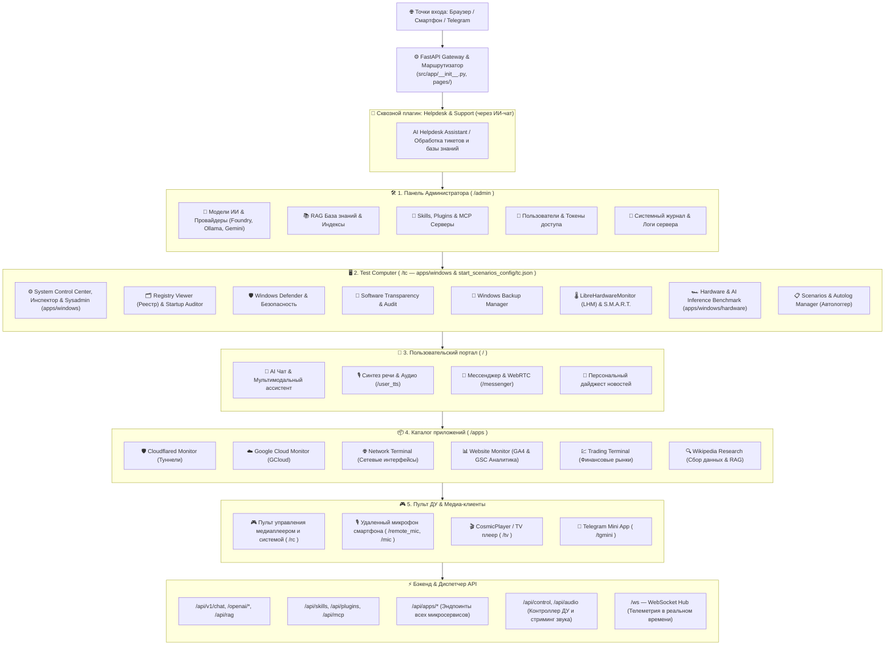

# 🖥️ Веб-интерфейсы AI-Breadboard

## 📋 Обзор и приоритетная иерархия

Платформа **AI-Breadboard** предоставляет структурированный набор веб-интерфейсов, разделенных по ролям, уровню доступа и критичности функционала.

Интерфейсы организованы в строгом порядке важности:
1. **🛠️ Панель Администратора (`/admin`)** — главное ядро настройки ИИ-провайдеров, векторных баз знаний (RAG), безопасности, навыков и управления пользователями.
2. **🖥️ Test Computer (`/tc`)** — системный мониторинг хоста, диагностика «железа», управление Windows, реестром и автоматизированный аудит безопасности.
3. **👤 Пользовательский портал (`/`)** — рабочее место пользователя: мультимодальный чат с ИИ, голосовой ассистент, мессенджер и персональные новости.
4. **📦 Каталог приложений (`/apps`)** — автономные микроприложения, сетевые туннели, облачная инфраструктура и бизнес-аналитика.
5. **🎮 Пульт управления и Медиа (`/rc`, `/tv`, `/tgmini`)** — мобильный пульт ДУ (`/rc`), плеер CosmicPlayer (`/tv`) и Telegram Mini App.

> [!NOTE]
> **Служба поддержки (Helpdesk)** является **сквозным плагином уровня ядра/сервисов**. Она не привязана к отдельному интерфейсу, а доступна сквозным образом через чат и AI-агентов во всех рабочих пространствах.

---

## 📊 Блок-схема веб-интерфейсов

---

## 🧭 Описание разделов и точек входа

### 1. Панель Администратора (`/admin`)
Центр управления ядром системы и безопасностью:
* **Модели и маршрутизация ИИ**: переключение между Microsoft Foundry Local, Ollama, Google Gemini и DirectML/ONNX.
* **База знаний RAG**: управление векторными индексами, документами и чатами Telegram.
* **Периферия ИИ**: реестр навыков (Skills), плагинов и MCP-серверов.
* **Пользователи и безопасность**: управление учетными записями, ролями и токенами.
* **Логирование**: агрегированные системные журналы FastAPI и фоновых задач.

### 2. Test Computer (`/tc`)
Специализированный стенд для комплексного мониторинга хоста Windows:
* **Аппаратный мониторинг**: интеграция с LibreHardwareMonitor, датчиками AIDA64, HWiNFO, CPU-Z, GPU-Z.
* **Автологгер датчиков и сценарии**: `Scenarios & Autolog Manager` для циклического логирования телеметрии.
* **Управление Windows**: просмотр и правка реестра (`Registry Viewer`), аудит автозагрузки (`Startup Auditor`), прозрачность процессов (`Software Transparency & Audit`), бэкапы и управление политиками Defender.

### 3. Пользовательский портал (`/`)
Основной интерфейс взаимодействия конечного пользователя с платформой:
* **Мультимодальный ИИ-чат**: диалог с моделями, анализ изображений и генерация контента.
* **Голос и аудио**: синтез речи (`/user_tts`) и персональный новостной дайджест.
* **Инструменты взаимодействия**: мессенджер с WebRTC (`/messenger`) и сквозное подключение к Helpdesk через чат.

### 4. Каталог приложений (`/apps`)
Изолированные микросервисы и сервисные панели:
* **Облако и сеть**: мониторинг туннелей Cloudflare (`Cloudflared Monitor`), Google Cloud (`GCloud Monitor`) и сетевой терминал.
* **Бизнес и аналитика**: торговый терминал (`Trading Terminal`), аналитика сайтов GA4/GSC (`Website Monitor`), модуль сбора данных `Wikipedia Research`.

### 5. Пульт дистанционного управления и Медиа
* **Пульт управления ДУ (`/rc`)**: сенсорный веб-пульт (D-Pad, перемотка, громкость, голосовые команды и управление воспроизведением медиа) для работы со смартфона или планшета.
* **Удаленный микрофон (`/remote_mic`, `/mic`)**: потоковая передача аудио и распознавание речи с мобильного устройства.
* **CosmicPlayer / TV (`/tv`)**: интерфейс домашнего медиацентра и потокового видео.
* **Telegram Mini App (`/tgmini`)**: мобильный клиент прямо внутри Telegram для дистанционного управления и чата.

### 6. Сквозной плагин Helpdesk
* Работает **поверх всех интерфейсов** как автономная система обработки обращений и вопросов.
* Взаимодействие происходит непосредственно через ИИ-чат (пользователи задают вопросы на естественном языке, а Helpdesk-агент формирует тикеты, опрашивает базы знаний и возвращает ответы).

