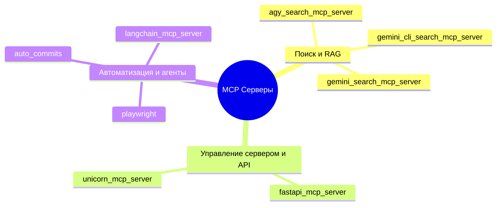

# 📚 Каталог MCP Серверов (.mcp/)

Полный каталог MCP-серверов и утилит интеграции платформы AI Breadboard.

---

## 🗂️ Реестр серверов

---

### 1. `gemini_search_mcp_server.py`
* **Файл:** `.mcp/gemini_search_mcp_server.py`
* **Назначение:** Предоставляет внешним агентам инструменты поиска и RAG-запросов через Google Gemini API и векторное хранилище AI-Breadboard.
* **Инструменты:**
  - `gemini_rag_search(query: str, top_k: int)` — семантический поиск по индексированным документам.
  - `gemini_grounded_search(query: str)` — поиск с вызовом Google Search Grounding.

---

### 2. `gemini_cli_search_mcp_server.py`
* **Файл:** `.mcp/gemini_cli_search_mcp_server.py`
* **Назначение:** Упрощенная и высокопроизводительная версия поискового сервера для терминальных CLI-инструментов.
* **Инструменты:**
  - `cli_search(query: str)` — компактный текстовый поиск по RAG-базе без тяжелых накладных расходов.

---

### 3. `agy_search_mcp_server.py`
* **Файл:** `.mcp/agy_search_mcp_server.py`
* **Назначение:** Специализированный MCP-сервер для взаимодействия с окружением Google Antigravity.
* **Инструменты:**
  - `agy_context_lookup(symbol: str)` — быстрый поиск определений, документации и навыков в контексте текущего воркспейса.
  - `agy_status_check()` — проверка состояния локальных сервисов и AI-провайдеров.

---

### 4. `fastapi_mcp_server.py`
* **Файл:** `.mcp/fastapi_mcp_server.py`
* **Назначение:** MCP-мост к REST API центрального сервера AI Breadboard.
* **Инструменты:**
  - `get_api_routes()` — инспекция зарегистрированных эндпоинтов FastAPI.
  - `invoke_api_endpoint(path: str, method: str, payload: dict)` — выполнение REST вызова к локальному серверу.
  - `get_server_health()` — статус здоровья и метрики задержки.

---

### 5. `unicorn_mcp_server.py`
* **Файл:** `.mcp/unicorn_mcp_server.py`
* **Назначение:** Управление жизненным циклом фонового ASGI/Uvicorn сервера (`Run-Unicorn.ps1`).
* **Инструменты:**
  - `restart_unicorn_server()` — горячая перезагрузка сервера.
  - `get_unicorn_logs(lines: int)` — чтение последних строк системного журнала Uvicorn.

---

### 6. `langchain_mcp_server.py`
* **Файл:** `.mcp/langchain_mcp_server.py`
* **Назначение:** Предоставление цепочек рассуждений (LangChain chains) и инструментов RAG для агентов.
* **Инструменты:**
  - `execute_media_chain(query: str)` — выполнение RAG-цепочки по медиатеке.
  - `summarize_document(text: str)` — рекурсивная суммаризация длинных документов.

---

### 7. `auto_commits.py`
* **Файл:** `.mcp/auto_commits.py`
* **Назначение:** Инструмент автоматического форматирования, валидации и генерации осмысленных Git commit-сообщений по соглашению Conventional Commits на основе диффа.
* **Инструменты:**
  - `generate_commit_message()` — генерация сообщения коммита по `git status` и `git diff`.
  - `validate_staging()` — проверка соответствия файлов правилам pre-commit.

---

### 8. `playwright`
* **Файл:** `.mcp/playwright/` (или модуль автоматизации браузера)
* **Назначение:** Управление headless-браузером Chromium для извлечения веб-страниц, динамического скрапинга и тестирования UI.
* **Инструменты:**
  - `browser_navigate(url: str)` — открытие страницы.
  - `browser_screenshot(path: str)` — снимок экрана страницы.
  - `browser_extract_text()` — извлечение очищенного DOM-текста.

---

## 📚 Связанные разделы

- [Руководство по настройке MCP](guide.md) — подключение серверов в Claude / Cursor.
- [Обзор подсистемы MCP](index.md) — архитектура интеграции.
- [Каталог навыков](../skills/catalog.md) — навыки платформы.