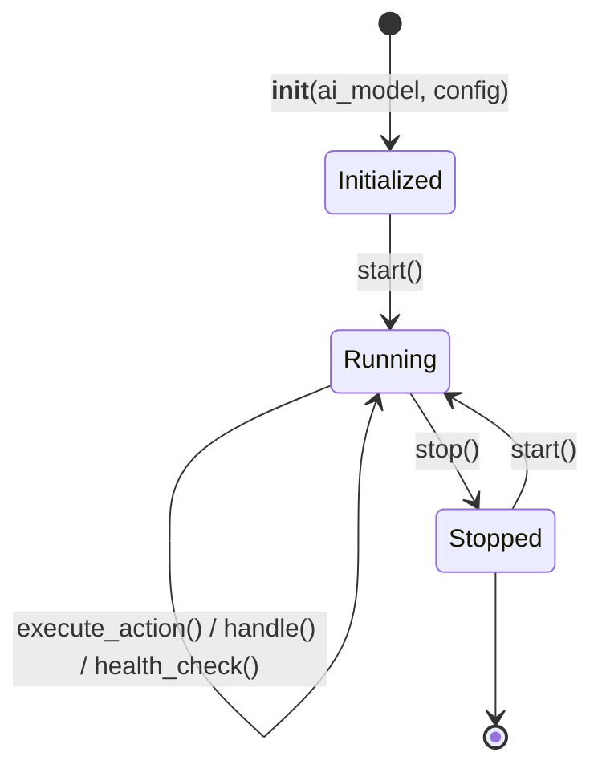

# Архитектура и жизненный цикл плагинов

> **Раздел:** Архитектура плагинов  
> **Язык:** Русский  

---

## 🏛️ Базовый класс `BasePlugin`

Все плагины в **AI Breadboard** наследуются от абстрактного базового класса `BasePlugin`, расположенного в `plugins/base.py`.

### Иерархия и свойства

```python
class BasePlugin(abc.ABC):
    name: str = "base_plugin"          # Уникальный системный идентификатор (slug)
    title: str = "Base Plugin"         # Отображаемое название (fallback)
    title_i18n: Dict[str, str] = {}    # Мультиязычные названия {"en": "...", "ru": "..."}
    version: str = "1.0.0"             # Семантическая версия (SemVer)
    description: str = "..."           # Базовое описание
    description_i18n: Dict[str, str] = {} # Мультиязычные описания
    icon: str = "🧩"                   # Emoji или иконка для отображения в Web UI
    category: str = "general"          # Категория ('communication', 'tools', 'security', 'media')
    enabled: bool = True               # Флаг доступности плагина
    is_system: bool = True             # Системный плагин (True) или пользовательский (False)
    scope: str = "system"              # Область видимости ('system' или 'user')
```

---

## 🔄 Жизненный цикл плагина (Lifecycle)

Плагины поддерживают управляемый жизненный цикл, позволяющий корректно инициализировать ресурсы при старте сервера и освобождать их при выключении.



### Методы жизненного цикла:

1. **`__init__(self, ai_model: Any = None, config: Optional[Dict[str, Any]] = None)`**  
   Инициализирует экземпляр плагина, сохраняет ссылку на модель ИИ и словарь настроек `self.config`.

2. **`async def start(self) -> None`**  
   Вызывается при активации плагина или старте сервера. Здесь запускаются фоновые потоки, демоны, клиенты очередей (например, polling Telegram-бота). Устанавливает `self.is_running = True`.

3. **`async def stop(self) -> None`**  
   Корректное завершение работы (Graceful Shutdown). Закрывает открытые соединения, освобождает дескрипторы файлов, останавливает асинхронные задачи. Устанавливает `self.is_running = False`.

4. **`async def health_check(self) -> Dict[str, Any]`**  
   Возвращает диагностическое состояние плагина (статус, метка времени, флаги активности).

---

## ⚙️ Конфигурация и поля ввода в Web UI (`get_config_fields`)

Плагин может декларировать форму настроек, которая автоматически рендерится в панели администратора:

```python
def get_config_fields(self) -> List[Dict[str, Any]]:
    return [
        {
            "name": "api_key",
            "label": "API Key",
            "label_i18n": {"en": "API Key", "ru": "Ключ API"},
            "type": "text",            # text, password, number, boolean, select, textarea
            "default": "",
            "description": "Секретный ключ для доступа к внешнему сервису",
        },
        {
            "name": "max_retries",
            "label": "Max Retries",
            "label_i18n": {"en": "Max Retries", "ru": "Макс. повторов"},
            "type": "number",
            "default": 3,
        },
        {
            "name": "auto_start",
            "label": "Auto Start",
            "label_i18n": {"en": "Auto Start", "ru": "Автозапуск демона"},
            "type": "boolean",
            "default": False,
        },
    ]
```

При сохранении настроек в UI вызывается метод:
```python
def update_config(self, new_config: Dict[str, Any]) -> None:
    self.config.update(new_config)
```

---

## ⚡ Кнопки действий (`get_actions` и `execute_action`)

Плагины могут добавлять в свою карточку в Web UI интерактивные кнопки быстрого действия:

```python
def get_actions(self) -> List[Dict[str, Any]]:
    return [
        {
            "id": "reindex_codebase",
            "label": "Rebuild Index",
            "label_i18n": {"en": "Rebuild Index", "ru": "Пересобрать индекс"},
            "icon": "🔄",
            "variant": "primary",    # primary, secondary, danger, warning
            "description": "Запустить полное перестроение AST-индекса",
        },
        {
            "id": "clear_cache",
            "label": "Clear Cache",
            "label_i18n": {"en": "Clear Cache", "ru": "Очистить кэш"},
            "icon": "🗑️",
            "variant": "danger",
        },
    ]

async def execute_action(self, action_id: str, params: Optional[Dict[str, Any]] = None) -> Dict[str, Any]:
    if action_id == "reindex_codebase":
        # Логика действия
        return {"status": "success", "message": "Индексация успешно завершена", "data": {"indexed_files": 120}}
    elif action_id == "clear_cache":
        return {"status": "success", "message": "Кэш успешно очищен"}
    return {"status": "error", "message": f"Неизвестное действие: {action_id}"}
```

---

## 🤖 Инструменты для AI-агентов (`get_tools` и `handle`)

Плагины могут объявлять инструменты вызова функций (LLM Function Calling) в формате JSON Schema:

```python
def get_tools(self) -> List[Dict[str, Any]]:
    return [
        {
            "name": "clean_rag_document",
            "description": "Очищает и форматирует документ (PDF, DOCX, HTML) для RAG-индексации.",
            "parameters": {
                "type": "object",
                "properties": {
                    "file_path": {"type": "string", "description": "Путь к исходному файлу"},
                    "output_format": {"type": "string", "enum": ["markdown", "text"], "default": "markdown"},
                },
                "required": ["file_path"],
            },
        }
    ]
```

Для потоковой обработки запросов переопределяется генератор:
```python
async def handle(self, message: str, **kwargs: Any) -> AsyncGenerator[Dict[str, Any], None]:
    yield {"status": "processing", "chunk": "Начало анализа логов..."}
    # ... расчеты ...
    yield {"status": "complete", "text": "Анализ завершен успешно."}
```

---

## 🌐 Механизм интернационализации (i18n)

Плагины поддерживают бесшовный перевод метаданных через методы:
- `get_title(lang="ru")` — возвращает русский заголовок. Если перевода нет, возвращается английский вариант или `self.title`.
- `get_description(lang="ru")` — возвращает локализованное описание.
- `get_manifest(lang="ru")` — формирует полный JSON-манифест со всеми полями, разрешенными для запрошенного языка.

---

## 🔌 Регистрация и API в FastAPI

Маршрутизатор администратора (`src/fastapi/router_admin.py`) предоставляет REST API для управления плагинами:

| Метод | Эндпоинт | Описание |
|---|---|---|
| `GET` | `/api/admin/plugins` | Получение списка всех плагинов с их манифестами и статусом |
| `GET` | `/api/admin/plugins/{name}` | Детальная информация по конкретному плагину |
| `POST` | `/api/admin/plugins/{name}/action` | Выполнение действия `execute_action(action_id, params)` |
| `POST` | `/api/admin/plugins/{name}/config` | Обновление конфигурации плагина |
| `POST` | `/api/admin/plugins/{name}/toggle` | Включение / выключение плагина (`enabled`) |
