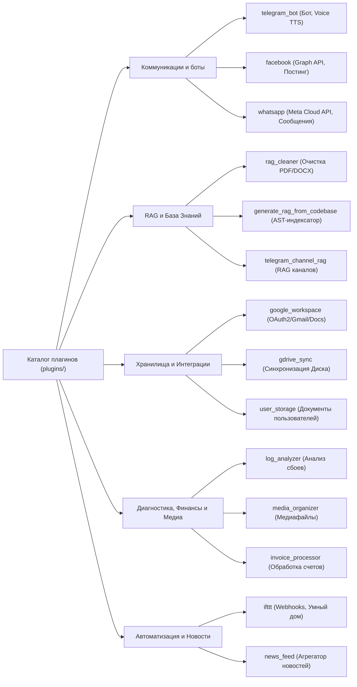

# Каталог плагинов проекта

> **Раздел:** Каталог плагинов  
> **Язык:** Русский  

---

## 📦 Обзор предустановленных плагинов

В состав **AI Breadboard** входит 13 системных и интеграционных плагинов (каталог `plugins/`):

---

## 1. `telegram_bot` (Telegram Бот и Голосовой ассистент)

- **Путь:** `plugins/telegram_bot/`
- **Категория:** `communication`
- **Назначение:** Предоставляет полноценный интерфейс Telegram-бота для взаимодействия с языковыми моделями платформы, включая обработку голосовых сообщений и генерацию голосовых ответов (TTS).
- **Ключевые возможности:**
  - Поддержка долгоживущего режима поллинга / вебхуков (`start()`, `stop()`).
  - Синтез речи (TTS) для голосовых ответов.
  - Интеграция с системным оркестратором моделей.
- **Поля конфигурации:**
  - `bot_token` — токен бота из BotFather.
  - `allowed_user_ids` — белый список Telegram User ID.
  - `tts_voice` — голос для синтеза речи.

---

## 2. `facebook` (Интеграция с Facebook Graph API)

- **Путь:** `plugins/facebook/`
- **Категория:** `communication`
- **Назначение:** Управление публикацией контента, синхронизацией постов и медиаматериалов в сообществах Facebook.
- **Ключевые действия (Actions):**
  - `publish_post` — публикация сгенерированного моделью текста и медиа в ленту.
  - `fetch_feed` — чтение последних публикаций и комментариев для RAG-анализа.
- **Инструменты (Tools):** `facebook_post`, `facebook_get_insights`.

---

## 3. `rag_cleaner` (Очистка и нормализация документов)

- **Путь:** `plugins/rag_cleaner/`
- **Категория:** `tools`
- **Назначение:** Предварительная обработка разнородных входных файлов (PDF, Word DOCX, HTML, ZIP-архивы, CSV, JSON, TXT) перед векторной индексацией в RAG.
- **Ключевые возможности:**
  - Удаление шума, колонтитулов, ненужных тегов и бинарного мусора.
  - Извлечение чистого Markdown с сохранением таблиц и структуры заголовков.
- **Действия (Actions):**
  - `clean_directory` — массовая очистка файлов в папке `data/`.
  - `validate_rag_inputs` — проверка корректности кодировок и целостности файлов.

---

## 4. `generate_rag_from_codebase` (Индексатор исходного кода)

- **Путь:** `plugins/generate_rag_from_codebase/`
- **Категория:** `tools`
- **Назначение:** Автоматический анализ репозитория, извлечение AST-деревьев, сигнатур функций, классов, docstrings и построение специализированного векторного индекса для поиска по кодовой базе.
- **Ключевые компоненты:**
  - `ast_parser.py` — синтаксический разбор Python файлов.
  - `md_parser.py` — структурирование Markdown документации.
  - `symbol_index.py` — извлечение глобальных символов и перекрестных ссылок.
  - `ignore_filter.py` — интеллектуальный учет `.gitignore` и фильтрация виртуальных окружений.
- **Действия (Actions):**
  - `rebuild_code_rag` — запуск полного цикла переиндексации проекта.

---

## 5. `log_analyzer` (Интеллектуальный анализатор логов)

- **Путь:** `plugins/log_analyzer/`
- **Категория:** `analytics`
- **Назначение:** Парсинг серверных логов, автоматическая кластеризация ошибок, вычисление метрик отказоустойчивости и формирование рекомендаций по устранению сбоев с помощью LLM.
- **Ключевые действия (Actions):**
  - `cluster_errors` — группировка повторяющихся stacktrace.
  - `generate_health_report` — выгрузка аналитического Markdown-отчета.
- **Инструменты (Tools):** `query_recent_errors`, `diagnose_subsystem`.

---

## 6. `media_organizer` (Организатор медиаконтента)

- **Путь:** `plugins/media_organizer/`
- **Категория:** `media`
- **Назначение:** Управление медиатекой, переименование файлов по стандартизированным шаблонам, извлечение метаданных и сверка с базой данных SQLite.
- **Ключевые действия (Actions):**
  - `scan_media_storage` — аудит директорий с медиафайлами.
  - `fix_broken_records` — исправление несоответствий путей в базе данных.

---

## 7. `ifttt` (Интеграция с IFTTT Webhooks)

- **Путь:** `plugins/ifttt/`
- **Категория:** `automation`
- **Назначение:** Управление устройствами умного дома, триггерами событий и отправкой оповещений через платформу IFTTT Webhooks.
- **Ключевые действия (Actions):**
  - `trigger_event` — отправка вебхука с тремя параметрами (value1, value2, value3).
  - `test_connection` — проверка валидности API-ключа и сетевой доступности сервиса.
- **Инструменты (Tools):** `ifttt_trigger_event`.

---

## 8. `invoice_processor` (Обработчик финансовой документации)

- **Путь:** `plugins/invoice_processor/`
- **Категория:** `analytics`
- **Назначение:** Автоматический анализ счетов, квитанций и инвойсов в форматах PDF и изображений с извлечением структурированных полей (суммы, даты, контрагенты) и экспортом в базы данных и таблицы.
- **Ключевые действия (Actions):**
  - `parse_invoice` — извлечение реквизитов из отдельного документа.
  - `batch_process_invoices` — пакетная обработка файлов в каталоге.

---

## 9. `news_feed` (Агрегатор и генератор новостных лент)

- **Путь:** `plugins/news_feed/`
- **Категория:** `automation`
- **Назначение:** Сбор новостей из RSS-потоков и веб-источников, семантическая фильтрация по интересам пользователя и генерация структурированных сводок с помощью LLM.
- **Ключевые действия (Actions):**
  - `fetch_feeds` — опрос настроенных новостных источников.
  - `generate_digest` — создание персонализированного дайджеста.

---

## 10. `telegram_channel_rag` (RAG-индексатор Telegram-каналов)

- **Путь:** `plugins/telegram_channel_rag/`
- **Категория:** `tools`
- **Назначение:** Мониторинг и выгрузка сообщений из публичных и приватных Telegram-каналов, очистка текста, построение векторных эмбеддингов и обеспечение контекстного RAG-поиска по истории публикаций.
- **Ключевые действия (Actions):**
  - `sync_channel_history` — загрузка новых сообщений канала.
  - `build_channel_embeddings` — переиндексация векторной базы.

---

## 11. `google_workspace` (Интеграция с сервисами Google)

- **Путь:** `plugins/google_workspace/`
- **Категория:** `integrations`
- **Назначение:** Управление пулом аккаунтов Google, OAuth2 авторизацией, Service Accounts, почтой Gmail, Google Docs, Sheets и Drive в рамках плагинной архитектуры.
- **Ключевые действия (Actions):**
  - `sync_accounts` — проверка и актуализация пула аккаунтов.
  - `test_auth` — валидация токенов доступа.

---

## 12. `gdrive_sync` (Синхронизация с Google Диском)

- **Путь:** `plugins/gdrive_sync/`
- **Категория:** `integrations`
- **Назначение:** Автоматическое облачное резервное копирование, зеркалирование данных и периодическая синхронизация локальных файлов с Google Диском.
- **Ключевые действия (Actions):**
  - `sync_now` — принудительный запуск зеркалирования файлов.
  - `check_status` — получение отчета о последней синхронизации.

---

## 13. `user_storage` (Пользовательское хранилище документов)

- **Путь:** `plugins/user_storage/`
- **Категория:** `storage`
- **Назначение:** Изолированное хранилище персональных документов пользователей, управление квотами дискового пространства и прямая передача файлов в RAG-пайплайн.
- **Ключевые действия (Actions):**
  - `scan_user_files` — сканирование персонального каталога.
  - `recalculate_quotas` — пересчет лимитов использования диска.

---

## 14. `whatsapp` (Интеграция с WhatsApp Messenger)

- **Путь:** `plugins/user-plugins/whatsapp/`
- **Категория:** `communication`
- **Назначение:** Отправка текстовых сообщений, мгновенных уведомлений и автоматическая пересылка дайджестов входящих писем в чаты WhatsApp.
- **Поддерживаемые протоколы:** Meta WhatsApp Cloud API (Graph API), Green API, Generic Webhooks.
- **Ключевые действия (Actions):**
  - `send_message` — отправка текстового сообщения на указанный номер в международном формате.
  - `send_email_alert` — форматирование и отправка структурированного дайджеста о входящем письме.
  - `test_connection` — проверка валидности токенов и доступности WhatsApp API.
- **Инструменты агентов:** `whatsapp_send_message`, `whatsapp_test_connection`.

