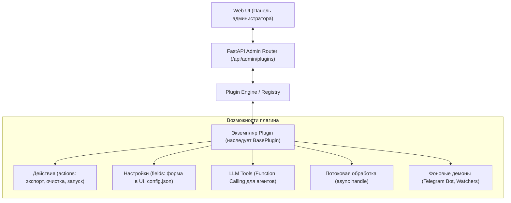

# Плагины в AI Breadboard

> **Раздел:** Модульные расширения и системные плагины  
> **Язык:** Русский  

---

## 🧩 Введение в систему плагинов

**Плагины (Plugins)** в платформе **AI Breadboard** — это полнофункциональные программные модули, расширяющие возможности системы как на уровне серверной логики (бэкенда), так и на уровне графического интерфейса администратора (Web UI).

В отличие от текстовых инструкций для моделей, плагин является полноценным Python-модулем, который:
1. Имеет собственный **жизненный цикл** (запуск, остановка, проверка работоспособности `health_check`).
2. Предоставляет **интерактивные элементы в Web UI** (карточки плагинов, формы параметров `get_config_fields`, кнопки действий `get_actions`).
3. Объявляет **инструменты вызова функций (LLM Function Calling)** для AI-агентов через `get_tools()`.
4. Может выполнять **фоновые задачи и процессы** (демоны, Telegram-боты, планировщики, сборщики метрик).
5. Поддерживает **строгую мультиязычность (i18n)** названий, описаний и меток интерфейса.

---

## ⚖️ Плагины vs Навыки (Skills) vs MCP-серверы

Чтобы правильно выбрать архитектурный компонент для вашей задачи, обратитесь к сравнительной таблице:

| Критерий | Плагины (Plugins) | Навыки (Skills) | MCP-серверы (Model Context Protocol) |
|---|---|---|---|
| **Основное назначение** | Расширение сервера и Web UI, системные сервисы, кнопки действий | Обучение языковых моделей регламентам и сценариям (Progressive Disclosure) | Стандартизированное подключение внешних инструментов по протоколу Anthropic MCP |
| **Где исполняются** | Внутри процесса FastAPI / Python бэкенда | AI-агент исполняет скрипты навыка через CLI или читает `SKILL.md` | В отдельных процессах через stdin/stdout или SSE |
| **Интерфейс в UI** | Интерактивные карточки, кнопки, поля ввода в админке | Отображаются во вкладке Skills (реестр) | Настройки подключения в конфигурации |
| **Потребление токенов** | Не потребляют токены модели до вызова `get_tools` | Загружаются динамически (краткие метаданные $\to$ полный `SKILL.md` при активации) | Схемы инструментов передаются в контекст |
| **Поддержка фоновых задач** | Да (`start()`, `stop()`, долгоживущие демоны) | Нет (ориентированы на дискретные запуски скриптов) | Да (сервер работает в фоне) |
| **Примеры в проекте** | `telegram_bot`, `facebook`, `generate_rag_from_codebase` | `tdd-doc-gen`, `rag-search-manager`, `db-inspector` | `sqlite-mcp`, `filesystem-mcp` |

---

## 🎯 Когда создавать плагин?

Создавайте **плагин**, если:
- Вам требуется интеграция с внешним сервисом, работающим непрерывно (например, Telegram-бот или Webhook-слушатель).
- Вам нужны интерактивные элементы управления в веб-интерфейсе (кнопка «Сгенерировать RAG по коду», «Экспортировать базу данных», «Очистить кэш»).
- Требуются динамические параметры конфигурации, которые администратор настраивает в UI без ручной правки JSON-файлов.
- Необходимо предоставить модели доступ к внутреннему Python API платформы через стандартизированный `get_tools()`.

---

## 🧭 Навигация по разделу плагинов

- [Архитектура и жизненный цикл плагинов](architecture.md) — детальное описание `BasePlugin`, методов жизненного цикла, полей конфигурации, экшенов и механизма i18n.
- [Разработка и создание плагинов](development.md) — пошаговое руководство, использование Plugin Factory (`manage_tools.py plugins create`), шаблоны кода и тесты.
- [Каталог плагинов проекта](catalog.md) — полный список существующих плагинов (`facebook`, `telegram_bot`, `rag_cleaner`, `generate_rag_from_codebase`, `log_analyzer` и др.) с их конфигурацией.
