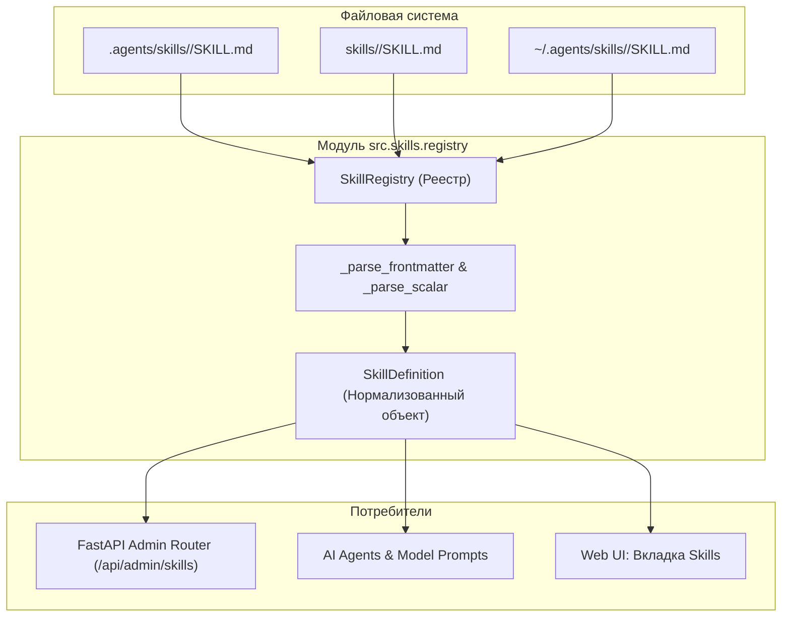
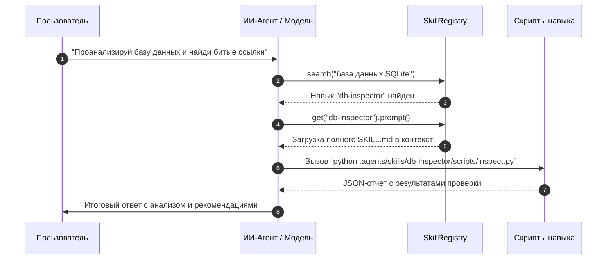

# Архитектура и устройство системы навыков

> **Раздел:** Архитектура навыков  
> **Язык:** Русский  

---

## 🏛️ Компоненты системы навыков

Система навыков в **AI Breadboard** управляется модулем `src/skills/registry.py` и состоит из двух ключевых сущностей:



---

## 🔍 `SkillRegistry` и пути сканирования

Класс `SkillRegistry` отвечает за поиск, нормализацию и кэширование навыков.

### Директории поиска по умолчанию:
1. **Проектные директории (Project-Level):**
   - `.agents/skills/`
   - `.github/skills/`
   - `skills/`
   - `.gemini/skills/`
2. **Глобальные пользовательские директории (User-Level):**
   - `~/.agents/skills/`
   - `~/.gemini/skills/`

### Приоритет разрешения конфликтов:
Если в нескольких директориях найден навык с одинаковым именем, применяется строгое правило: **локальный проектный навык переопределяет глобальный пользовательский**.

---

## 📦 Класс `SkillDefinition`

Каждый обнаруженный навык преобразуется в неизменяемый датакласс `SkillDefinition`:

```python
@dataclass(frozen=True)
class SkillDefinition:
    name: str                           # Уникальное имя навыка
    description: str                    # Базовое английское описание
    root: Path                          # Путь к корневой папке навыка
    source: Path                        # Путь к файлу SKILL.md
    metadata: dict[str, Any]            # Произвольные поля frontmatter
    instructions: str = ""              # Полное тело Markdown-инструкций
    manifest: dict[str, Any]            # Данные из опционального skill.json
    descriptions_i18n: dict[str, str]   # Словарь локализованных описаний
```

### Основные методы:
- `get_description(lang="ru")` — возвращает описание на запрошенном языке (с автоматическим фоллбэком на английский).
- `to_dict(include_instructions=True, lang="ru")` — сериализация в JSON-словарь для API и веб-интерфейса.
- `prompt(lang=None)` — возвращает чистый текст Markdown-инструкций для инъекции в системный промпт модели при активации навыка.

---

## ⚡ Легковесный парсинг Frontmatter

Для максимальной производительности и отсутствия тяжелых внешних зависимостей (таких как `PyYAML`), разбор заголовков `SKILL.md` осуществляется регулярным выражением и внутренним скалярным парсером `_parse_scalar`:

```python
_FRONTMATTER_PATTERN = re.compile(r"\A---\s*\n(?P<body>.*?)\n---\s*(?:\n|\Z)", re.DOTALL)
```

Парсер поддерживает:
- Простые ключ-значения (`name: my-skill`, `version: 1.0.0`).
- Вложенные словари с отступами (`description_i18n: ...`).
- Списки JSON-формата (`tags: ["rag", "search"]`).
- Булевы флаги (`enabled: true`) и строки в кавычках.

---

## 🌐 Механизм интернационализации (i18n)

`SkillRegistry` автоматически извлекает локализованные описания из нескольких источников в `SKILL.md`:
1. Блока `description_i18n` в YAML Frontmatter:
   ```yaml
   description_i18n:
     en: "Performs deep SQLite database inspection."
     ru: "Выполняет глубокий аудит и проверку базы SQLite."
   ```
2. Отдельных суффиксных ключей frontmatter (`description_ru`, `description_en`).
3. Файла `skill.json` (при наличии).

---

## 🔄 Полный жизненный цикл навыка


