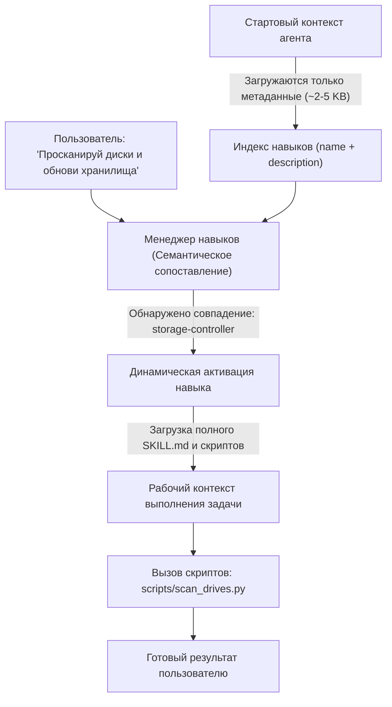

# Навыки моделей (Skills) в AI Breadboard

> **Раздел:** Навыки моделей и агентов  
> **Язык:** Русский  

---

## 🧠 Что такое Skills (Навыки) для моделей?

**Skill (Навык)** — это структурированный программный пакет расширения возможностей языковых моделей и автономных ИИ-агентов. 

Навык объединяет:
1. **Манифест `SKILL.md`** — метаданные в формате YAML Frontmatter и четкие Markdown-инструкции для модели (регламенты, сценарии, протоколы).
2. **Вспомогательные скрипты (`scripts/`)** — готовые к исполнению утилиты на Python, PowerShell или Bash.
3. **Справочные материалы (`references/`)** — технические спецификации, схемы API и примеры.
4. **Ресурсы и шаблоны (`resources/`, `examples/`)** — эталонные данные, конфигурации и шаблоны документов.

---

## 🛑 Проблема: Перегрузка системного промпта (System Prompt Bloat)

При классическом подходе к разработке агентов все инструкции добавляются прямо в системный промпт:
- ❌ **Огромный расход токенов:** За статичный текст в 50 000 токенов приходится платить при каждом запросе пользователя.
- ❌ **Потеря внимания ("Lost in the Middle"):** Когда объем системного промпта слишком велик, модель начинает игнорировать правила или путать контекст.
- ❌ **Сложность поддержки:** Любое изменение регламента требует правки монолитного промпта.

---

## 💡 Решение: Прогрессивное раскрытие (Progressive Disclosure)

В платформе **AI Breadboard** система навыков реализует принцип **Progressive Disclosure**:

### Преимущества подхода:
- ⚡ **Минимальный базовый промпт:** Модель держит в памяти только имена и однострочные описания навыков.
- 🎯 **Высокая точность:** Полный текст регламентов загружается в память модели строго в момент постановки соответствующей задачи.
- 🧩 **Модульность и повторное использование:** Навыки версионируются в Git, переносятся между проектами и тестируются независимо.

---

## 🧭 Навигация по разделу навыков

- [Архитектура и реестр навыков](architecture.md) — детальное описание `SkillRegistry`, `SkillDefinition`, алгоритма сканирования, приоритетов загрузки и мультиязычности.
- [Разработка и создание навыков](development.md) — пошаговое руководство, спецификация `SKILL.md`, фабрика `skill-factory`, скрипты и юнит-тесты.
- [Каталог навыков проекта](catalog.md) — полный обзор 25 встроенных навыков платформы (`db-inspector`, `google-workspace`, `tdd-doc-gen`, `rag-search-manager`, `travel-agent` и др.).
