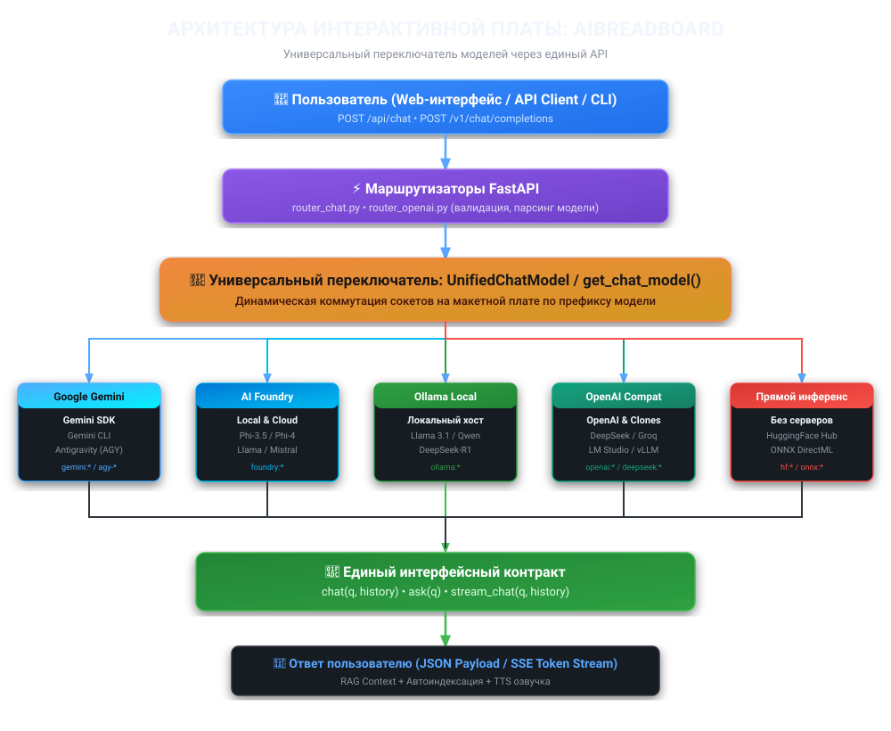

# Глава 1: Макетная плата ИИ (AI Breadboard) и универсальная коммутация моделей

---

## 🎯 1. Проблема и мотивация (Зачем это нужно?)

Когда начинающий разработчик пробует работать с современным искусственным интеллектом, он сталкивается с «зоопарком» технологий:
- У **Google Gemini** свой SDK и свой формат сообщений (`contents`, `parts`).
- У **OpenAI** свой клиент и эндпоинты `/v1/chat/completions`.
- **Microsoft AI Foundry** требует подключения к своему локальному или облачному сервису.
- Локальная **Ollama** слушает порт `11434` и имеет свой REST API.
- Для **HuggingFace** и **ONNX** нужен собственный пайплайн инференса на тензорах.

### ❓ Боль разработчика:
Если писать отдельный код под каждую модель, проект моментально обрастает дублированием, хаосом из веток `if/else`, десятками разных оберток и непрозрачными Docker-контейнерами.

### 🎯 Цель этой главы:
Понять, как устроена архитектура **`aibreadboard`**, позволяющая объединить все эти модели в единый унифицированный интерфейс и переключать их «на лету» без изменения бизнес-логики приложения.

---

## 💡 2. Концептуальная ментальная модель (Аналогия)

Представьте себе радиолюбительскую **макетную плату (Breadboard)**:

<p align="center">
  <i>«Мы не припаиваем один микрочип намертво — мы вставляем нужную микросхему в стандартный сокет, проводим тест и при необходимости меняем её на другую за две секунды».</i>
</p>

В проекте **`aibreadboard`** этот принцип перенесен в программную архитектуру:
1. **Шина питания и данных (API):** Единый сетевой шлюз FastAPI (`/api/chat` и `/v1/chat/completions`).
2. **Коммутатор платы (Switch):** Модуль `UnifiedChatModel`, который по префиксу модели направляет запрос в нужный сокет.
3. **Сменные чипы (Model Sockets):** Адаптеры Gemini, Foundry, Ollama, OpenAI/DeepSeek/Groq, ONNX.
4. **Единый стандарт выводов (Contract):** Любой чип реализует ровно три метода: `.chat()`, `.ask()`, `.stream_chat()`.

---

## 🗺️ 3. Архитектура и Визуальная схема

Ниже представлена полная схема движения данных от пользовательского запроса до конкретной модели на макетной плате:

<p align="center">
  
</p>

### Разбор уровней архитектуры:
1. **User / Client:** Пользователь отправляет запрос через веб-интерфейс или любой HTTP-клиент (например, `curl` или Python `requests`), указывая целевую модель (например, `openai:gpt-4o`, `ollama:llama3.1` или `gemini-3.7-flash`).
2. **FastAPI Gateway:** Роутеры проверяют запрос, авторизуют пользователя и передают его в универсальный переключатель.
3. **Unified Switch (`UnifiedChatModel`):** Разбирает префикс имени модели и активирует соответствующий драйвер.
4. **Model Drivers:** Выполняют запрос к провайдеру с автоматическим retry и ротацией ключей.
5. **Unified Contract:** Возвращает результат в стандартизированном виде (строка или асинхронный генератор SSE).

---

## 🔌 4. Практикум: Как выглядит переключение моделей в коде

Пользователю достаточно передать идентификатор модели с нужным префиксом:

```python
from core.ai.unified_chat import UnifiedChatModel

# Инициализируем универсальную макетную плату
ai_board = UnifiedChatModel(
    api_key_names=["GEMINI_API_KEY"],
    system_instruction="Ты — краткий и точный ассистент.",
    foundry_model_id="qwen2.5-1.5b-instruct-generic-cpu:4",
)

# 1. Запрос к Google Gemini
ans_gemini = await ai_board.ask("Что такое макетная плата?", model_name="gemini-3.7-flash")

# 2. Тот же самый метод, но запрос идет в локальную Ollama
ans_ollama = await ai_board.ask("Что такое макетная плата?", model_name="ollama:llama3.1")

# 3. Тот же самый метод, но запрос идет в DeepSeek
ans_deepseek = await ai_board.ask("Что такое макетная плата?", model_name="deepseek:deepseek-chat")

# 4. Тот же самый метод для Microsoft AI Foundry
ans_foundry = await ai_board.ask("Что такое макетная плата?", model_name="foundry:qwen2.5")
```

> [!NOTE]
> Обратите внимание: метод вызова **всегда один и тот же** — `.ask()` или `.chat()`. Читателю не нужно помнить нюансы синтаксиса SDK каждой компании.

---

## 🔍 5. Анатомия кода под микроскопом

Внутри класса `UnifiedChatModel` работает фабричный роутинг:

```python
def _get_active_model(self, model_name: Optional[str] = None):
    active_name = model_name or self._model_name
    
    # Слот Ollama (локальные модели)
    if active_name.startswith("ollama:"):
        model_id = active_name.replace("ollama:", "")
        return OllamaChatBase(model_id=model_id, system_prompt=self.system_instruction), active_name

    # Слот OpenAI / DeepSeek / Groq / LM Studio
    openai_prefixes = ("openai:", "deepseek:", "groq:", "openrouter:", "lmstudio:", "local:")
    if any(active_name.startswith(p) for p in openai_prefixes):
        prov_name, model_id = active_name.split(":", 1)
        return OpenAICompatChat.create_for_provider(
            provider_name=prov_name,
            model_id=model_id,
            system_prompt=self.system_instruction,
        ), active_name

    # Слот Microsoft AI Foundry
    if active_name.startswith("foundry:"):
        model_id = active_name.replace("foundry:", "")
        return FoundryChatBase(model_id=model_id, system_prompt=self.system_instruction), active_name

    # По умолчанию — нативный Google Gemini
    return self.gemini_model, active_name
```

> [!IMPORTANT]
> **Никакого дублирования логики:** Модули RAG-поиска, голосовой озвучки (TTS) и фильтрации контекста общаются **только** с интерфейсом `UnifiedChatModel`, благодаря чему любая новая модель мгновенно получает доступ ко всей экосистеме проекта.

---

## 🧪 6. Лабораторная работа: Тест связи с моделями через API

Проверим работу макетной платы с помощью встроенного эндпоинта валидации связи `/api/chat/test-model`.

### Шаг 1: Запуск сервера
Откройте PowerShell в корне проекта и запустите сервер:
```powershell
.\Run-Unicorn.ps1
```

### Шаг 2: Отправка тестовых запросов через PowerShell
```powershell
# Тест 1: Google Gemini
Invoke-RestMethod -Uri "http://localhost:8000/api/chat/test-model" -Method Post -ContentType "application/json" -Body '{"provider": "gemini", "model": "gemini-3.7-flash", "message": "Привет! Ответь одним словом: Готов."}'

# Тест 2: OpenAI / DeepSeek
Invoke-RestMethod -Uri "http://localhost:8000/api/chat/test-model" -Method Post -ContentType "application/json" -Body '{"provider": "deepseek", "model": "deepseek-chat", "message": "Привет! Ответь одним словом: Готов."}'

# Тест 3: Локальная Ollama
Invoke-RestMethod -Uri "http://localhost:8000/api/chat/test-model" -Method Post -ContentType "application/json" -Body '{"provider": "ollama", "model": "llama3.1", "message": "Привет! Ответь одним словом: Готов."}'
```

### Ожидаемый результат:
Каждый вызов вернет статус `ok`, время выполнения в миллисекундах (`duration_ms`) и ответ подключенной модели.

---

## 📌 7. Резюме и контрольные вопросы

### Ключевые выводы главы:
1. **Макетная плата (AI Breadboard)** — это архитектурный подход, при котором модели ИИ являются сменными модулями с общим контрактом взаимодействия.
2. Единая точка входа через FastAPI позволяет клиентскому приложению не зависеть от библиотек конкретных вендоров.
3. Единый контракт (`.chat()`, `.ask()`, `.stream_chat()`) гарантирует, что добавление новой модели занимает считанные строки кода.

### Контрольные вопросы:
1. *Чем подход «Макетной платы» отличается от классического жесткого подключения одной нейросети в проект?*
2. *Какие 3 обязательных метода должен реализовывать любой адаптер модели в проекте?*
3. *Как маршрутизатор понимает, в какую систему направить запрос при вызове `openai:gpt-4o` или `ollama:llama3.1`?*
